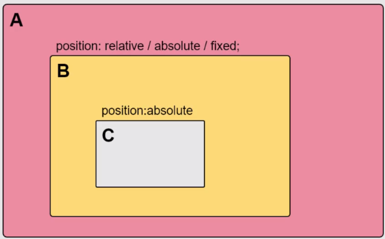
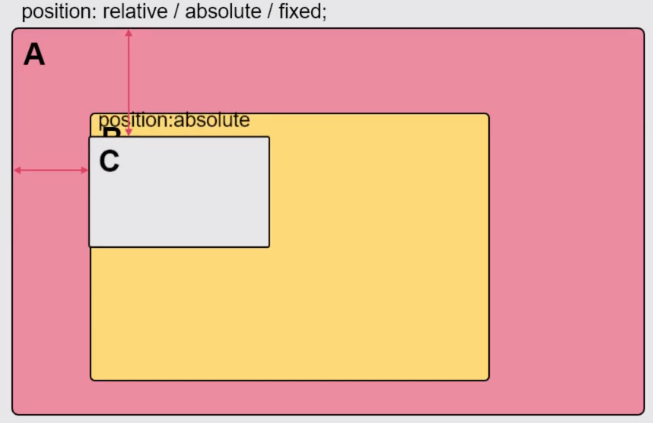

- 浮动元素都是block块元素
# 布局中的定位
- position
  - relative(相对定位):内部的元素参考系
  - absolute(绝对定位):参考relative的位置进行定位
  - fixed(固定定位):相对于整个网页来进行定位,固定在某个位置
# 定位的特点

总结:
- 父级元素没有参考系
- 元素会自动的查找上一级
- 如果上一级还是没有,那么它最终会找到浏览器窗口来进行定位

