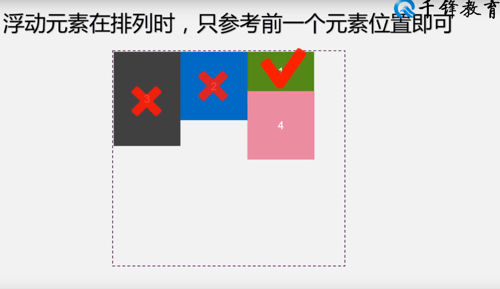

# 浮动局部特点
- 浮动元素会脱离网页文档,与其他元素发生重叠,但不会与文字内容发生重叠
- 包裹浮动元素的父元素高度**不会被浮动的子元素撑开**,原因:浮动的元素不占据空间
- 解决方法:
	- 给父元素指定的高度
	- overflow:auto;(超出边界的元素)
	- clear:left/right/both;(表示该元素不受left/right/both浮动的影响)
- 浮动元素在排列时,只参考前一个元素的位置

- 右浮动的位置会与代码相反
# 重叠问题
- 浮动元素不会覆盖文字内容
- 浮动元素不会覆盖图片内容(因为图片本身也属于文本,可以看做是一个特殊的文本)
- 浮动元素不会覆盖表单元素