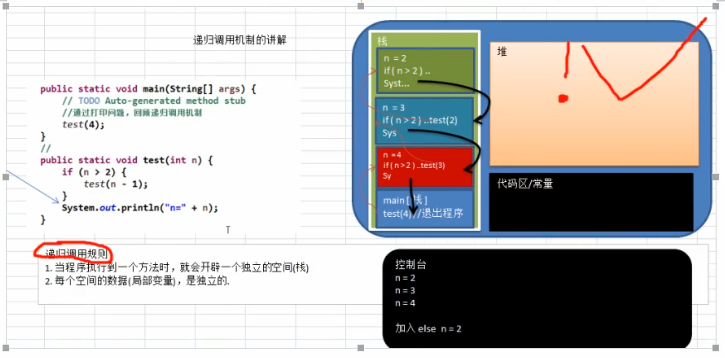

# 第一章 内容介绍

## 1.1 数据结构和算法内容介绍

### 1.1.1 经典的算法面试题

- 字符串匹配问题:

  1. 有一个字符串 str1= ""硅硅谷 尚硅谷你尚硅 尚硅谷你尚硅谷你尚硅你好"",和一个字串str2 = "尚硅谷你尚硅你"

  2. 现在要判断str1是否含有str2,如果存在,就返回第一次出现的位置,如果没有,则返回-1

  3. 要求用最快的速度来完成匹配

  4. 你的思路是什么？

     暴力匹配[简单,效率低]

     KMP算法《部分匹配表》

- 汉诺塔游戏

  请完成汉诺塔游戏的代码:

  - 要求
    1. 将A塔的所有圆盘移动到C塔。
    2. 小圆盘上不能放大圆盘
    3. 在三根柱子之间一次只能移动一个圆盘

  

- 八皇后问题

  ​	八皇后问题，是一个古老而著名的问题，是回溯算法的典型案例。该问题是国际西洋棋棋手马克思·北瑟尔与1848年提出：在8×8格的国际象棋上摆放八个皇后，使其不能互相攻击，即：任意两个皇后都不能处于同一行、同一列或同一斜线上，问有多少种摆法。【92】=>分治算法

  

- 马踏棋盘算法介绍和游戏演示

  ​	马踏棋盘算法也被称为骑士周游问题

  ​	将马随机放在国际象棋的8×8棋盘Board【0~7】【0~7】的某个方格中，马按走棋规则(马走日字)进行移动。要求每个方格只进入一次，走遍棋盘上全部64个方格，会使用到图的深度优化遍历算法(DFS)+贪心算法优化

  ​	

### 1.1.2 数据结构和算法的重要性

1. 算法是程序的灵魂，优秀的程序可以在海量的数据计算时，依然保持高速计算
2. 一般来讲程序会使用内存计算框架(比如Spark)和缓存技术(比如redis等)来优化程序，再深入的思考一下，这些计算框架和缓存技术，它的核心功能是哪个部分呢？
3. 在Unix下开发服务器程序，功能要支持上千万人同时在线，在上线前，做内测，一切OK，上线后，服务器瞬间爆炸，公司的CTO对代码进行优化，再次上线，坚如磐石。程序的灵魂为算法
4. 目前程序员的门槛越来越高，很多一线IT公司(大厂)，都会有数据结构和算法面试题
5. 如果不想永远都是代码工人，那就花时间来研究下数据结构和算法

### 1.1.3 本套数据结构和算法内容介绍

### 1.1.4 课程亮点和授课方式

1. 课程深入，非蜻蜓点水
2. 课程成体系，非星星点灯
3. 高效而愉快的学习，数据结构和算法很有用，很好玩
4. 数据结构和算法很重要，但是相对困难
5. 采用 应用场景->数据结构或算法->剖析原理->分析实现步骤->代码实现的步骤讲解
6. 达到能在工作中运用解决实际问题和优化程序的目的

# 第二章 数据结构和算法概述

## 2.1.1 数据结构和算法的关系

1. 数据结构是一门**研究组织数据方式**的学科,有了编程语言也就有了数据结构,学好数据结构可以编写出更加漂亮,更加有效率的代码。
2. 要学习好数据结构就要多多考虑如何将生活中遇到的问题,用程序去解决。
3. 程序 = 数据结构 + 算法
4. 数据结构是算法的基础，换言之，想要学好算法，需要把数据结构学到位

## 2.2 看几个实际编程中遇到的问题

### 2.2.1 问题一: 字符串替换问题

java代码：

```java
public static void main(String[] args){
    String str = "Java,Java,hello,world!";
    String newStr = str.replaceAll();// 算法
    System.out.println("newStr=" + newStr);
}
```

问：试写出用**单链表**表示的字符串类及字符串结点类的定义，并依次实现它的构造函数、以及计算串长度、串赋值、判断两串相等、求字串、两串连接、求字串在串中位置等7个成员函数。

### 2.2.2 一个五子棋程序


​		如何判断游戏的输赢，并可以完成存盘退出和继续上局的功能

1. 棋盘 二维数组=>稀疏数组=>写入文件【存档功能】
2. 读取文件=》稀疏数组=》二维数组=》棋盘【接上局】

### 2.2.3 约瑟夫问题(丢手帕问题)

1. Josephu问题为：设编号为1，2，...n的n个人围坐一圈，约定编号为k（1<=k<=n）的人从1开始报数，数到m的那个人出列，它的下一位又从1开始报数，数到m的那个人出列，依次类推，直到所有人出列为止，由此产生一个出队编号的序列。
2. 提示：用一个不带头结点的循环链表来处理Josephu问题：先构成一个有n个结点的单循环链表（单向环形链表），然后由k结点起从1开始计数，计到m时，对应结点从链表中删除，然后再从被删除结点的下一个结点又从1开始计数，直到最后一个结点从链表中删除算法结束。
3. 小结：完成约瑟夫问题，需要使用到单向环形链表这个数据结构

### 2.2.4 其它常见算法问题


1. 修路问题=>最小生成树(加权值)【数据结构】+ 普利姆算法
2. 最短路径问题=>图 + 弗洛伊德算法
3. 汉诺塔=>分支算法
4. 八皇后问题=>回朔法 

## 2.3 线性结构和非线性结构

数据结构包括：线性结构和非线性结构。

### 2.3.1 线性结构

1. 线性结构作为最常用的数据结构，其特点是**数据元素之间存在一对一**的线性关系
2. 线性结构由两种不同的存储结构，即**顺序存储结构(数组)**和**链式存储结构(链表)**。顺序存储的线性表称为顺序表，顺序表中的**存储元素是连续**的
3. 链式存储的线性表称为链表，链表中的存储元素**不一定是连续的**，元素节点中存放数据元素以及相邻元素的地址信息
4. 线性结构常见的有：**数组、队列、链表和栈(面试题)**

### 2.3.2 非线性结构

非线性结构包括：二维数组，多维数组，广义表，树结构，图结构

# 第三章 稀疏数组和队列

## 3.1 稀疏sparsearray数组

### 3.1.1 先看一个实际的需求

- 编写的五子棋程序中，有存盘退出和续上盘的功能


- 问题
  - 因为该二维数组的很多值是默认值0，因此记录了很多没有意义的数据=>稀疏数组

### 3.1.2 基本介绍

当一个数组中大部分元素为0，或者同一个值的数组时，可以使用稀疏数组来保存该数组。

稀疏数组的处理方法是：

- 记录数组**一共有几行几列，有多少个不同**的值
- 把具有不同值的元素的行列及值记录在一个小规模的数组中，从而**缩小程序**的规模

稀疏数组举例说明：


### 3.1.3 应用实例

1. 使用稀疏数组，来保留类似前面的二维数组(棋盘、地图等等)
2. 把稀疏数组存盘，并且可以从新恢复原来的二维数组
3. 整体思路分析


代码实现:

```java
public class SpareseArray {

	public static void main(String[] args) {
		// 创建一个原始的二维数组 11 * 11
		// 0：表示没有棋子，1表示黑子 2表示蓝子
		int chessArr1[][] = new int[11][11];
		chessArr1[1][2] = 1;
		chessArr1[2][3] = 2;
		chessArr1[4][5] = 2;
		// 输出原始的二维数组
		System.out.println("原始的二维数组~~");
		for (int[] row : chessArr1) {
			for (int data : row) {
				System.out.printf("%d ", data);
			}
			System.out.println();
		}

		// 将二维数组转稀疏数组的思想
		// 1. 先遍历二维数组 得到非0数据的个数
		int sum = 0;
		for (int i = 0; i < 11; i++) {
			for (int j = 0; j < 11; j++) {
				if (chessArr1[i][j] != 0) {
					sum++;
				}
			}
		}

		// 2. 创建对应的稀疏数组
		int sparseArr[][] = new int[sum + 1][3];
		// 给稀疏数组赋值
		sparseArr[0][0] = 11;
		sparseArr[0][1] = 11;
		sparseArr[0][2] = sum;

		// 遍历二维数组，将非0的值存放到sparseArr中
		int count = 0; // 用于记录是第几个非0数据
		for (int i = 0; i < 11; i++) {
			for (int j = 0; j < 11; j++) {
				if (chessArr1[i][j] != 0) {
					count++;
					sparseArr[count][0] = i;
					sparseArr[count][1] = j;
					sparseArr[count][2] = chessArr1[i][j];
				}
			}
		}
		// 输出稀疏数组的形式
		System.out.println();
		System.out.println("得到的稀疏数组为~~~~");
		for (int i = 0; i < sparseArr.length; i++) {
			System.out.printf("%d\t%d\t%d\t\n", sparseArr[i][0], sparseArr[i][1], sparseArr[i][2]);
		}

		// 将稀疏数组恢复成原始的二维数组
		/**
		 * 1.先读取稀疏数组的第一行，根据第一行的数据，创建原始的二维数组 
		 * 2.在读取稀疏数组后几行数组，并赋给原始的二维数组即可
		 */
		// 1.先读取稀疏数组的第一行，根据第一个的数据，创建原始的二维数组
		int chessArr2[][] = new int[sparseArr[0][0]][sparseArr[0][1]];
		
		// 2.在读取稀疏数组后几行的数组，并赋给原始的二维数组即可
		for (int i = 1; i < sparseArr.length; i++) {
			chessArr2[sparseArr[i][0]][sparseArr[i][1]] = sparseArr[i][2];
		}
		
		// 输出恢复后的二维数组
		System.out.println();
		System.out.println("恢复后的二维数组");
		
		for (int[] row : chessArr2) {
			for (int data : row) {
				System.out.printf("%d ", data);
			}
			System.out.println();
		}
	}

}
```

### 3.1.4 巩固练习

- 要求：
  - 在前面的基础上，将稀疏数组保存到磁盘上，比如map.data
  - 恢复原来的数组时，读取map.data进行恢复

## 3.2 队列

### 3.2.1 队列的一个使用场景

银行排队的案例：


### 3.2.2 队列介绍

1. 队列是一个有序列表，可以用数组或是链表来实现。

2. 遵循先入先出的原则。即：先存入队列的数据，要先取出。后存入的要后取出

3. 示意图：（使用数组模拟队列示意图）

   

### 3.2.3 数据模拟队列思路

- 队列本身是有序列表，若使用数组的结构来存储队列的数据，则队列数组的声明如下图，其中maxSize是该队列的最大容量

- 因为队列的输出、输入分别从前后端来处理，因此需要两个变量front及rear分别纪录队列前后端的下标，front会随着数据输出而改变，而rear则是随着数据输入而改变，如图所示：

  

- 当我们将数据存入队列时称为“addQueue”,addQueue的处理需要有两个步骤：思路分析

  - 将尾指针往后移：rear+1，当front==rear【空】
  - 若尾指针rear小于队列的最大小标maxSize-1，则将数据存入rear所指的数组元素中，否则无法存入数据。rear==maxSize-1【队列满】

- 代码实现:

  ```java
  import java.util.Scanner;
  
  public class ArrayQueueDemo {
      public static void main(String[] args) {
          ArrayQueue arrayQueue = new ArrayQueue(3);
          // 创建一个队列
          char key = ' ';
          Scanner scanner = new Scanner(System.in);
          boolean loop = true;
          while (loop) {
              System.out.println("s(show):显示队列");
              System.out.println("e(exit):退出程序");
              System.out.println("a(add):添加数据");
              System.out.println("g(get):获取数据");
              System.out.println("h(head):查看数据");
              key = scanner.next().charAt(0);
              switch (key) {
                  case 's':
                      arrayQueue.showQueue();
                      break;
                  case 'a':
                      System.out.println("输入一个数");
                      int value = scanner.nextInt();
                      arrayQueue.addQueue(value);
                      break;
                  case 'g':
                      try {
                          int res = arrayQueue.getQueue();
                          System.out.printf("取出的数据是%d\n", res);
                      } catch (Exception e) {
                          System.out.println(e.getMessage());
                      }
                      break;
                  case 'h':
                      try {
                          int res = arrayQueue.headQueue();
                          System.out.printf("队列头的数据是%d\n", res);
                      } catch (Exception e) {
                          System.out.println(e.getMessage());
                      }
                      break;
                  case 'e':
                      scanner.close();
                      loop = false;
                      break;
              }
          }
          System.out.println("程序退出");
      }
  }
  
  class ArrayQueue {
      private int maxSize; // 表示数组的最大容量
      private int front; // 队列头
      private int rear; // 队列尾
      private int[] arr; // 该数据用于存放数据，模拟队列
  
      // 创建队列的构造器
      public ArrayQueue(int maxSize) {
          this.maxSize = maxSize;
          arr = new int[maxSize];
          front = -1; //指向队列的头部，分析出front是指向队列头的前一个
          rear = -1; // 指向队列的尾部，指向队列尾的数据(即队列最后一个数据)
  
      }
  
      // 判断队列是否满
      public boolean isFull() {
          return rear == maxSize-1;
      }
  
      // 判断队列是否为空
      public boolean isEmpty() {
          return front == rear;
      }
  
      // 添加数据到队列
      public void addQueue(int n) {
          // 判断队列是否满
          if (isFull()) {
              System.out.println("队列满，不能加入数据~");
              return;
          }
          rear++;// 让rear 后移
          arr[rear] = n;
      }
  
      // 获取队列的数据，出队列
      public int getQueue() {
          // 判断队列是否为空
          if (isEmpty()) throw new RuntimeException("队列为空，不能取数据");
          front++;
          return arr[front];
      }
  
      // 显示队列的所有数据
      public void showQueue() {
          // 遍历
          if (isEmpty()) {
              System.out.println("队列为空，没有数据！！");
              return;
          }
          for (int i = 0; i < arr.length; i++) {
              System.out.printf("arr[%d]=%d\n", i, arr[i]);
          }
      }
  
      // 显示队列的头数据，注意不是取出数据
      public int headQueue() {
          if (isEmpty())
              throw new RuntimeException("队列为空，没有数据");
          return arr[front + 1];
      }
  }
  
  ```

- 问题分析并优化

  - 目前数组使用一次就不能用，没有达成复用效果
  - 将这个数组使用算法，改进成一个环形的数组

### 3.2.4 数组模拟环形队列

​	对前面的数组模拟队列的优化，充分利用数组，因此将数组看成环形的。（通过取模的方式来实现）

- 分析说明

  - 尾索引的下一个为头索引时表示队列满，即将队列容量空出一个作为约定，这个在做判断队列满的时候要注意(rear+1)%maxSize == front [满]

  - rear== front [空]

  - 分析示意图：

    
    
  - 代码实现
  
    ```java
    import java.util.Scanner;
    
    public class CircelArrayDemo {
    
        public static void main(String[] args) {
            CircleArray arrayQueue = new CircleArray(4);
            // 创建一个队列
            char key = ' ';
            Scanner scanner = new Scanner(System.in);
            boolean loop = true;
            while (loop) {
                System.out.println("s(show):显示队列");
                System.out.println("e(exit):退出程序");
                System.out.println("a(add):添加数据");
                System.out.println("g(get):获取数据");
                System.out.println("h(head):查看数据");
                key = scanner.next().charAt(0);
                switch (key) {
                    case 's':
                        arrayQueue.showQueue();
                        break;
                    case 'a':
                        System.out.println("输入一个数");
                        int value = scanner.nextInt();
                        arrayQueue.addQueue(value);
                        break;
                    case 'g':
                        try {
                            int res = arrayQueue.getQueue();
                            System.out.printf("取出的数据是%d\n", res);
                        } catch (Exception e) {
                            System.out.println(e.getMessage());
                        }
                        break;
                    case 'h':
                        try {
                            int res = arrayQueue.headQueue();
                            System.out.printf("队列头的数据是%d\n", res);
                        } catch (Exception e) {
                            System.out.println(e.getMessage());
                        }
                        break;
                    case 'e':
                        scanner.close();
                        loop = false;
                        break;
                }
            }
            System.out.println("程序退出");
        }
    }
    
    class CircleArray {
        private int maxSize; // 表示数组的最大容量
        // front 变量的含义做一个调整：front就只想队列的第一个元素，也就是说arr[front]
        // front 的初始值为0
        private int front; // 队列头
        // rear 变量的含义做一个调整：rear指向队列的最后一个元素的后一个位置。希望空出一个位置
        // rear 的初始值=0
        private int rear; // 队列尾
        private int[] arr; //该数组用于存放数据，模拟队列
    
        public CircleArray(int maxSize) {
            this.maxSize = maxSize;
            arr = new int[maxSize];
        }
    
        // 判断是否满
        public boolean isFull() {
            return (rear + 1) % maxSize == front;
        }
    
        // 判断队列是否为空
        public boolean isEmpty() {
            return rear == front;
        }
    
        // 添加数据到队列
        public void addQueue(int n) {
            // 判断队列是否满
            if (isFull()) {
                System.out.println("队列满");
                return;
            }
            arr[rear] = n;
            rear = (rear + 1) % maxSize;
        }
    
        // 获取队列的数据，出队列
        public int getQueue() {
            if (isEmpty()) throw new RuntimeException("队列空，不能取数据");
            int value = arr[front];
            front = (front + 1) % maxSize;
            return value;
        }
    
        // 显示队列
        public void showQueue() {
            // 遍历
            if (isEmpty()) {
                System.out.println("队列空");
                return;
            }
            for (int i = front; i < front + size(); i++) {
                System.out.printf("arr[%d]=%d\n", i % maxSize, arr[i % maxSize]);
            }
        }
    
        // 求出当前队列有效数据的个数
        public int size() {
            return (rear + maxSize - front) % maxSize;
        }
    
        // 显示队列的头数据，注意不是取出数据
        public int headQueue() {
            if (isEmpty())
                throw new RuntimeException("队列为空，没有数据");
            return arr[front];
        }
    }
    
    ```
  
    

## 4.1 链表(LinkedList)介绍

链表是有序的列表，但是它再内存中的存储如下


小结：

1. 链表是以节点的方式来存储，是**链式储存**

2. 每个节点包含data域，next域：指向下一个节点

3. 如图：**链表的各个节点不一定是连续存储**

4. 链表分**带头节点的链表**和**没有头节点的链表**，根据实际需求来确定

   1. 单链表逻辑结构示意图

      

## 4.2 单链表的应用实例

使用带head头的单向链表实现水浒英雄排行榜管理完成对英雄人物的增删改查操作。

- 第一种方法在添加英雄时，直接添加到链表的尾部
  - 思路分析示意图

    

  - 代码实现

    ```java
     /**
         * 添加节点到单向链表
         * 1.找到当前链表的最后节点
         * 2.将最后这个节点的next指向新的节点
         *
         * @param heroNode
         */
        void add(HeroNode heroNode) {
            // 因为head节点不能动，因此我们需要一个辅助遍历
            HeroNode temp = head;
            // 遍历链表，找到最后
            while (temp.next != null) {
                // 如果没有找到最后，将temp后移
                temp = temp.next;
            }
            // 当退出while循环时,temp就指向了链表的最后
            temp.next = heroNode;
        }
    ```

    

- 第二种方式在添加英雄时，根据排名将英雄插入到指定位置(如果有这个排序，则添加失败，并给出提示)
  - 思路分析图

    

  - 代码实现

    ```java
     /**
         * 根据排名将英雄插入到指定位置
         *
         * @param heroNode
         */
        public void addByOrder(HeroNode heroNode) {
            HeroNode temp = head;
            boolean flag = false;
            // 为null表示找到了最后
            while (temp.next != null) {
                if (temp.next.no > heroNode.no) {
                    // 位置找到，就在temp后面插入
                    break;
                } else if (temp.next.no == heroNode.no) {
                    // 说明编号存在
                    flag = true;
                    break;
                }
                temp = temp.next;
            }
            if (flag) {
                System.out.println("已存在");
            } else {
                heroNode.next = temp.next;
                temp.next = heroNode;
            }
        }
    ```

    

    

- 修改节点功能

  - 思路

    - 找到该节点，通过遍历
    - temp.name = newHeroNode.name
    - temp.nickName = newHeroNode.nickName 

  - 代码实现

    ```java
     /**
         * 更新
         * @param newHeroNode
         */
        void update (HeroNode newHeroNode) {
            if (newHeroNode == null) {
                System.out.println("链表为空");
                return;
            }
            HeroNode temp = head.next;
            boolean flag = false;
            while(temp != null) {
                if (temp.no == newHeroNode.no) {
                    temp.name = newHeroNode.name;
                    temp.nickName = newHeroNode.nickName;
                    flag = true;
                    break;
                }
                temp = temp.next;
            }
            if (!flag){
                System.out.println("没有找到");
            }
        }
    ```

    

- 删除节点功能

  - 思路分析代码示意图

    

  - 代码实现

    ```java
     void del (int no ) {
            HeroNode temp = head;
            boolean flag = false;
            while(temp.next != null ){
                if (temp.next.no == no) {
                    flag = true;
                    break;
                }
                temp= temp.next;
            }
            if (flag) {
                temp.next = temp.next.next;
            } else {
                System.out.println("无法删除");
            }
        }
    ```

- 完整代码

  ```java
  package linklist;
  
  class SingleLinkedListDemo {
      public static void main(String[] args) {
          HeroNode hero1 = new HeroNode(1, "宋江", "及时雨");
          HeroNode hero2 = new HeroNode(2, "卢俊义", "玉麒麟");
          HeroNode hero3 = new HeroNode(3, "吴用", "智多星");
          HeroNode hero4 = new HeroNode(4, "林冲", "豹子头");
          // 创建链表
          SingleLinkedList singleLinkedList = new SingleLinkedList();
          // 添加
          singleLinkedList.addByOrder(hero1);
          singleLinkedList.addByOrder(hero4);
          singleLinkedList.addByOrder(hero2);
          singleLinkedList.addByOrder(hero3);
  
          // 测试修改节点的代码
          HeroNode hero5 = new HeroNode(4, "林2冲", "豹2子头");
          singleLinkedList.update(hero5);
          // 遍历
          singleLinkedList.del(4);
          singleLinkedList.del(3);
          singleLinkedList.del(2);
          singleLinkedList.del(1);
          singleLinkedList.list();
      }
  }
  
  class SingleLinkedList {
      // 初始化一个头节点，不存放具体的数据
      private HeroNode head = new HeroNode(0, "", "");
  
  
      void del (int no ) {
          HeroNode temp = head;
          boolean flag = false;
          while(temp.next != null ){
              if (temp.next.no == no) {
                  flag = true;
                  break;
              }
              temp= temp.next;
          }
          if (flag) {
              temp.next = temp.next.next;
          } else {
              System.out.println("无法删除");
          }
      }
  
      /**
       * 更新
       * @param newHeroNode
       */
      void update (HeroNode newHeroNode) {
          if (newHeroNode == null) {
              System.out.println("链表为空");
              return;
          }
          HeroNode temp = head.next;
          boolean flag = false;
          while(temp != null) {
              if (temp.no == newHeroNode.no) {
                  temp.name = newHeroNode.name;
                  temp.nickName = newHeroNode.nickName;
                  flag = true;
                  break;
              }
              temp = temp.next;
          }
          if (!flag){
              System.out.println("没有找到");
          }
      }
      /**
       * 添加节点到单向链表
       * 1.找到当前链表的最后节点
       * 2.将最后这个节点的next指向新的节点
       *
       * @param heroNode
       */
      void add(HeroNode heroNode) {
          // 因为head节点不能动，因此我们需要一个辅助遍历
          HeroNode temp = head;
          // 遍历链表，找到最后
          while (temp.next != null) {
              // 如果没有找到最后，将temp后移
              temp = temp.next;
          }
          // 当退出while循环时,temp就指向了链表的最后
          temp.next = heroNode;
      }
  
      /**
       * 根据排名将英雄插入到指定位置
       *
       * @param heroNode
       */
      public void addByOrder(HeroNode heroNode) {
          HeroNode temp = head;
          boolean flag = false;
          // 为null表示找到了最后
          while (temp.next != null) {
              if (temp.next.no > heroNode.no) {
                  // 位置找到，就在temp后面插入
                  break;
              } else if (temp.next.no == heroNode.no) {
                  // 说明编号存在
                  flag = true;
                  break;
              }
              temp = temp.next;
          }
          if (flag) {
              System.out.println("已存在");
          } else {
              heroNode.next = temp.next;
              temp.next = heroNode;
          }
      }
  
      /**
       * 遍历
       */
      void list() {
          // 判断链表是否为空
          if (head.next == null) {
              System.out.println("链表为空");
              return;
          }
          // 因为头节点不能动，因此我们需要一个辅助变量来遍历
          HeroNode temp = head.next;
          while (temp != null) {
  
              // 输出节点信息
              System.out.println(temp);
              temp = temp.next;
          }
      }
  }
  
  class HeroNode {
      int no;
      String name;
      String nickName;
      HeroNode next;
  
      public HeroNode(int no, String name, String nickName) {
          this.no = no;
          this.name = name;
          this.nickName = nickName;
      }
  
      @Override
      public String toString() {
          return "HeroNode{" +
                  "no=" + no +
                  ", name='" + name + '\'' +
                  ", nickName='" + nickName + '\'' +
                  '}';
      }
  }
  ```


## 4.3 单链表的面试题(新浪、百度、腾讯)

1. 求单链表当中有效节点的个数

   ```java
      /**
        * 获取到单链表的节点的个数(如果是带头的节点的链表，需要不统计头节点)
        *
        * @param head
        * @return
        */
       public static int getLength(HeroNode head) {
           int length = 0;
           if (head.next == null) {
               return length;
           }
           // 定义一个辅助变量
           HeroNode cur = head.next;
           while (cur != null) {
               length++;
               cur = cur.next;
           }
           return length;
       }
   ```

2. 查找单链表中的倒数第K个节点【新浪】

   ```java
     /**
        * 查找单链表中的倒数第K个节点【新浪面试题】
        * 思路：
        * 1.编写一个方法，接收head节点，同时接收一个index
        * 2.index表示倒数第index个节点
        * 3.先把链表从头到尾遍历，得到链表的总长度length
        * 4.得到length之后，我们从链表的第一个开始遍历(length-index)个，就可以得到
        * 5.如果找到了，则返回该节点，否则返回null
        *
        * @param head
        * @param index
        * @return
        */
       public static HeroNode findLastIndex(HeroNode head, int index) {
           if (head.next == null) {
               return null;
           }
           int length = getLength(head);
           if (index <= 0 || index > length) {
               return null;
           }
           HeroNode temp = head.next;
           for (int i = 0; i < (length - index); i++) {
               temp = temp.next;
           }
           return temp;
       }
   ```

3. 单链表的反转【腾讯】

   思路分析图：

   

   

   ```java
     /**
        * 将单链表反转【腾讯】
        *
        *
        * @param head
        */
       public static void reversetList(HeroNode head) {
           // 如果当前链表为空，或者只有一个节点，无需反转，直接返回
           if (head.next == null || head.next.next == null) {
               return;
           }
           // 定义一个辅助的指针（变量）
           HeroNode cur = head.next;
           // 指向当前节点cur的下一个节点，防止链表断裂
           HeroNode next = null;
           HeroNode reverseHead = new HeroNode(0, "", "");
           while (cur != null) {
               // 当前对象的下一个对象
               next = cur.next;
               // 将cur的下一个节点指向新的链表的最前端
               cur.next = reverseHead.next;
               reverseHead.next = cur;
               // 让cur后移
               cur = next;
           }
           // 将reverseHead 给 head
           head.next = reverseHead.next;
       }
   ```

4. 从尾到头打印单链表【百度】

   
   
   ```java
   
       /**
        * 从尾到头打印单链表【百度】
        * 利用栈的特点先入后出来实现
        * @param head
        */
       public static void reversetPrint(HeroNode head) {
           if (head.next == null) {
               return;
           }
           HeroNode temp = head.next;
           Stack<HeroNode> heroNodes = new Stack<>();
           while(temp != null) {
               heroNodes.push(temp);
               temp = temp.next;
           }
   
           while (heroNodes.size() > 0) {
               System.out.println(heroNodes.pop());
           }
    }
   ```
   

## 4.4 双向链表应用实例

### 4.4.1 双向链表的操作分析和实现

使用带head头的双向链表实现-水浒英雄排行榜

- 管理单向链表的缺点分析：

  - 单向链表，查找的方向只能是一个方向，而双向链表可以向前或者向后查找

  - 单向链表不能自我删除，需要靠辅助接点，而双向链表，则可以自我删除

  - 思路图

    

  - 说明

    - 遍历方法和单链表一样，只是可以向前，也可以向后查找

    - 添加(默认添加到双向链表的最后这个节点)

      - 先找到双向链表的最后节点
      - temp.next = newHeroNode
      - newHeroNode.pre=temp;

    - 修改和原来单向链表一致

    - 删除

      - 因为是双向链表，因此，我们可以实现自我删除某个节点
      - 直接找到要删除的这个节点，比如temp
      - temp.pre.next = temp.next
      - temp.next.pre = temp.pre

    - 代码实现

      ```java
      package linklist;
      
      public class DoubleLinkedListDemo {
          public static void main(String[] args) {
              System.out.println("双向链表的测试");
              HeroNode2 hero1 = new HeroNode2(1, "宋江", "及时雨");
              HeroNode2 hero2 = new HeroNode2(2, "卢俊义", "玉麒麟");
              HeroNode2 hero3 = new HeroNode2(3, "吴用", "智多星");
              HeroNode2 hero4 = new HeroNode2(4, "林冲", "豹子头");
              DoubleLinkedList doubleLinkedList = new DoubleLinkedList();
              doubleLinkedList.add(hero1);
              doubleLinkedList.add(hero2);
              doubleLinkedList.add(hero3);
              doubleLinkedList.add(hero4);
              doubleLinkedList.list();
              System.out.println("------");
              doubleLinkedList.update(new HeroNode2(4,"公孙胜","入云龙"));
              doubleLinkedList.list();
              System.out.println("------");
              doubleLinkedList.del(3);
              doubleLinkedList.list();
          }
      }
      
      class DoubleLinkedList {
          private HeroNode2 heroNode2 = new HeroNode2(0, "", "");
      
          public HeroNode2 getHeroNode2() {
              return heroNode2;
          }
      
          void del(int no) {
              if (heroNode2 == null) return;
              HeroNode2 temp = heroNode2.next;
              boolean flag = false;
              while (temp.next != null) {
                  if (temp.no == no) {
                      flag = true;
                      break;
                  }
                  temp = temp.next;
              }
              if (flag) {
                  // 将temp 上一个的元素下一个指向改为temp的下一个，
                  temp.pre.next = temp.next;
                  // 避免temp为最后一个时空指针异常
                  if (temp.next != null)
                      temp.next.pre = temp.pre;
              } else {
                  System.out.println("无法删除");
              }
          }
      
          /**
           * 更新
           *
           * @param newHeroNode
           */
          void update(HeroNode2 newHeroNode) {
              if (newHeroNode == null) {
                  System.out.println("链表为空");
                  return;
              }
              HeroNode2 temp = heroNode2.next;
              boolean flag = false;
              while (temp != null) {
                  if (temp.no == newHeroNode.no) {
                      temp.name = newHeroNode.name;
                      temp.nickName = newHeroNode.nickName;
                      flag = true;
                      break;
                  }
                  temp = temp.next;
              }
              if (!flag) {
                  System.out.println("没有找到");
              }
          }
      
          public void add(HeroNode2 heroNode) {
              // 因为head节点不能动，因此我们需要一个辅助遍历temp
              HeroNode2 temp = heroNode2;
              while (temp.next != null) {
                  temp = temp.next;
              }
              temp.next = heroNode;
              heroNode.pre = temp;
          }
      
          /**
           * 遍历
           */
          void list() {
              // 判断链表是否为空
              if (heroNode2.next == null) {
                  System.out.println("链表为空");
                  return;
              }
              // 因为头节点不能动，因此我们需要一个辅助变量来遍历
              HeroNode2 temp = heroNode2.next;
              while (temp != null) {
      
                  // 输出节点信息
                  System.out.println(temp);
                  temp = temp.next;
              }
          }
      }
      
      class HeroNode2 {
          public int no;
          public String name;
          public String nickName;
          public HeroNode2 next; // 指向下一个节点
          public HeroNode2 pre; // 指向前一个节点
      
          public HeroNode2(int no, String name, String nickName) {
              this.no = no;
              this.name = name;
              this.nickName = nickName;
          }
      
          @Override
          public String toString() {
              return "HeroNode2{" +
                      "no=" + no +
                      ", name='" + name + '\'' +
                      ", nickName='" + nickName + '\'' +
                      '}';
          }
      }
      ```

### 4.4.2 作业和提示

双向链表的第二种添加方式，按照编号顺序添加(按照单链表得到顺序添加，稍作修改即可)

```java
 public void addOrder(HeroNode2 heroNode) {
        HeroNode2 temp = heroNode2;
        boolean flag = false;
        while (temp.next != null) {
            if (temp.next.no > heroNode.no) {
                break;
            }
            temp = temp.next;
        }
        if (!flag) {
            heroNode.pre = temp;
            heroNode.next = temp.next;
            if (temp.next != null) {
                temp.next.pre = heroNode;
            }
            temp.next = heroNode;
        }
    }

```

思路分析：

1. 新元素的上一个 = 旧元素的上一个

2. 新元素的下一个 = 旧元素

3. 旧元素的上一个 = 新元素(如果没有到链表尾的话)

4. 旧元素的上一个元素的下一个 = 新元素。

5. 思路图

   


## 4.5 单向环形链表应用场景

​	Josephu (约瑟夫、约瑟夫环)问题

​	Josephu问题为：设编号为1，2，...n的n个人围坐一圈，约定编号为k(1<=k<=n)的人从1开始报数，数到m的那个人出列，它的下一位又从1开始报数，数到m的那个人又出列，依次类推，知道所有人出列为止，由此产生一个出兑编号的序列。

​	提示：用一个不带头节点的循环链表来处理Josehu问题：先构成一个有n个节点的单循环链表，然后由k结点从1开始计数，计到m时，对应结点从链表中删除，然后再从被删除节点的下一个节点又从1开始计数，直到最后一个结点从链表中删除算法结束。


## 4.6 单向环形链表介绍


## 4.7 Josephu 问题示意图


- Josephu问题

  Josephu问题为：设编号为1,2,...n的n个人围坐一圈,约定编号为k (1<=k<=n)的人从1开始报数,数到m的那个人出列,它的下一位又从1开始报数,数到m的那个人又出列,依次类推,直到所有人出列为止,由此产生一个出队编号的序列。

- 提示

  用一个不带头节点的循环链表来处理Josephu问题：先构成一个有n个结点的单循环链表,然后由k结点起从1开始计数,计到m时,对应结点从链表中删除,然后再从被删除结点的下一个结点又从1开始计数,直到最后一个结点从链表中删除算法结束。

- 约瑟夫问题-创建环形链表的思路图解

  

- 约瑟夫问题-小孩出圈的思路分析图

  
  
## 4.8 约瑟夫问题的代码实现

  ```java
public class Josepfu {
    public static void main(String[] args) {
        CircleSingleLinkedList circleSingleLinkedList = new CircleSingleLinkedList();
        circleSingleLinkedList.addBoy(5);
        circleSingleLinkedList.showBoy();
        // 测试小孩出圈是否正确
        circleSingleLinkedList.countBoy(1,2,5);
    }
}

// 创建一个环形的单向链表
class CircleSingleLinkedList {
    // 创建一个first节点，当前没有编号
    private Boy first = null;

    // 添加小孩节点，构建一个环形的链表
    public void addBoy(int nums) {
        // 做一个数据校验
        if (nums < 1) {
            System.out.println("nums的值不正确");
            return;
        }
        // 辅助指针，帮助构建环形链表
        Boy curBoy = null;
        //使用for来创建环形链表
        for (int i = 1; i <= nums; i++) {
            // 根据编号，创建小孩节点
            Boy boy = new Boy(i);
            // 如果是第一个小孩
            if (i == 1) {
                first = boy;
                // 构成环
                first.setNext(first);
                // 让curBoy指向第一个小孩
                curBoy = first;
            } else {
                curBoy.setNext(boy);
                boy.setNext(first);
                curBoy = boy;
            }
        }

    }

    // 遍历当前的环形链表
    public void showBoy() {
        // 判断链表是否为空
        if (first == null) {
            System.out.println("链表为空");
            return;
        }
        // 因为first不能动，因此我们仍然使用一个辅助指针完成遍历
        Boy curBoy = first;
        while (true) {
            System.out.printf("小孩的编号%d \n", curBoy.getNo());
            if (curBoy.getNext() == first) {
                break;
            }
            curBoy = curBoy.getNext();//curboy后移
        }

    }

    // 根据用户的输入，计算出小孩出圈的顺序

    /**
     * @param startNo  表示从第几个小孩开始数数,因为小孩本身需要数一次，实际上相当于指针移动 startNo-1次
     * @param countNum 表示数几下
     * @param nums     表示最初有多少小孩在圈中
     */
    public void countBoy(int startNo, int countNum, int nums) {
        // 先对数据进行校验
        if (first == null || startNo < 1 || startNo > nums) {
            System.out.println("参数输入有误，请重新输入");
            return;
        }
        // 创建辅助指针，帮助完成小孩出圈
        Boy helper = first;
        // 创一个辅助指针helper,事先应该指向环形链表的最后这个节点
        while (helper.getNext() != first) {
            helper = helper.getNext();
        }
        // 小孩报数前，先让first 和heloer移动startNo - 1次
        for (int i = 0; i < startNo - 1; i++) {
            first = first.getNext();
            helper = helper.getNext();
        }
        // 当小孩报数时，让first和helper指针同时的移动countNum-1次，然后出圈
        while (helper != first) {
            for (int i = 0; i < countNum - 1; i++) {
                first = first.getNext();
                helper = helper.getNext();
            }
            // first指向要出圈的节点
            System.out.printf("小孩%d\n", first.getNo());
            // 出圈节点
            first = first.getNext();
            helper.setNext(first);
        }
        System.out.printf("最后留在圈中的小孩编号%d\n",first.getNo());
    }
}

class Boy {
    private int no; // 编号
    private Boy next; // 指向下一个节点,默认null

    public Boy(int no) {
        this.no = no;
    }

    public int getNo() {
        return no;
    }

    public void setNo(int no) {
        this.no = no;
    }

    public Boy getNext() {
        return next;
    }

    public void setNext(Boy next) {
        this.next = next;
    }
}


  ```

# 第五章 栈

## 5.1 栈的一个实际需求

请输入一个表达式

计算式：[7\*2\*2-5+1-5+3-3]点击计算【如下图】


请问：计算机底层是如何运算得到结果的？注意不是简单的把算式列出运算，因为我们看这个算式7\*2\*2-5，但计算机怎么理解这个算式的(对计算机而言，它接收到的就是一个字符串)，我们讨论的是这个问题。

## 5.2 栈的介绍

1. 栈的英文为(stack)

2. 栈是一个***先入后出***的有序列表。

3. 栈是限制线性表中元素的插入与删除只能在线性表的同一端进行的一种特殊线性表，允许插入和删除的一端,为**变化的一端,称为栈顶**,另一端为**固定的一段，称为栈底。**

4. 根据栈的定义可知，最先放入栈中元素在栈底，最后放入的元素在栈顶，而删除元素刚好相反，最后放入的元素最先删除，最先放入的元素最后删除

5. 图解方式说明出栈(pop)和入栈(push)的概念

   

## 5.3 栈的应用场景

1. 子程序的调用：在跳往子程序前，会将下个指令的地址存到堆栈中，知道子程序执行完后再将地址取出，以回到原来的程序中。
2. 处理递归调用：和子程序的调用类类似，只是出了储存下一个指令的地址外，也将参数、区域变量等数据存入堆栈中。
3. 表达式的转换【中缀表达式转后缀表达式】与求值(实际解决)。
4. 二叉树的遍历。
5. 图形的深度优先(depth-first)搜索法。

## 5.4 栈的快速入门

1. 用数组模拟栈的使用，由于栈是一种有序列表，当然可以使用数组的结构来存储栈的数据内容，下面我们用数组模拟栈的出栈、入栈等操作。

2. 实现思路分析，并画出示意图

   

3. 代码实现

   ```java
   import java.util.Scanner;
   
   /**
    * @author Administrator
    */
   public class ArrayStackDemo {
       public static void main(String[] args) {
           ArrayStack stack = new ArrayStack(4);
           String key = "";
           boolean loop = true;
           Scanner scanner = new Scanner(System.in);
           while (loop) {
               System.out.println("show:显示栈");
               System.out.println("exit:退出程序");
               System.out.println("push:添加数据");
               System.out.println("pop:取出数据");
               System.out.println("请输入你的选择");
               key = scanner.next();
               switch (key) {
                   case "show":
                       stack.list();
                       break;
                   case "push":
                       System.out.println("请输入一个数");
                       int value = scanner.nextInt();
                       stack.push(value);
                       break;
                   case "pop":
                       try {
                           int result = stack.pop();
                           System.out.printf("出栈的数据是%d\n", result);
                       } catch (Exception e) {
                           System.out.println(e.getMessage());
                       }
                       break;
                   case "exit":
                       scanner.close();
                       loop = false;
                       break;
               }
           }
           System.out.println("程序退出");
       }
   
   }
   
   /**
    * 定义一个ArrayStack 表示栈
    */
   class ArrayStack {
   
       /**
        * 栈的大小
        */
       private int maxSize;
   
       /**
        * 数组，数组模拟栈，数据就放在该数据
        */
       private int[] stack;
   
       /**
        * top表示栈顶，初始化为-1
        */
       private int top = -1;
   
       /**
        * 构造器
        *
        * @param maxSize 大小
        */
       public ArrayStack(int maxSize) {
           this.maxSize = maxSize;
           stack = new int[this.maxSize];
       }
   
       /**
        * 栈是否满
        *
        * @return
        */
       public boolean isFull() {
           return top == maxSize - 1;
       }
   
       /**
        * 栈内是否为空
        */
       public boolean isEmpty() {
           return top == -1;
       }
   
       /**
        * 入栈
        */
       public void push(int value) {
           if (isFull()) {
               System.out.println("栈满");
               return;
           }
           top++;
           stack[top] = value;
       }
   
       /**
        * 出栈
        */
       public int pop() {
           if (isEmpty()) {
               throw new RuntimeException("栈为空");
           }
           int value = stack[top];
           top--;
           return value;
       }
   
       /**
        * 显示栈的情况【遍历栈】,遍历时从栈顶开始
        */
       public void list() {
           if (isEmpty()) {
               System.out.println("栈空,没有数据");
               return;
           }
           for (int i = top; i >= 0; i--) {
               System.out.printf("stack[%d]=%d\n", i, stack[i]);
           }
       }
   }
   
   ```

4. 关于栈的一个小练习

将此段程序改成使用链表来模拟栈

```java
import javax.print.attribute.standard.NumberOfDocuments;

public class MyStackDemo {
    public static void main(String[] args) {
        MyStack<Integer> integerMyStack = new MyStack<>(4);
        integerMyStack.push(1);
        integerMyStack.push(2);
        integerMyStack.push(3);
        integerMyStack.push(4);
        /*
        System.out.println(integerMyStack.pop());
        System.out.println(integerMyStack.pop());
        System.out.println(integerMyStack.pop());
        System.out.println(integerMyStack.pop());
        System.out.println(integerMyStack.pop());*/
        integerMyStack.list();
    }
}

class MyStack<T> {
    /**
     * 头结点
     */
    private Node header;

    /**
     * 栈最大数量
     */
    private int maxSize;

    public MyStack(int maxSize) {
        this.maxSize = maxSize;
    }

    /**
     * 栈是否满
     *
     * @return
     */
    public boolean isFull() {
        int count = 0;
        Node temp = header;
        if (temp != null) {
            while (temp.getNext() != null) {
                count++;
                temp = temp.getNext();
            }
        }
        return count == maxSize - 1;
    }

    /**
     * 栈是否为空
     *
     * @return
     */
    public boolean isEmpty() {
        return header == null;
    }

    /**
     * 入栈
     * @param value
     */
    public void push(T value) {
        if (isFull()) {
            throw new RuntimeException("栈满");
        }
        Node node = new Node(value);
        if (header == null) {
            header = node;
        } else {
            node.setNext(header);
            header = node;
        }
    }

    public void list () {
        if (isEmpty()) {
            throw  new RuntimeException("栈空,没有数据");
        }
        Node temp = header;
        while (temp != null) {
            System.out.println(temp.getData());
            temp = temp.getNext();
        }
    }

    /**
     * 出栈
     * @return
     */
    public T pop () {
        if (isEmpty()) {
            throw new RuntimeException("栈为空");
        }
        Object data = header.getData();
        header = header.getNext();
        return (T) data;
    }
}

class Node<T> {
    private T data;
    private Node next;

    public Node(T data) {
        this.data = data;
    }

    public T getData() {
        return data;
    }

    public void setData(T data) {
        this.data = data;
    }

    public Node getNext() {
        return next;
    }

    public void setNext(Node next) {
        this.next = next;
    }

    @Override
    public String toString() {
        return "Node{" +
                "data=" + data +
                ", next=" + next +
                '}';
    }
}
```

## 5.5 栈实现综合计算器(中缀表达式)

- 使用栈来实现综合计算器

  计算: 7\*2\*2-5+1-5+3-3

- 思路分析(图解)

  

- 代码实现[1.实现一位数的运算,2.扩展多位数的运算]

  ```java
  /**
   * @author pyw
   * @date 2019-12-27
   */
  public class Calculator {
  
      public static void main(String[] args) {
          String expression = "7*2*2-5+1-5+3-4";
          // 创建两个栈，数栈与符号栈
          ArrayStack numStack = new ArrayStack(10);
          ArrayStack operStack = new ArrayStack(10);
          // 定义需要的变量
          // 用于扫描
          int index = 0;
          int num1 = 0;
          int num2 = 0;
          int oper = 0;
          int res = 0;
          String keepNum = "";
          // 将每次扫描得到的char保存到ch
          char ch = ' ';
          // 开始while循环的扫描expression
          while (true) {
              // 依次得到expression的每一个字符
              ch = expression.substring(index, index + 1).charAt(0);
              // 判断ch是什么,然后做相应的处理
              if (operStack.isOper(ch)) {
                  // 如果是运算符,判断当前的符号栈是否为空
                  if (!operStack.isEmpty()) {
                      // 如果符号栈有操作符,就进行比较,如果当前的操作符的优先级小于或者等于栈中的操作符就需要从数栈中pop出两个数
                      // 在从符号栈中pop出一个符号,进行运算,将得到结果,入数栈,然后将当前的操作符入符号栈
                      if (operStack.priority(ch) <= operStack.priority(operStack.peek())) {
                          num1 = numStack.pop();
                          num2 = numStack.pop();
                          oper = operStack.pop();
                          res = numStack.cal(num1, num2, oper);
                          // 把运算的结果入数栈
                          numStack.push(res);
                          // 然后将当前的操作符入符号栈
                          operStack.push(ch);
                      } else {
                          // 如果当前的操作符的优先级大于栈中的操作符,就直接入符号栈
                          operStack.push(ch);
                      }
                  } else {
                      // 如果为空,直接入栈
                      operStack.push(ch);
                  }
              } else {
                  // 如果是数,则直接入数栈 ascii
                  //
                  //1. 当处理多位数时,不能发现时一个数就立即入栈,因为他可能是多位数
                  //2. 在处理数，需要向ecoression的表达式index后再看一位,如果是数就进行扫描,如果是符号就入栈
                  //3. 因此我们需要定义一个字符串变量用户拼接
                  //处理多位数
                  keepNum += ch;
                  // 如果ch 已经是exporession的最后一位,就直接入栈
                  if (index == expression.length() - 1) {
                      numStack.push(Integer.parseInt(keepNum));
                  } else {
                      // 判断是否为数字
                      // 注意是看后一位,不是index++
                      if (operStack.isOper(expression.substring(index + 1, index + 2).charAt(0))) {
                          // 如果是数字,就继续扫描
                          // 如果后一位是运算符,则入栈
                          numStack.push(Integer.parseInt(keepNum));
                          keepNum = "";
                      }
  
                  }
              }
              // 让index + 1,并判断是否扫描到expression最后
              index++;
              if (index >= expression.length()) {
                  break;
  
              }
          }
          // 当表达式扫描完毕,就顺序的从数栈和符号栈中pop出响应的数和符号
          while (!operStack.isEmpty()) {
              num1 = numStack.pop();
              num2 = numStack.pop();
              oper = operStack.pop();
              res = numStack.cal(num1, num2, oper);
              // 入栈
              numStack.push(res);
          }
          // 将数栈的最后数,pop出来就是结果
          int res2 = numStack.pop();
          System.out.printf("表达式%s = %d", expression, res2);
      }
  
  
  }
  
  /**
   * 定义一个ArrayStack 表示栈
   */
  class ArrayStack {
  
  
      private final int MUL = '*';
  
      private final int DIV = '/';
      private final int ADD = '+';
      private final int SUB = '-';
      /**
       * 栈的大小
       */
      private int maxSize;
  
      /**
       * 数组，数组模拟栈，数据就放在该数据
       */
      private int[] stack;
  
      /**
       * top表示栈顶，初始化为-1
       */
      private int top = -1;
  
      /**
       * 构造器
       *
       * @param maxSize 大小
       */
      public ArrayStack(int maxSize) {
          this.maxSize = maxSize;
          stack = new int[this.maxSize];
      }
  
      /**
       * 返回栈顶的值
       *
       * @return
       */
      public int peek() {
          return stack[top];
      }
  
      /**
       * 栈是否满
       *
       * @return
       */
      public boolean isFull() {
          return top == maxSize - 1;
      }
  
      /**
       * 栈内是否为空
       */
      public boolean isEmpty() {
          return top == -1;
      }
  
      /**
       * 入栈
       */
      public void push(int value) {
          if (isFull()) {
              System.out.println("栈满");
              return;
          }
          top++;
          stack[top] = value;
      }
  
      /**
       * 出栈
       */
      public int pop() {
          if (isEmpty()) {
              throw new RuntimeException("栈为空");
          }
          int value = stack[top];
          top--;
          return value;
      }
  
      /**
       * 显示栈的情况【遍历栈】,遍历时从栈顶开始
       */
      public void list() {
          if (isEmpty()) {
              System.out.println("栈空,没有数据");
              return;
          }
          for (int i = top; i >= 0; i--) {
              System.out.printf("stack[%d]=%d\n", i, stack[i]);
          }
      }
  
      /**
       * 返回运算符的优先级,优先级是程序员来确定,优先级使用数字表示
       * 数字越大,则优先级越高
       *
       * @param oper
       * @return
       */
      public int priority(int oper) {
          if (oper == MUL || oper == DIV) {
              return 1;
          } else if (oper == ADD || oper == SUB) {
              return 0;
          } else {
              // 假定目前的表达式只有+-*/
              return -1;
          }
      }
  
      /**
       * 判断是否为一个运算符
       *
       * @param val
       * @return
       */
      public boolean isOper(char val) {
          return val == ADD || val == SUB || val == MUL || val == DIV;
      }
  
      /**
       * 计算值的方法
       *
       * @param num1
       * @param num2
       * @param oper
       * @return
       */
      public int cal(int num1, int num2, int oper) {
          // 用户存放计算的结果
          int res = 0;
          switch (oper) {
              case ADD:
                  res = num1 + num2;
                  break;
              case SUB:
                  // 注意顺序
                  res = num2 - num1;
                  break;
              case MUL:
                  res = num1 * num2;
                  break;
              case DIV:
                  res = num2 / num1;
                  break;
              default:
                  break;
          }
          return res;
      }
  }
  
  ```

- 课后练习-给表达式加入小括号

## 5.6 逆波兰计算器

完成有一个逆波兰计算器,要求完成如下任务:

1. 输入一个逆波兰表达式(后缀表达式),使用栈(stack),计算其结果

2. 支持小括号和多位数整数,因为这里主要讲数据结构,因此计算器进行简化,只支持对整数的计算

3. 思路分析

   例如：(3+4)×5-6对应的后缀表达式就是34+5×6-,针对后缀表达式求值

   1. 从左至右扫描，将3和4压入堆栈:

   2. 遇到+运算符，因此弹出4和3(4为栈顶元素,3为次顶元素),计算出3+4，得7，再将7入栈；

   3. 将5入栈:

   4. 接下来是×运算符，因此弹出5和7，计算出7×5=15，将35入栈：

   5. 将6入栈；

   6. 最后是－运算符，计算出35-6的值，即29，由此得出最终结果

4. 代码完成

   ```java
   import java.util.Arrays;
   import java.util.List;
   import java.util.Stack;
   
   public class PolandNoTation {
       public static void main(String[] args) {
           // 先定义一个逆波兰表达式
           // (3+4) x 5 - 6 => 3 4 + 5 x 6 -
           // 为了方便,逆波兰表达式当中使用空格隔开
           // String suffixExpression = "30 4 + 5 × 6 -";
           // 4 * 5 - 8 + 60 + 8 / 2 = 76
           String suffixExpression = "4 5 × 8 - 60 + 8 2 / +";
           // 思路
           // 1. 先将"3 4 + 5 × 6 -"放入ArrayList
           // 2. 将ArrayList传递给一个方法,遍历ArrayList配合栈完成计算
           List<String> rpnList = getListString(suffixExpression);
           System.out.println(rpnList);
           int res = calculate(rpnList); 
           System.out.println(res);
       }
   
       public static List<String> getListString(String suffixExpression) {
           // 将suffixExpression分割
           String[] split = suffixExpression.split(" ");
           return Arrays.asList(split);
       }
   
       public static int calculate(List<String> ls) {
           // 创建一个栈,只需要一个栈
           Stack<String> stack = new Stack<>();
           for (String item : ls) {
               // 这里使用正则表达式来取出数
               // 匹配多位数
               if (item.matches("\\d+")) {
                   // 入栈
                   stack.push(item);
               } else {
                   // pop出两个数,并运算,再入栈
                   int num2 = Integer.parseInt(stack.pop());
                   int num1 = Integer.parseInt(stack.pop());
                   int res = 0;
                   switch (item) {
                       case "+":
                           res = num1 + num2;
                           break;
                       case "-":
                           res = num1 - num2;
                           break;
                       case "×":
                           res = num1 * num2;
                           break;
                       case "/":
                           res = num1 / num2;
                           break;
                       default:
                           throw new RuntimeException("运算符不正确");
                   }
                   stack.push(String.valueOf(res));
               }
           }
           return Integer.parseInt(stack.pop());
       }
   }
   
   ```
## 5.7 中缀表达式转换为后缀表达式

后缀表达式适合计算器进行运算,但是却不太容易写出来,尤其是表达式很长的情况下,所以我们需要将中缀表达式转成后缀表达式

### 5.7.1 具体步骤如下

1. 初始化两个栈:运算符栈s1和储存中间结果的栈s2
2. 从左至右扫描中缀表达式
3. 遇到操作数时,将其压s2
4. 遇到运算符时,比较其与s1栈顶运算符的优先级
   - 如果s1为空,或栈顶运算符为左括号,则直接将此运算符入栈
   - 若优先级比栈顶运算符的高,也将运算符压入s1
   - 将s1栈顶的运算符弹出并压入到s2中,再次转到4-1与s1中新的栈顶运算符相比较
5. 遇到括号时
   - 如果是左括号,则直接压入s1
   - 如果是右括号,则依次弹出 s1栈顶的运算符,并压入s2,直到遇到左括号为止,此时将这一对括号丢弃
6. 重复步骤2至5,直到表达式的最右边
7. 将s1剩余的运算符依次弹出并压入s2
8. 依次弹出s2中的元素并输出,结果的逆序即为中缀表达式对应的后缀表达式

### 5.7.2 举例说明

将中缀表达式`1+(2+3*4)-5`转为后缀表达式的过程如下


### 5.7.3 代码实现

- 思路分析

  

- 代码实现

  - 功能代码

    ```java
        /**
         * 将中缀表达式转成对应的List
         * @param s
         * @return
         */
        public static List<String> toInfixExpressionList(String s) {
            // 定义一个List,存在中缀表达式对应的内容
            List<String> ls = new ArrayList<>();
            // 用于遍历字符串
            int i = 0;
            // 对多位数的拼接操作
            String str;
            // 每遍历到一个字符,就放入到c
            char c;
            do {
                //如果c是一个非数字,我需要加入到ls
                if ((c = s.charAt(i)) < 48 || (c = s.charAt(i)) > 57) {
                    ls.add("" + c);
                    i++;
                } else {
                    // 如果是一个数,需要考虑多位数
                    // 先将str值空
                    str = "";
                    while (i < s.length() && (c = s.charAt(i)) >= 48 && (c = s.charAt(i)) <= 57) {
                        // 拼接
                        str += c;
                        i++;
                    }
                    ls.add(str);
                }
            } while (i < s.length());
            return ls;
        }
    ```

    ```java
       /**
         * 将得到的中缀表达式对应的List转为后缀表达式的List
         *
         * @param ls
         * @return
         */
        public static List<String> parseSuffixExpressionList(List<String> ls) {
    
            // 定义两个栈
            // 符号栈
            Stack<String> s1 = new Stack<>();
    
            // 说明：因为s2这个栈,在整个转换过程中,没有pop操作,因此就不用栈改用集合
            List<String> s2 = new ArrayList<>();
            // 遍历ls
            for (String item : ls) {
                // 如果是一个数,加入s2
                if (item.matches("\\d+")) {
                    s2.add(item);
                } else if (item.equals("(")) {
                    s1.push(item);
                } else if (item.equals(")")) {
                    // 如果是右括号")",则依次弹出s1栈顶的运算符,并压入s2,直到遇到左括号为止,并将这一对括号丢弃
                    while (!s1.peek().equals("(")) {
                        s2.add(s1.pop());
                    }
                    // 将(弹出s1栈,
                    s1.pop();
                } else {
                    // 当item的优先级小于等于s1栈顶运算符
                    // 将s1栈顶的运算符并加入到s2中,再次转到(4,1)
                    // 与s1中新的栈顶运算符相比较
                    while (s1.size() != 0 && Opeation.getValue(s1.peek()) >= Opeation.getValue(item)) {
                        s2.add(s1.pop());
                    }
                    // 还需要将item压入栈
                    s1.push(item);
                }
    
            }
            // 将s1中剩余的运算符依次弹出并加入s2
            while (s1.size() != 0) {
                s2.add(s1.pop());
            }
            return s2;
        }
    ```

    

  - 完整代码

    ```java
    import java.util.ArrayList;
    import java.util.Arrays;
    import java.util.List;
    import java.util.Stack;
    
    /**
     * 逆波兰计算器
     *
     * @author Administrator
     */
    public class PolandNoTation {
        public static void main(String[] args) {
            // 将一个中缀表达式转成后缀表达式的功能
            // 说明
            // 1. 1 + ((2+3)×4)-5 => 转成 1 2 3 + 4 × + 5 -
            // 2. 因此直接对str操作不方便,因此将 1 + ((2+3)×4)-5 => 转成 中缀表达式对应的List
            // 即 1 + ((2+3)×4)-5 => ArrayList[1,+,(,(,2,+,3,),*,4,),-,5]
            // 3. 将得到的中缀表达式对应的List转为后缀表达式
            String expression = "1+((2+3)*4)-5";
            List<String> infixExpressionList = toInfixExpressionList(expression);
            System.out.println("中缀表达式对应的List=" +infixExpressionList);
            List<String> parseSuffixExpressionList = parseSuffixExpressionList(infixExpressionList);
            System.out.println("后缀表达式对应的List=" + parseSuffixExpressionList);
            System.out.printf("expression=%d", calculate(parseSuffixExpressionList));
            // 简单写法
          /*  List<String> objects = new ArrayList<>();
            char[] chars = expression.toCharArray();
            for (char aChar : chars) {
                objects.add(String.valueOf(aChar));
            }
            System.out.println(objects);*/
    
            // 先定义一个逆波兰表达式
            // (3+4) x 5 - 6 => 3 4 + 5 x 6 -
            // 为了方便,逆波兰表达式当中使用空格隔开
            // String suffixExpression = "30 4 + 5 × 6 -";
            // 4 * 5 - 8 + 60 + 8 / 2 = 76
            //  String suffixExpression = "4 5 × 8 - 60 + 8 2 / +";
            // 思路
            // 1. 先将"3 4 + 5 × 6 -"放入ArrayList
            // 2. 将ArrayList传递给一个方法,遍历ArrayList配合栈完成计算
            // List<String> rpnList = getListString(suffixExpression);
            // System.out.println(rpnList);
            // int res = calculate(rpnList);
            // System.out.println(res);
        }
    
        /**
         * 将得到的中缀表达式对应的List转为后缀表达式的List
         *
         * @param ls
         * @return
         */
        public static List<String> parseSuffixExpressionList(List<String> ls) {
    
            // 定义两个栈
            // 符号栈
            Stack<String> s1 = new Stack<>();
    
            // 说明：因为s2这个栈,在整个转换过程中,没有pop操作,因此就不用栈改用集合
            List<String> s2 = new ArrayList<>();
            // 遍历ls
            for (String item : ls) {
                // 如果是一个数,加入s2
                if (item.matches("\\d+")) {
                    s2.add(item);
                } else if (item.equals("(")) {
                    s1.push(item);
                } else if (item.equals(")")) {
                    // 如果是右括号")",则依次弹出s1栈顶的运算符,并压入s2,直到遇到左括号为止,并将这一对括号丢弃
                    while (!s1.peek().equals("(")) {
                        s2.add(s1.pop());
                    }
                    // 将(弹出s1栈,
                    s1.pop();
                } else {
                    // 当item的优先级小于等于s1栈顶运算符
                    // 将s1栈顶的运算符并加入到s2中,再次转到(4,1)
                    // 与s1中新的栈顶运算符相比较
                    while (s1.size() != 0 && Opeation.getValue(s1.peek()) >= Opeation.getValue(item)) {
                        s2.add(s1.pop());
                    }
                    // 还需要将item压入栈
                    s1.push(item);
                }
    
            }
            // 将s1中剩余的运算符依次弹出并加入s2
            while (s1.size() != 0) {
                s2.add(s1.pop());
            }
            return s2;
        }
    
        public static List<String> newtToInfixExpressionList(String s) {
            List<String> result = new ArrayList<>();
            String str = "";
            for (int i = 0; i < s.length(); i++) {
                if (s.charAt(i) < 48 || s.charAt(i) > 57) {
                    result.add(String.valueOf(s.charAt(i)));
                } else {
                    str = "";
                    int j = i;
                    while (j < s.length() && s.charAt(j) >= 48 && s.charAt(j) <= 57) {
                        str += s.charAt(j);
                        j++;
                    }
                    result.add(str);
                }
            }
            return result;
        }
    
        /**
         * 将中缀表达式转成对应的List
         *
         * @param s
         * @return
         */
        public static List<String> toInfixExpressionList(String s) {
            // 定义一个List,存在中缀表达式对应的内容
            List<String> ls = new ArrayList<>();
            // 用于遍历字符串
            int i = 0;
            // 对多位数的拼接操作
            String str;
            // 每遍历到一个字符,就放入到c
            char c;
            do {
                //如果c是一个非数字,我需要加入到ls
                if ((c = s.charAt(i)) < 48 || (c = s.charAt(i)) > 57) {
                    ls.add("" + c);
                    i++;
                } else {
                    // 如果是一个数,需要考虑多位数
                    // 先将str值空
                    str = "";
                    while (i < s.length() && (c = s.charAt(i)) >= 48 && (c = s.charAt(i)) <= 57) {
                        // 拼接
                        str += c;
                        i++;
                    }
                    ls.add(str);
                }
            } while (i < s.length());
            return ls;
        }
    
        public static List<String> getListString(String suffixExpression) {
            // 将suffixExpression分割
            String[] split = suffixExpression.split(" ");
            return Arrays.asList(split);
        }
    
        public static int calculate(List<String> ls) {
            // 创建一个栈,只需要一个栈
            Stack<String> stack = new Stack<>();
            for (String item : ls) {
                // 这里使用正则表达式来取出数
                // 匹配多位数
                if (item.matches("\\d+")) {
                    // 入栈
                    stack.push(item);
                } else {
                    // pop出两个数,并运算,再入栈
                    int num2 = Integer.parseInt(stack.pop());
                    int num1 = Integer.parseInt(stack.pop());
                    int res = 0;
                    switch (item) {
                        case "+":
                            res = num1 + num2;
                            break;
                        case "-":
                            res = num1 - num2;
                            break;
                        case "*":
                            res = num1 * num2;
                            break;
                        case "/":
                            res = num1 / num2;
                            break;
                        default:
                            throw new RuntimeException("运算符不正确");
                    }
                    stack.push(String.valueOf(res));
                }
            }
            return Integer.parseInt(stack.pop());
        }
    }
    
    /**
     * @author Administrator
     * 返回一个运算符对应的优先级
     */
    class Opeation {
        private static int ADD = 1;
        private static int SUB = 1;
        private static int MUL = 2;
        private static int DIV = 2;
    
        /**
         * 返回优先级
         *
         * @param operation
         * @return
         */
        public static int getValue(String operation) {
            int result = 0;
            switch (operation) {
                case "+":
                    result = ADD;
                    break;
                case "-":
                    result = SUB;
                    break;
                case "*":
                    result = MUL;
                    break;
                case "/":
                    result = DIV;
                    break;
                default:
                    System.out.println("不存在该运算符");
                    break;
            }
            return result;
        }
    
    }
    
    ```

5.8 逆波兰计算器完整版

5.8.1 完整版的逆波兰计算器

功能如下：

1. 支持+-*/()
2. 多位数，支持小数
3. 兼容处理,过滤任何空白字符,包括空格、制表符、换页符

说明：逆波兰计算器完整版考虑的因素较多,基本思路与前面一致：用到的核心技术：中缀表达式转后缀表达式。

代码实现：

```java
import java.util.ArrayList;
import java.util.Collections;
import java.util.List;
import java.util.Stack;
import java.util.regex.Pattern;

public class ReversePolishMultiCalc {

	 /**
     * 匹配 + - * / ( ) 运算符
     */
    static final String SYMBOL = "\\+|-|\\*|/|\\(|\\)";

    static final String LEFT = "(";
    static final String RIGHT = ")";
    static final String ADD = "+";
    static final String MINUS= "-";
    static final String TIMES = "*";
    static final String DIVISION = "/";

    /**
     * 加減 + -
     */
    static final int LEVEL_01 = 1;
    /**
     * 乘除 * /
     */
    static final int LEVEL_02 = 2;

    /**
     * 括号
     */
    static final int LEVEL_HIGH = Integer.MAX_VALUE;


    static Stack<String> stack = new Stack<>();
    static List<String> data = Collections.synchronizedList(new ArrayList<String>());

    /**
     * 去除所有空白符
     * @param s
     * @return
     */
    public static String replaceAllBlank(String s ){
        // \\s+ 匹配任何空白字符，包括空格、制表符、换页符等等, 等价于[ \f\n\r\t\v]
        return s.replaceAll("\\s+","");
    }

    /**
     * 判断是不是数字 int double long float
     * @param s
     * @return
     */
    public static boolean isNumber(String s){
        Pattern pattern = Pattern.compile("^[-\\+]?[.\\d]*$");
        return pattern.matcher(s).matches();
    }

    /**
     * 判断是不是运算符
     * @param s
     * @return
     */
    public static boolean isSymbol(String s){
        return s.matches(SYMBOL);
    }

    /**
     * 匹配运算等级
     * @param s
     * @return
     */
    public static int calcLevel(String s){
        if("+".equals(s) || "-".equals(s)){
            return LEVEL_01;
        } else if("*".equals(s) || "/".equals(s)){
            return LEVEL_02;
        }
        return LEVEL_HIGH;
    }

    /**
     * 匹配
     * @param s
     * @throws Exception
     */
    public static List<String> doMatch (String s) throws Exception{
        if(s == null || "".equals(s.trim())) throw new RuntimeException("data is empty");
        if(!isNumber(s.charAt(0)+"")) throw new RuntimeException("data illeagle,start not with a number");

        s = replaceAllBlank(s);

        String each;
        int start = 0;

        for (int i = 0; i < s.length(); i++) {
            if(isSymbol(s.charAt(i)+"")){
                each = s.charAt(i)+"";
                //栈为空，(操作符，或者 操作符优先级大于栈顶优先级 && 操作符优先级不是( )的优先级 及是 ) 不能直接入栈
                if(stack.isEmpty() || LEFT.equals(each)
                        || ((calcLevel(each) > calcLevel(stack.peek())) && calcLevel(each) < LEVEL_HIGH)){
                    stack.push(each);
                }else if( !stack.isEmpty() && calcLevel(each) <= calcLevel(stack.peek())){
                    //栈非空，操作符优先级小于等于栈顶优先级时出栈入列，直到栈为空，或者遇到了(，最后操作符入栈
                    while (!stack.isEmpty() && calcLevel(each) <= calcLevel(stack.peek()) ){
                        if(calcLevel(stack.peek()) == LEVEL_HIGH){
                            break;
                        }
                        data.add(stack.pop());
                    }
                    stack.push(each);
                }else if(RIGHT.equals(each)){
                    // ) 操作符，依次出栈入列直到空栈或者遇到了第一个)操作符，此时)出栈
                    while (!stack.isEmpty() && LEVEL_HIGH >= calcLevel(stack.peek())){
                        if(LEVEL_HIGH == calcLevel(stack.peek())){
                            stack.pop();
                            break;
                        }
                        data.add(stack.pop());
                    }
                }
                start = i ;    //前一个运算符的位置
            }else if( i == s.length()-1 || isSymbol(s.charAt(i+1)+"") ){
                each = start == 0 ? s.substring(start,i+1) : s.substring(start+1,i+1);
                if(isNumber(each)) {
                    data.add(each);
                    continue;
                }
                throw new RuntimeException("data not match number");
            }
        }
        //如果栈里还有元素，此时元素需要依次出栈入列，可以想象栈里剩下栈顶为/，栈底为+，应该依次出栈入列，可以直接翻转整个stack 添加到队列
        Collections.reverse(stack);
        data.addAll(new ArrayList<>(stack));

        System.out.println(data);
        return data;
    }

    /**
     * 算出结果
     * @param list
     * @return
     */
    public static Double doCalc(List<String> list){
        Double d = 0d;
        if(list == null || list.isEmpty()){
            return null;
        }
        if (list.size() == 1){
            System.out.println(list);
            d = Double.valueOf(list.get(0));
            return d;
        }
        ArrayList<String> list1 = new ArrayList<>();
        for (int i = 0; i < list.size(); i++) {
            list1.add(list.get(i));
            if(isSymbol(list.get(i))){
                Double d1 = doTheMath(list.get(i - 2), list.get(i - 1), list.get(i));
                list1.remove(i);
                list1.remove(i-1);
                list1.set(i-2,d1+"");
                list1.addAll(list.subList(i+1,list.size()));
                break;
            }
        }
        doCalc(list1);
        return d;
    }

    /**
     * 运算
     * @param s1
     * @param s2
     * @param symbol
     * @return
     */
    public static Double doTheMath(String s1,String s2,String symbol){
        Double result ;
        switch (symbol){
            case ADD : result = Double.valueOf(s1) + Double.valueOf(s2); break;
            case MINUS : result = Double.valueOf(s1) - Double.valueOf(s2); break;
            case TIMES : result = Double.valueOf(s1) * Double.valueOf(s2); break;
            case DIVISION : result = Double.valueOf(s1) / Double.valueOf(s2); break;
            default : result = null;
        }
        return result;

    }

    public static void main(String[] args) {
        //String math = "9+(3-1)*3+10/2";
        String math = "12.8 + (2 - 3.55)*4+10/5.0";
        try {
            doCalc(doMatch(math));
        } catch (Exception e) {
            e.printStackTrace();
        }
    }

}

```


# 第六章 递归

## 6.1 递归应用场景

实际应用场景，迷宫问题(回溯)，递归(Recursion)


## 6.2 递归的概念

递归就是方法自己调用自己,每次调用时传入不同的变量,递归有助于编程者解决复杂的问题,同时可以让代码变得更加简洁。

## 6.3 递归调用机制

1. 打印问题

2. 阶乘问题

3. 示意图

   

4. 代码示意

   ```java
   public class RecursionTest {
       public static void main(String[] args) {
           // 通过打印问题，回顾递归调用机制
           // test(4);
           int factorial = factorial(2);
           System.out.println(factorial);
       }
   
       /**
        * 打印问题
        *
        * @param n
        */
       public static void test(int n) {
           if (n > 2) {
               test(n - 1);
           }
           System.out.println("n=" + n);
       }
   
       /**
        * 阶乘问题
        * @param n
        * @return
        */
       public static int factorial(int n) {
           if (n == 1) {
               return 1;
           } else {
               return factorial(n - 1) * n;
           }
       }
   
   }
   ```
   

## 6.4 递归能解决什么样的问题

1. 各种数学问题：如八皇后问题，汉诺塔，阶乘问题，迷宫问题，球和篮子的问题
2. 各种算法中也会使用到递归，比如快排，归并排序，二分查找，分支算法等
3. 将用栈解决的问题-->递归代码比较简洁

## 6.5 递归需要遵守的重要规则

1. 执行一个方法时，就创建一个新的受保护的独立空间(栈空间)
2. 方法的局部变量是独立的，不会相互影响，比如n变量
3. 如果方法中使用的是引用类型变量(比如数组)，就会共享该引用类型
4. 递归**必须向退出递归的条件逼近**，否则就是无限递归，出现StackOverflowError，无限死递归
5. 当一个方法执行完毕，或者遇到return，就会返回，**遵守谁调用，就讲结果返回给谁**，同时当方法执行完毕或者返回时，该方法也就执行完毕 

## 6.6 递归-迷宫问题

### 6.6.1 迷宫问题


### 6.6.2 代码实现

```java
package com.pyw.recursion;

public class MiGong {
    public static void main(String[] args) {
        // 先创建一个二维数组,模拟迷宫
        // 地图
        int[][] map = new int[8][7];

        // 使用1表示墙
        // 上下全部置为1
        for (int i = 0; i < 7; i++) {
            map[0][i] = 1;
            map[7][i] = 1;
        }

        // 左右全部置为1
        for (int i = 0; i < 8; i++) {
            map[i][0] = 1;
            map[i][6] = 1;
        }
        // 设置挡板,1表示
        map[3][1] = 1;
        map[3][2] = 1;
        //map[1][2] = 1;
       //  map[2][2] = 1;

        for (int i = 0; i < map.length; i++) {
            for (int j = 0; j < map[i].length; j++) {
                System.out.print(map[i][j]);
            }
            System.out.println();
        }

        // 使用递归回溯给小球找路
        setWay2(map, 1, 1);
        // 输出新的地图，小球走过,并标识的递归
        System.out.println("小球走过,并标识的递归");

        for (int i = 0; i < map.length; i++) {
            for (int j = 0; j < map[i].length; j++) {
                System.out.print(map[i][j]);
            }
            System.out.println();
        }
    }

    /**
     * @param map 地图
     * @param i   从哪个位置开始找
     * @param j
     * @return 如果找到通路, 就返回true, 否则返回false
     * @description 使用递归回溯来给小球找路
     * 1. map表示地图
     * 2. i,j表示从地图的那个位置开始出发(1,1)
     * 3. 如果小球能到[6][5] 位置,则说明通路找到
     * 4. 当map[i,j] 为0表示该点没有走过
     * 当为1表示墙;
     * 当为2表示可以走。
     * 当为3表示该位置已经走过，但是不通
     * 5.策略下->右->上->左，如果该点走不通则回溯
     */
    public static boolean setWay(int[][] map, int i, int j) {
        // 通路已经找到ok
        if (map[6][5] == 2) {
            return true;
        } else {
            // 当前这个点是否走过
            if (map[i][j] == 0) {
                // 没有走过
                // 按照策略走 下->右->上->左 走
                map[i][j] = 2;
                // 向下走
                if (setWay(map, i + 1, j)) {
                    return true;
                } else if (setWay(map, i, j + 1)) {
                    // 向右走
                    return true;
                } else if (setWay(map, i - 1, j)) {
                    // 向上走
                    return true;
                } else if (setWay(map, i, j - 1)) {
                    // 向左走
                    return true;
                } else {
                    // 说明该点走不通,死路
                    map[i][j] = 3;
                    return false;
                }
            } else {
                // 如果map[i][j] !=0,可能是1,2,3
                return false;
            }
        }
    }

    /**
     * 修改策略
     *   上->右->下->左
     * @param map
     * @param i
     * @param j
     * @return
     */
    public static boolean setWay2(int[][] map, int i, int j) {
        // 通路已经找到ok
        if (map[6][5] == 2) {
            return true;
        } else {
            // 当前这个点是否走过
            if (map[i][j] == 0) {
                // 没有走过
                // 按照策略走 上->右->下->左
             map[i][j] = 2;
                // 向上走
                if (setWay2(map, i - 1, j)) {
                    return true;
                } else if (setWay2(map, i, j + 1)) {
                    // 向右走
                    return true;
                } else if (setWay2(map, i + 1, j)) {
                    // 向下走
                    return true;
                } else if (setWay2(map, i, j - 1)) {
                    // 向左走
                    return true;
                } else {
                    // 说明该点走不通,死路
                    map[i][j] = 3;
                    return false;
                }
            } else {
                // 如果map[i][j] !=0,可能是1,2,3
                return false;
            }
        }
    }
}

```

### 6.6.3 对迷宫问题的讨论

1. 小球得到的路径，和程序员设置的**找路策略**有关即:找路的上下左右的顺序相关
2. 再得到小球路径时，可以先使用(下右上左)，再改成(**上右下左**)， 看看路径是不是有变化
3. 测试回溯现象
4. 思考:如何求出最短路径?

## 6.7 递归-八皇后问题(回溯法)

### 6.7.1 八皇后问题介绍

八皇后问题,是一个古老而著名的问题,是回溯算法的典型案例。该问题是国际西洋棋棋手马克斯·贝瑟尔于1848年提出：在8×8的国际象棋上摆放八个皇后,使其不能相互攻击,即：**任意两个皇后都不能处于同一行、同一列或同一斜线上,问有多少种摆法。**

### 6.7.2 八皇后问题算法思路分析

1. 第一个皇后先放在第一行第一列

2. 第二个皇后放在第二行第一列、然后判断是否OK,如果不OK,继续放在第二列、第三列、依次把所有列放完,找到一个合适

3. 继续第三个皇后,还是第一列、第二列......直到第8个皇后也能放在一个不冲突的位置,算是找到了一个正确解

4. 当得到一个正确解时,在栈回退到上一个栈时,就会开始回溯,即将第一个皇后,放到第一列的所有正确解,全部得到

5. 然后回头继续第一个皇后放第二列,后面继续循环执行1,2,3,4的步骤

6. 示意图:

   

   - 说明:

     理论上应该创建一个二维数组来表示棋盘,但实际上可以通过算法,用一个一维数组即可解决问题.

     ```java
     // arr下标表示第几行，即第几个皇后
     // arr[i] = val,val表示第i+1个皇后
     // 放在第i+1行的第val + 1列
     arr[8]={0,4,7,5,2,6,1,3}
     ```


### 6.7.3 八皇后问题算法代码实现

```java
package com.pyw.recursion;


public class Queue8 {

    /**
     * 定义一个max表示共有多少个皇后
     */
    int max = 8;

    /**
     * 定义数组array,保存皇后放置位置的结果,比如arr = {0,4,7,5,2,6,1,3}
     */
    int[] array = new int[max];
    static  int count = 0;
    public static void main(String[] args) {
        Queue8 queue8 = new Queue8();
        queue8.check(0);
        System.out.printf("一共有%d解法", count);
    }

    /**
     * 放置第n个皇后
     * 注意：check是每一次递归时,进入到check种都有一套for循环
     * @param n
     */
    private void check(int n) {
        if (n == max) {
            // n = 8
            print();
            return;
        }
        // 依次放入皇后,并判断是否冲突
        for (int i = 0; i < max; i++) {
            // 先把当前这个皇后 n ,放到该行的第一列
            array[n] = i;
            // 判断当放置第n个皇后到i列时,是否冲突
            if (judge(n)) {
                // 不冲突,接着放
                check(n + 1);
            }
            // 如果冲突,就继续arr[n] = i ,相当于在此行往后移动一列
        }
    }

    /**
     * @return
     * @desc 查看第n个皇后是否和前面已经摆放的皇后冲突
     */
    private boolean judge(int n) {
        for (int i = 0; i < n; i++) {
            //1.array[i] == array[n],判断是否在同一列
            //2.Math.abs(n-i) == Math.abs(array[n] - array[i])判断是否在同一斜线
            // 假设现在要放置第2个皇后那么 n = 1  Math.abs(1-0) = 1
            // Math.abs(array[1] - array[0]) = 1
            //3. 因为每次n都在递增,所以没有必要判断是否在同一行
            if (array[i] == array[n] || Math.abs(n - i) == Math.abs(array[n] - array[i])) {
                return false;
            }
        }
        return true;
    }

    /**
     * 将皇后摆放的位置输出
     */
    private void print() {
        count++;
        for (int i = 0; i < array.length; i++) {
            System.out.print(array[i]);
        }
        System.out.println();
    }


}

```


