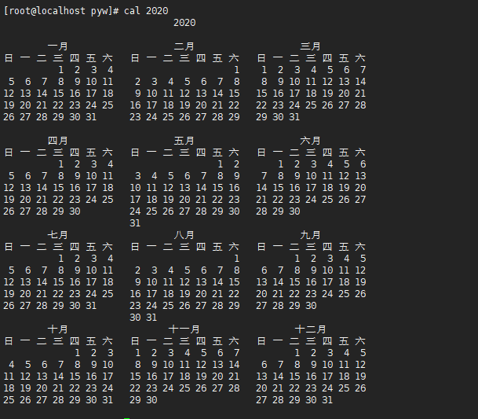
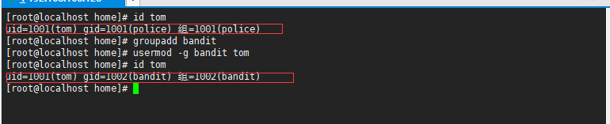

# Linux学习记录

# 第一章 Linux开山篇

## 1.1 内容介绍


## 1.2学习方向

### 1.2.1 linux运维工程师

### 1.2.2 linux嵌入式开发工程师

### 1.2.3 在linux下做各种程序开发

### 1.2.4 示意图


## 1.3 linux的应用领域

### 1.3.1 个人桌面应用领域

​	此领域是传统linux应用最薄弱的环节,传统linux由于界面简单、操作复杂、应用软件少的缺点,一直被windows所压制,但近些年随着ubuntu、fedora等优秀桌面环境的兴起,同时各大硬件厂商对其支持的加大,linux在个人桌面领域的占有率有所提高。

### 1.3.2 服务器应用领域

- linux在服务器领域的应用是最强的
- linux免费、稳定、高效等特点在这里得到了很好的体现，近些年来linux服务器市场得到了飞速的提升，尤其在一些高端领域尤为广泛。

### 1.3.3 嵌入式应用领域

- 近些年来linux在嵌入式领域的应用得到了飞速的提高
- linux运行稳定、对网络的良好支持性、低成本，且可以根据需要进行软件裁剪。内核最小可以达到几百KB等特点，使其近些年来在嵌入式领域的应用得到非常大的提高
- 主要应用：机顶盒、数字电视、网络电话、程控交换机、手机、PDA、智能家居、智能硬件等都是其应用领域。以后在物联网中应用会更加广泛

## 1.4 学习Linux的阶段(高手进阶过程)

- Linux是一个开源、免费的操作系统,其稳定性、安全性、处理多并发已经得到业界的认可,目前很多中型，大型甚至是集群项目都在使用Linux,很多软件公司考虑到开发成本都首选Linux,在中国软件工程得到广泛的使用。
- 第一阶段:Linux环境下的基本操作命令,包括文件操作命令(rm mkdir chomd,chown)编辑工具使用(vi vim) Linux用户管理(useradd userdel usermod)等
- 第二阶段:Linux的各种配置(环境变量配置,网络配置,服务配置)
- 第三阶段:Linux如何搭建对应语言的开发环境(大数据,javaee,python等)
- 第四阶段:能编写shell脚本,对Linux服务器进行维护
- 第五阶段:能进行安全设置,防止攻击,保障服务器正常进行,能对系统调优
- 第六阶段:深入理解Linux系统(对内核有研究),熟练掌握大型网站应用架构组成、并熟悉各个环境的部署和维护方法。

## 1.5 Linux的学习方法和建议

- 高效而愉快的学习
- 先建立一个整体框架,然后细节
- 不需要掌握所有的Linux指令,要学会查询手册和百度
- 先know how,再know why
- 计算机是一门"做中学"的学科,不是会了再做,而是做了才会
- 适当的囫囵吞枣
- Linux不是编程,重点是实际操作,各种常用指令要玩的溜

# 第二章 Linux基础篇

## 2.1 Linux介绍

- Linux怎么读,[里纽克斯,利尼克斯,里纳克斯]
- Linux是一款操作系统,免费,开源,安全,高效,稳定,处理高并发非常强悍,现在很多的企业级的项目都部署到Linux/unix服务器运行
- Linux创始人- linus 林纳斯
- Linux的吉祥物: 企鹅 tux
- Linux主要发行版本
  - Centos
  - Ubuntu
  - Suse
  - 红旗Linux
- 目前主要的操作系统
  - windows
  - android
  - 车载系统
  - linux

## 2.2 unxi 是怎么来的


## 2.3 Linux是怎么来的


## 2.4 Linux与Unix的关系


## 2.5Linux与Windows比较


# 第三章 Linux基础篇VM和Linux系统(CentOS)安装

## 3.1 安装VM和Centos

​	学习Linux需要一个环境,我们需要创建一个虚拟机,然后在虚拟机上安装一个Centos系统来学习

- 先安装virtual machine vm12
- 再安装Linux(CentOS 6.8)

## 3.2 vm软件和CentOS的关系


## 3.3 VM安装的步骤

- 去BIOS里修改设置开启虚拟化设备支持
- 安装虚拟机软件

## 3.4 CentOS安装的步骤

- 创建虚拟机
  - 网络设置
    - 桥接模式: 直接连接到物理网络,即与主机共享IP段,如果人数较多,可能产生IP冲突
    - NAT模式:网络地址转换方式:Linux可以访问外网,不会造成IP冲突
    - 主机模式: 独立主机,不能访问外网
- 安装Centos
  - 分区介绍
    - boot:系统引导区
    - swap: 虚拟内存(一般分配为物理内存的1.5倍)
    - 根目录(/):所剩空间都给它

## 3.5 Centos的终端使用和联网

- 终端的使用

  

- 配置网络

  

## 3.6 vmtools安装

### 3.6.1 介绍

- 可以直接粘贴命令在windows和centos系统之间
- 可以设置windows和centos的共享文件夹

## 3.7 vmtools的安装和使用

### 3.7.1 安装vmtools的步骤说明

- 进入centos
- 点击vm菜单的->install vmware tools
- centos会出现一个vm的安装包
- 点击右键解压,得到一个安装文件
- 进入该vm解压的目录,该文件在/root/桌面/vmware-tools-distrib/下
- 安装 ./vmware-install.pl
- 全部使用默认设置即可
- 需要reboot重新启动即可生效

### 3.7.2 使用vmtools设置共享文件夹

- 虚拟机-> 设置

  

- 选项->共享文件夹->总是启用-> 添加

  

- 共享文件夹默认在centos的/mnt/hgfs

# 第四章 Linux基础篇Linux的目录结构

## 4.1 基本介绍

​	Linux的文件系统是采用级层式的树状目录结构,在此结构中的最上层是根目录"/",然后再次目录下再创建其它的目录。

​	在Linux的世界里,一切皆文件。


## 4.2 目录结构具体介绍


# 第五章 Linux实操篇 远程登录Linux系统

## 5.1为什么需要远程登录Linux


- Linux服务器是开发小组共享
- 正式上线的项目是运行在公网的
- 因此程序员需要远程登录到centos进行项目管理或者开发
- 远程登录客户端有Xshell5,Xftp

## 5.2 远程登录Linux-Xshell5

- 介绍

  - Xshell是目前最好的远程登录到Linux操作的软件，流畅的速度并且完美解决了中文乱码的问题，是目前程序员首选的软件
  - Xshell是一个强大的安全终端模拟软件，它支持SSH1,SSH2,以及Microsoft Windows平台的TWLNET协议
  - Xshell可以在Windows界面下用来访问远端不同系统下的服务器,从而比较好的达到远程控制中断的目的

  

- 特别说明
  
  - 如果希望安装好Xshell5就可以远程访问Linux系统的话,需要Linux开启了一个SSHD服务监听22端口

## 5.3 安装XShell5并使用


## 5.4 远程上传下载文件Xftp5

### 5.4.1 XFtp介绍

​	是一个基于Windows平台的功能强大的SFTP、FTP文件传输软件。使用了XFTP以后，Windows用户能安全地在Unix/linux和windows之间传输文件。

# 第六章 Linux实操篇 vi与vim编辑器

## 6.1 vi和vim的基本介绍

​	所有的Linux系统都会内建vi文本编辑器。

​	vim具有程序编辑的能力,可以看到vi的增强版本,可以主动以字体颜色辨别语法的正确性,方便程序设计。代码补完、编辑及错误跳转等方便变成的功能特别丰富,在程序员中被广泛使用。

## 6.2 vi与vim的三种常见模式

### 6.2.1 正常模式

​	在正常模式下，我们可以使用快捷键。

​	以vim打开一个档案就直接进入一般模式了。在这个模式中，你可以使用[上下左右]按键来移动光标,你可以使用【删除字符】或【删除整行】来处理档案内容，也可以使用【复制、贴上】来处理你的文件数据。

### 6.2.2 插入模式

​	在插入模式下，程序员可以输入内容。

​	按下任意一个字母之后才会进行编辑模式，一般来说按i即可

### 6.2.3 命令行模式

​	在这个模式当中，可以提供你相关指令，完成读取、存盘、替换、离开vim、显示行号等动作在此模式中达成

## 6.3快速入门案例

​	使用vim开发一个Hello.java程序，保存，步骤说明和演示。


# 第七章 实操篇 开机、重启和用户登录注销

## 7.1 关机&重启命令

### 7.1.1 基本介绍

- shutdown
  - shutdown -h now:立即关机
  - shutdown -h 1:表示1分钟后关机
  - shutdown -r now:立即重启
- halt:直接使用,效果等价与关机
- reboot:重启系统
- syn:把内存的数据同步到磁盘

### 7.1.2 注意细节

​	当我们关机或者重启时，都应该先执行以下sync指令,把内存的数据写入磁盘,防止数据丢失。


## 7.2 用户登录和注销

### 7.2.1 基本介绍

- 登录时尽量少用root帐号登录,因为它是系统管理员,最大的权限,避免操作失误。可以利用普通用户登录,登录后再用"su - 用户名"命令来切换成系统管理员身份。
- 在提示符下输入logout即可注销用户

# 第八章 Linux实操篇 用户管理

## 8.1 基本介绍


- Linux系统是一个多用户多任务的操作系统,任何一个要使用系统资源的用户,都必须首先向系统管理员申请一个账号,然后以这个账号的身份进入系统
- Linux的用户需要至少属于一个组

## 8.2添加用户

### 8.2.1 基本语法

```shell
useradd 用户名
```

### 8.2.2 实际案例

添加用户


### 8.2.3 细节说明

- 当创建用户成功后,会自动的创建和用户同名的家目录
- 也可以通过useradd -d 指定目录 用户名,给新创建的用户指定家目录

## 8.3 给用户指定或修改密码

- 基本语法

  ```shell
  passwd 用户名
  ```

## 8.4 删除用户

- 基本语法

  ```shell
  userdel 用户名
  ```

- 应用案例

  - 删除用户，但是保留家目录

    ```shell
    userdel 用户名
    ```

    

  - 删除用户以及用户主目录

    ```shell
    userdel -r 用户名
    ```


## 8.5 细节说明

### 8.5.1 基本语法

```shell
id 用户名
```

返回格式:

uid = 用户ID号 

gid = 所在组的ID号 

组= 所在组的名称

### 8.5.2 应用实例

### 8.5.3 细节说明

​	当用户不存在时,返回“无此用户”

## 8.6 切换用户

### 8.6.1 介绍

​	在操作Linux中,如果当前用户的权限不够,可以通过su - 指令,切换到高权限用户,比如 root 

### 8.6.2 基本语法

```shell
su - 切换用户名
exit // 返回原先用户
```


## 8.7 用户名

### 8.7.1 介绍

​	类似于角色,系统可以对有共性的多个用户进行统一的管理

### 8.7.2 增加组

```shell
groupadd 组名
```

### 8.7.3 删除组

```shell
groupdel 组名
```

## 8.8 增加用户时直接加上组

### 8.8.1 基本语法

```shell
useradd -g 用户组 用户名
```

## 8.9 修改用户的组

### 8.9.1 基本语法

```shell
usermod -g 用户组 用户名
```

## 8.10 /etc/passwd 文件

​	用户的配置文件,记录用户的各种信息

​	每行的含义:用户名:口令:用户标识号:组标识号:注释性描述:主目录:登录shell

## 8.11 /etc/shadow 文件

​	口令的配置文件

​	每行的含义:登录名:加密口令:最后一次修改时间:最小时间间隔:最大时间间隔:警告时间:不活动时间:失效时间:标志

## 8.12  /etc/group 文件

​	组(group)的配置文件,记录Linux包含的组的信息

​	每行含义: 组名:口令:组标识号:组内用户列表

# 第九章 Linux实操篇 实用指令

## 9.1 指定运行级别

运行级别说明:

0. 关机
1. 单用户(找回丢失密码)
2. 多用户状态没有网络服务
3. 多用户状态有网络服务
4. 系统未使用保留给用户
5. 图形界面
6. 系统重启

常用的运行级别是3和5,要修改默认的运行级别可改文件

[参考](https://www.linuxidc.com/Linux/2016-04/130558.htm)

/etc/inittab的id:5:initdefault:这一行中的数字

示意图:


## 9.2 切换到指定运行级别的指令

- 基本语法

  ```shell
  init [级别]
  ```

  

### 9.2.1 面试题

​	如何找回root密码,如果我们不小心忘记root密码,怎么找回。

​	思路: 进入到单用户模式,然后修改root密码。因为进入单用户模式,root不需要密码就可以登录。

​	[参考](https://www.linuxidc.com/Linux/2018-01/150211.htm)

## 9.3 帮助指令

### 9.3.1 介绍

​	当我们对某个指令不熟悉时,我们可以使用Linux提供的帮助指令来了解这个指令的使用方法。

### 9.3.2 man 获得帮助信息

- 基本语法

  ```shell
  man [命令或配置文件]
  ```

  

- 应用实例

  - 查看ls命令的帮助信息

    ```shell
    man ls
    ```

    

### 9.3.2 help 获得帮助信息

- 基本语法

  ```shell
  help [命令或配置文件]
  ```

- 应用实例

  - 查看cd命令的帮助信息

    

## 9.4 文件目录类

### 9.4.1 pwd指令

- 基本语法

  ```shell
  pwd
  ```

- 应用实例

  

### 9.4.2 ls指令

- 基本语法

  ```shell
  ls [选项] [目录或是文件]
  ```

  

- 常用选项

  -a:显示当前木梭所有的文件和目录,包括隐藏的

  -l:以列表的方式显示信息

- 应用实例

  - 查看当前目录的所有内容信息

  - 不显示隐藏

    

  - 显示隐藏

    

### 9.4.3 cd指令

- 基本语法

  ```shell
  cd [参数](功能描述:切换到指定目录)
  ```

- 常用参数

  - 绝对路径和相对路径
  - cd~或者cd:回到自己的家目录
  - cd..:回到当前目录的上一级目录

- 应用实例

  - 使用绝对路径切换到root目录


### 9.4.4 mkdir 指令

​	mkdir 指令用于创建目录(make directory)

- 基本语法

  ```shell
  mkdir [选项] 要创建的目录
  ```

- 常用选项

  - -p: 创建多级目录

### 9.4.5 rmdir指令

- 介绍

  - rmdir指令删除空目录

- 基本语法

  ```shell
  rmdir [选项] 要删除的空目录
  ```

- 使用细节

  - rmdir删除的是空目录,如果目录下有内容时无法删除
  - 如果需要删除非空目录,需要使用rm -rf 要删除的目录

### 9.4.6 touch指令

​	touch指令创建空文件

- 基本语法

  ```shell
  touch 文件名称
  ```

- 使用案例

  

### 9.4.7 cp指令

​	cp指令拷贝文件到指定目录

- 基本语法

  ```shell
  cp [选项] 源文件 目标路径 // 会提示是否覆盖原有文件
  \cp [选项] 源文件 目标路径 // 不会提示是否覆盖原有文件
  ```

  

- 常用选择

  - -r: 递归复制整个文件夹

### 9.4.8 rm指令

​	rm指令移除文件或目录

- 基本语法

  ```shell
  rm [选项] 要删除得到文件或目录
  ```

- 常用选项

  - -r:递归删除整个文件夹
  - -f:强制删除不提示

- 使用案例

  - 递归强制删除整个文件夹

    ```shell
    rm -rf 文件夹
    ```

### 9.4.9 mv指令

​	mv移动文件与目录或重命名

- 基本语法

  ```shell
  mv oldNameFile newNameFile // 重命名
  mv 旧路径 新路径 // 移动文件
  ```

### 9.4.10 cat指令

​	cat查看文件内容,以只读的方式

- 基本语法

  ```shell
  cat [选项] 要查看的文件
  ```

- 常用选相关

  - -n: 显示行号

- 使用细节

  - cat只能浏览文件,无法修改文件

  - 为了浏览方便,一般会带上管道命令 |more

    ```shell
    cat -n /etc/profile | more // 以cat指令打开文件,并分页显示
    ```

###  9.4.11 more指令

​	more指令是一个基于VI编辑器的文本过滤器,它以全屏幕的方式按页文本文件的内容。more指令中内置了若干快捷键,详见操作说明

- 基本语法

  ```shell
  more 要查看的文件
  ```

- 操作说明

  |  操作  |       功能说明       |
  | :----: | :------------------: |
  | space  |       向下翻页       |
  | enter  |      向下翻一行      |
  |   q    |       立即离开       |
  | ctrl+f |     向下滚动一屛     |
  | ctrl+b |      返回上一屛      |
  |   =    |   输出当前行的行号   |
  |   :f   | 输出文件名和当前行号 |

- 应用实例

  - 案例:	采用more查看/etc/profile文件

    


### 9.4.12 less指令

​	less指令用来分屏查看文件内容,它的功能与more指令个类似,但是比more指令更加强大,支持各种显示终端。less指令在显示文件内容时,**并不是一次将整个文件加载之后才显示,而是根据显示需要加载内容**,对于显示大型文件具有较高的效率。

- 基本语法

  ```shell
  less 文件名
  ```

  

- 操作说明

  |   操作   |                    功能说明                     |
  | :------: | :---------------------------------------------: |
  |  space   |                    向下翻页                     |
  | pagedown |                  向下翻动一页                   |
  |  pageup  |                  向上翻动一页                   |
  |  /字串   | 向下搜寻[字串]的功能: n: 向下查找; N: 向上查找; |
  |  ?字串   | 向上搜寻[字串]的功能:n: 向上查找; N: 向下查找;  |
  |    q     |                离开less这个程序                 |

### 9.4.13 >指令和>> 指令

- \> 指令和 >> 指令

  - \> 输出重定向
  - \>> 追加

- 基本语法

  - ls -l > a.txt：将 ls -l 显示内容覆盖写入到a.txt中,如果该文件不存在则创建

    

  - ls -l >> b.txt:将 ls -l 显示内容追加写入到b.txt

    

  - cat 文件1 > 文件2: 将文件1的内容覆盖写入到文件2

    

  - echo "内容" >> 文件:将内容追加到文件当中去

    

- 应用实例

  - 案例一: 将/home目录下的文件列表 写入到/ home/info.txt中

### 9.4.14 echo指令

​	echo输出内容到控制台

- 基本语法

  ```shell
  echo [选项] [输出内容]
  ```

- 应用案例

  - 使用echo 指令输出环境变量,输出当前的环境变量

    

  - 使用echo 指令输出hello,world!

### 9.4.15 head指令

​	head用于显示文件的开头部分内容,默认情况下head指令显示文件的前10行

- 基本语法

  ```shell
  head 文件 // 查看文件头10行内容
  head -n 5 文件 // 查看文件头5行内容,5可以是任意行数
  ```

- 应用实例

  - 查看/etc/profile的前面5行代码

    

### 9.4.16 tail指令

​	tail用于输出文件中尾部的内容,默认情况下tail指令个显示文件的后10行内容。

- 基本语法

  ```shell
  tail 文件  // 查看文件后10行内容
  tail -n 5 文件  // 查看文件后5行内容,5可以是任意行数
  tail -f 文件 //  实时追踪该文档的更新
  ```

- 应用实例

  - 查看/etc/porfile最后5行的代码

    

  - 实时监控mydate.txt,看文件有变化时,是否看到,实时的追加日期

    

### 9.4.17 ln指令

​	软链接也叫符号链接,类似于windows里的快捷方式,主要存放了连接其他文件的路径

- 基本语法

  ```shell
  ln -s [源文件或目录] [软链接名]
  ```

- 应用实例

  - 在/home目录下创建一个软连接LinkToRoot,连接到/root目录

    

  - 删除软连接LinkToRoot

    

### 9.4.18 history指令

​	查看已经执行过历史命令,也可以执行历史命令

- 基本语法

  ```shell
  history 
  ```

  

- 应用实例

  - 显示所有的历史命令

    

  - 实现最近使用过的10个指令

    

  - 执行历史编号为9的指令

    

## 9.5 时间日期类

### 9.5.1 date指令-显示当前日期

- 基本语法

  ```shell
  date // 显示当前时间
  date + %Y // 显示当前年份
  date + %m // 显示当前月份
  date + %d // 显示当前是那一天
  date "+%Y-%m-%d %H:%M:%S" // 显示年月日时分秒
  ```

  

- 应用案例

  - 显示当前时间信息

    

  - 显示当前时间年月日

    

  - 显示当前时间年月日时分秒

    

### 9.5.2 date指令-设置日期

- 基本语法

  ```shell
  date -s 字符串时间
  ```

- 应用实例

  - 设置系统当前时间

    

### 9.5.3 cal指令

​	查看日历指令

- 基本语法

  ```shell
  cal [选项] // 不加选项,显示本月日历
  ```

- 应用实例

  - 显示当前日历

    

  - 显示2020年日历

    

## 9.6 查找指令

### 9.6.1 find指令

​	find指令将从指定目录向下递归地遍历其各个子目录,将满足条件的文件或者目录显示在终端

- 基本语法

  ```shell
  find [搜索范围] [选项]
  ```

- 选项说明

  |      选项       |               说明               |
  | :-------------: | :------------------------------: |
  | -name<查询方式> | 按照指定的文件名查找模式查找文件 |
  |  -user<用户名>  |    查找输入指定用户名所有文件    |
  | -size<文件大小> |    按照指定的文件带下查找文件    |

- 应用实例

  - 按文件名

    

  - 按拥有者

    

  - 查找整个Linux系统下大于20M的文件(+n大于 -n小于 n等于)

    

  - 通配查找

    

### 9.6.2 locate指令

​	locate指令可以快速定位文件路径。locate指令利用事先建立的系统中所有文件名称及路径的locate数据库事先快速定位给定的文件。locate指令无需遍历整个文件夹,查询速度较快。为了保证查询结果的准确度,管理员必须定期更新locate时刻。

- 基本语法

  ```shell
  locate 搜索文件
  ```

- 特别说明

  - 由于locate指令基于数据库进行查询,所以第一次运行前,必须使用updatedb指令创建locate数据库。

- 应用实例

  - 使用locate指令快速定位hello.txt文件所在目录

    

### 9.6.3 grep指定与管理符号 |

​	grep过滤查找,管道符,"|",表示将前一个命令的处理结果输出传递给后面的命令处理。

- 基本语法

  ```shell
  grep [选项] 查找内容 源文件
  ```

- 常用选项

  | 选项 |       功能       |
  | :--: | :--------------: |
  |  -n  | 显示匹配行及行号 |
  |  -i  |  忽略字母大小写  |

- 应用案例

  - 在hello.txt文件中查找yes所在行,并显示行号

    

## 9.7 压缩和解压类

 ### 9.7.1 gzip/gunzip指令

​	gzip用于压缩文件,gunzip用于解压

- 基本语法

  ```shell
  gzip 文件 // 压缩文件,只能将文件压缩为*.gz文件
  gunzip 文件.gz // 解压缩文件命令
  ```

- 应用实例

  - gzip压缩,将/home下hello.txt压缩

    

  - gunzip解压缩

    

- 注意事项
  
  - 此压缩会删除原先的文本

### 9.7.2 zip/unzip 指令

​	zip用于压缩文件,unzip用于解压文件

- 基本语法

  ```shell
  zip [选项] XXX.zip 将要压缩的内容 // 压缩文件和目录的命令
  unzip [选项] XXX.zip // 解压缩文件
  ```

- zip常用选项

  - -r: 递归压缩,即压缩目录

- unzip的常用选项

  - -d <目录>:指定解压后文件的存放目录

- 应用实例

  ```shell
  zip -r mypackage.zip /home // 打包home目录下所有的文件
  
  unzip -d /opt/tmp/ mypackage.zip // 将mypackage解压到/opt/tmp下
  ```

### 9.7.3 tar指令

​	tar指令是打包指令,最后打包后的文件是.tar.gz的文件

- 基本语法

  ```shell
  tar [选项] XXX.tar.gz 打包的内容 // 打包目录,压缩后格式为.tar.gz
  ```

- 选项说明

  | 选项 |        功能        |
  | :--: | :----------------: |
  |  -c  |  产生.tar打包文件  |
  |  -v  |    显示详细信息    |
  |  -f  | 指定压缩后的文件名 |
  |  -z  |    打包同时压缩    |
  |  -x  |    解包.tar文件    |

- 应用实例

  - 压缩多个文件,将/home/a.txt和/home/b.txt压缩成a.tar.gz

    

  - 将/home 的文件夹压缩成myhome.tar.gz

    

  - 将a.tar.gz解压

    

  - myhome.tar.gz解压到/opt

    

# 第十章 Linux实操篇 组管理与权限管理

## 10.1 Linux组基本介绍

​	在Linux中的每个用户必须属于一个组,不能独立于组外。在Linux中每个文件有所有者、所在组、其它组的概念。

- 所有者
- 所在组
- 其它组
- 改变用户所在的组


## 10.2 文件/目录 所有者

​	一般为文件的创建者,谁创建了该文件,就自然的成为该文件的所有者

### 10.2.1 查看文件的所有者

- 指令:ls -ahl

- 应用实例

  - 创建一个组police,再创建一个用户tom,并将tom放在police组，然后新建一个文件ok.txt,查看ok.txt所有者

    

    

### 10.2.2 修改文件的所有者

- 指令

  ```shell
  chown 用户名 文件名
  ```

- 应用案例

  - 使用root创建一个文件apple.txt,然后将其所有者修改为tom

    

## 10.3 组的创建

### 10.3.1 基本指令

```shell
groupadd 组名
```

### 10.3.2 应用实例

- 创建一个组monster
- 创建一个用户fox,并放入到monster组中

## 10.4 文件/目录所在组

​	当某个用户创建了一个文件后,默认这个文件的所在组就是该用户所在的组

### 10.4.1 查看文件/目录所在组

- 基本指令

  ```shell
  ls -ahl
  ```

### 10.4.2 修改文件所在的组

- 基本指令

  ```shell
  chgrp 组名 文件名
  ```

- 应用实例

  - 使用root用户创建文件orange.txt,看看当前这个文件属于那个组,然后将这个文件所在组,修改到police组。

    

## 10.5 其它组

​	除文件的所有者和所在组的用户外,系统的其它用户都是文件的其它组。

## 10.6 改变用户所在组

​	在添加用户时,可以指定将该用户添加到那个组中,同样的用root的管理权限可以改变某个用户所在的组。

### 10.6.1 改变用户所在组

```shell
usermod -g 组名 用户名
usermod -d 目录名 用户名  // 改变该用户登录的初始目录
```

### 10.6.2 应用实例

​	创建一个土匪组(bandit)将tom这个用户从原来所在的police组,修改到bandit组

​	

## 10.7 权限的基本介绍

​	ls -l 中显示的内容如下:

​	**-rwxrw-r--** 1 root root 1213 Feb 2 09:39 abc

​	0-9位说明：

1. 第0为确定文件类型

2. 第1-3位确定所有者拥有该文件的权限

3. 第4-6位确定所属组拥有该文件的权限

4. 第7-9为确定其他用户拥有该文件的权限

   

## 10.8 权限详解

### 10.8.1 rwx作用到文件

- [r]代表可读(read):可以读取,查看
- [w]代表可写(write):可以修改,但是不代表可以删除该文件,删除一个文件的前提条件是对该文件所在目录有写权限,才能删除该文件
- [x]代表可执行(execute):可以被执行

### 10.8.2 rwx作用到目录

- [r]代表可读(read):可以读取,ls查看目录内容
- [w]代表可写(write):可以修改,目录内创建+删除+重命名目录
- [x]代表可执行[execute]:可以进入该目录

## 10.9 文件及目录权限实际案例

- ls -l 中显示的内容如下:

  

  ```shell
  drwx------. 16 pyw  pyw    4096 10月  6 23:38 pyw
  ```

  - 10个字符确定不同用户对文件干什么

  - 第一个字符代表文件类型
    - 文件(-)
    - 目录(d)
    - 链接(l)
  - 其余字符每三个一组(rwx): r(读)、w(写)、x(执行)
    - -rw-r--r--.  1 tom  root      0 10月  6 23:41 apple.txt
      - rw-:代表文件拥有者拥有的权限是读写
      - r--:与文件拥有者同一组得到用户的权限是只读
      - r--:不与文件拥有者同组的其它用户的权限是只读

- 可用数字表示为: r=4,w=2,x=1 因此rwx=4+2+1=7

  