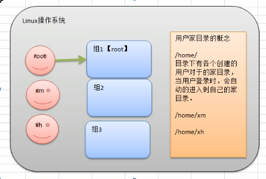
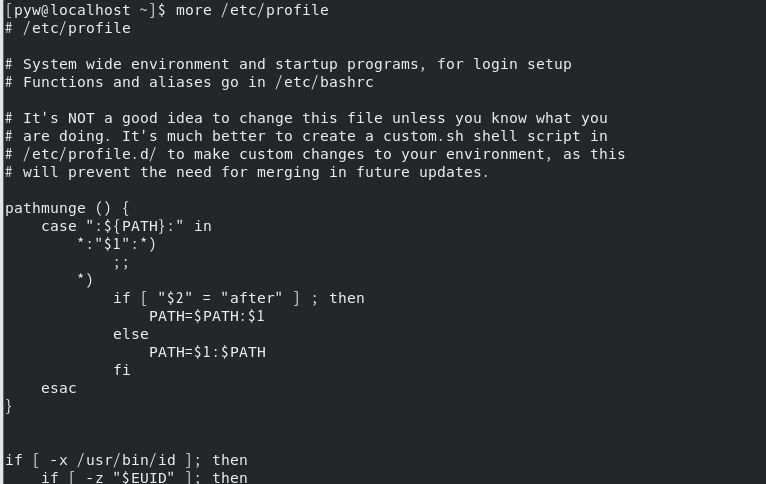
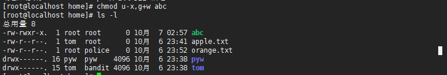
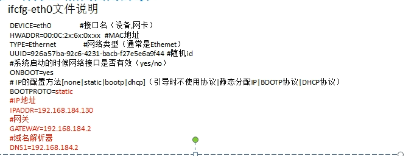

# Linux学习记录

# 第一章 Linux开山篇

## 1.1 内容介绍


## 1.2学习方向

### 1.2.1 linux运维工程师

### 1.2.2 linux嵌入式开发工程师

### 1.2.3 在linux下做各种程序开发

### 1.2.4 示意图


## 1.3 linux的应用领域

### 1.3.1 个人桌面应用领域

​	此领域是传统linux应用最薄弱的环节,传统linux由于界面简单、操作复杂、应用软件少的缺点,一直被windows所压制,但近些年随着ubuntu、fedora等优秀桌面环境的兴起,同时各大硬件厂商对其支持的加大,linux在个人桌面领域的占有率有所提高。

### 1.3.2 服务器应用领域

- linux在服务器领域的应用是最强的
- linux免费、稳定、高效等特点在这里得到了很好的体现，近些年来linux服务器市场得到了飞速的提升，尤其在一些高端领域尤为广泛。

### 1.3.3 嵌入式应用领域

- 近些年来linux在嵌入式领域的应用得到了飞速的提高
- linux运行稳定、对网络的良好支持性、低成本，且可以根据需要进行软件裁剪。内核最小可以达到几百KB等特点，使其近些年来在嵌入式领域的应用得到非常大的提高
- 主要应用：机顶盒、数字电视、网络电话、程控交换机、手机、PDA、智能家居、智能硬件等都是其应用领域。以后在物联网中应用会更加广泛

## 1.4 学习Linux的阶段(高手进阶过程)

- Linux是一个开源、免费的操作系统,其稳定性、安全性、处理多并发已经得到业界的认可,目前很多中型，大型甚至是集群项目都在使用Linux,很多软件公司考虑到开发成本都首选Linux,在中国软件工程得到广泛的使用。
- 第一阶段:Linux环境下的基本操作命令,包括文件操作命令(rm mkdir chomd,chown)编辑工具使用(vi vim) Linux用户管理(useradd userdel usermod)等
- 第二阶段:Linux的各种配置(环境变量配置,网络配置,服务配置)
- 第三阶段:Linux如何搭建对应语言的开发环境(大数据,javaee,python等)
- 第四阶段:能编写shell脚本,对Linux服务器进行维护
- 第五阶段:能进行安全设置,防止攻击,保障服务器正常进行,能对系统调优
- 第六阶段:深入理解Linux系统(对内核有研究),熟练掌握大型网站应用架构组成、并熟悉各个环境的部署和维护方法。

## 1.5 Linux的学习方法和建议

- 高效而愉快的学习
- 先建立一个整体框架,然后细节
- 不需要掌握所有的Linux指令,要学会查询手册和百度
- 先know how,再know why
- 计算机是一门"做中学"的学科,不是会了再做,而是做了才会
- 适当的囫囵吞枣
- Linux不是编程,重点是实际操作,各种常用指令要玩的溜

# 第二章 Linux基础篇

## 2.1 Linux介绍

- Linux怎么读,[里纽克斯,利尼克斯,里纳克斯]
- Linux是一款操作系统,免费,开源,安全,高效,稳定,处理高并发非常强悍,现在很多的企业级的项目都部署到Linux/unix服务器运行
- Linux创始人- linus 林纳斯
- Linux的吉祥物: 企鹅 tux
- Linux主要发行版本
  - Centos
  - Ubuntu
  - Suse
  - 红旗Linux
- 目前主要的操作系统
  - windows
  - android
  - 车载系统
  - linux

## 2.2 unxi 是怎么来的


## 2.3 Linux是怎么来的


## 2.4 Linux与Unix的关系


## 2.5Linux与Windows比较


# 第三章 Linux基础篇VM和Linux系统(CentOS)安装

## 3.1 安装VM和Centos

​	学习Linux需要一个环境,我们需要创建一个虚拟机,然后在虚拟机上安装一个Centos系统来学习

- 先安装virtual machine vm12
- 再安装Linux(CentOS 6.8)

## 3.2 vm软件和CentOS的关系


## 3.3 VM安装的步骤

- 去BIOS里修改设置开启虚拟化设备支持
- 安装虚拟机软件

## 3.4 CentOS安装的步骤

- 创建虚拟机
  - 网络设置
    - 桥接模式: 直接连接到物理网络,即与主机共享IP段,如果人数较多,可能产生IP冲突
    - NAT模式:网络地址转换方式:Linux可以访问外网,不会造成IP冲突
    - 主机模式: 独立主机,不能访问外网
- 安装Centos
  - 分区介绍
    - boot:系统引导区
    - swap: 虚拟内存(一般分配为物理内存的1.5倍)
    - 根目录(/):所剩空间都给它

## 3.5 Centos的终端使用和联网

- 终端的使用

  

- 配置网络

  

## 3.6 vmtools安装

### 3.6.1 介绍

- 可以直接粘贴命令在windows和centos系统之间
- 可以设置windows和centos的共享文件夹

## 3.7 vmtools的安装和使用

### 3.7.1 安装vmtools的步骤说明

- 进入centos
- 点击vm菜单的->install vmware tools
- centos会出现一个vm的安装包
- 点击右键解压,得到一个安装文件
- 进入该vm解压的目录,该文件在/root/桌面/vmware-tools-distrib/下
- 安装 ./vmware-install.pl
- 全部使用默认设置即可
- 需要reboot重新启动即可生效

### 3.7.2 使用vmtools设置共享文件夹

- 虚拟机-> 设置

  

- 选项->共享文件夹->总是启用-> 添加

  

- 共享文件夹默认在centos的/mnt/hgfs

# 第四章 Linux基础篇Linux的目录结构

## 4.1 基本介绍

​	Linux的文件系统是采用级层式的树状目录结构,在此结构中的最上层是根目录"/",然后再次目录下再创建其它的目录。

​	在Linux的世界里,一切皆文件。


## 4.2 目录结构具体介绍


# 第五章 Linux实操篇 远程登录Linux系统

## 5.1为什么需要远程登录Linux


- Linux服务器是开发小组共享
- 正式上线的项目是运行在公网的
- 因此程序员需要远程登录到centos进行项目管理或者开发
- 远程登录客户端有Xshell5,Xftp

## 5.2 远程登录Linux-Xshell5

- 介绍

  - Xshell是目前最好的远程登录到Linux操作的软件，流畅的速度并且完美解决了中文乱码的问题，是目前程序员首选的软件
  - Xshell是一个强大的安全终端模拟软件，它支持SSH1,SSH2,以及Microsoft Windows平台的TWLNET协议
  - Xshell可以在Windows界面下用来访问远端不同系统下的服务器,从而比较好的达到远程控制中断的目的

  

- 特别说明
  
  - 如果希望安装好Xshell5就可以远程访问Linux系统的话,需要Linux开启了一个SSHD服务监听22端口

## 5.3 安装XShell5并使用


## 5.4 远程上传下载文件Xftp5

### 5.4.1 XFtp介绍

​	是一个基于Windows平台的功能强大的SFTP、FTP文件传输软件。使用了XFTP以后，Windows用户能安全地在Unix/linux和windows之间传输文件。

# 第六章 Linux实操篇 vi与vim编辑器

## 6.1 vi和vim的基本介绍

​	所有的Linux系统都会内建vi文本编辑器。

​	vim具有程序编辑的能力,可以看到vi的增强版本,可以主动以字体颜色辨别语法的正确性,方便程序设计。代码补完、编辑及错误跳转等方便变成的功能特别丰富,在程序员中被广泛使用。

## 6.2 vi与vim的三种常见模式

### 6.2.1 正常模式

​	在正常模式下，我们可以使用快捷键。

​	以vim打开一个档案就直接进入一般模式了。在这个模式中，你可以使用[上下左右]按键来移动光标,你可以使用【删除字符】或【删除整行】来处理档案内容，也可以使用【复制、贴上】来处理你的文件数据。

### 6.2.2 插入模式

​	在插入模式下，程序员可以输入内容。

​	按下任意一个字母之后才会进行编辑模式，一般来说按i即可

### 6.2.3 命令行模式

​	在这个模式当中，可以提供你相关指令，完成读取、存盘、替换、离开vim、显示行号等动作在此模式中达成

## 6.3快速入门案例

​	使用vim开发一个Hello.java程序，保存，步骤说明和演示。


# 第七章 实操篇 开机、重启和用户登录注销

## 7.1 关机&重启命令

### 7.1.1 基本介绍

- shutdown
  - shutdown -h now:立即关机
  - shutdown -h 1:表示1分钟后关机
  - shutdown -r now:立即重启
- halt:直接使用,效果等价与关机
- reboot:重启系统
- syn:把内存的数据同步到磁盘

### 7.1.2 注意细节

​	当我们关机或者重启时，都应该先执行以下sync指令,把内存的数据写入磁盘,防止数据丢失。


## 7.2 用户登录和注销

### 7.2.1 基本介绍

- 登录时尽量少用root帐号登录,因为它是系统管理员,最大的权限,避免操作失误。可以利用普通用户登录,登录后再用"su - 用户名"命令来切换成系统管理员身份。
- 在提示符下输入logout即可注销用户

# 第八章 Linux实操篇 用户管理

## 8.1 基本介绍



- Linux系统是一个多用户多任务的操作系统,任何一个要使用系统资源的用户,都必须首先向系统管理员申请一个账号,然后以这个账号的身份进入系统
- Linux的用户需要至少属于一个组

## 8.2添加用户

### 8.2.1 基本语法

```shell
useradd 用户名
```

### 8.2.2 实际案例

添加用户


### 8.2.3 细节说明

- 当创建用户成功后,会自动的创建和用户同名的家目录
- 也可以通过useradd -d 指定目录 用户名,给新创建的用户指定家目录

## 8.3 给用户指定或修改密码

- 基本语法

  ```shell
  passwd 用户名
  ```

## 8.4 删除用户

- 基本语法

  ```shell
  userdel 用户名
  ```

- 应用案例

  - 删除用户，但是保留家目录

    ```shell
    userdel 用户名
    ```

    

  - 删除用户以及用户主目录

    ```shell
    userdel -r 用户名
    ```


## 8.5 细节说明

### 8.5.1 基本语法

```shell
id 用户名
```

返回格式:

uid = 用户ID号 

gid = 所在组的ID号 

组= 所在组的名称

### 8.5.2 应用实例

### 8.5.3 细节说明

​	当用户不存在时,返回“无此用户”

## 8.6 切换用户

### 8.6.1 介绍

​	在操作Linux中,如果当前用户的权限不够,可以通过su - 指令,切换到高权限用户,比如 root 

### 8.6.2 基本语法

```shell
su - 切换用户名
exit // 返回原先用户
```


## 8.7 用户名

### 8.7.1 介绍

​	类似于角色,系统可以对有共性的多个用户进行统一的管理

### 8.7.2 增加组

```shell
groupadd 组名
```

### 8.7.3 删除组

```shell
groupdel 组名
```

## 8.8 增加用户时直接加上组

### 8.8.1 基本语法

```shell
useradd -g 用户组 用户名
```

## 8.9 修改用户的组

### 8.9.1 基本语法

```shell
usermod -g 用户组 用户名
```

## 8.10 /etc/passwd 文件

​	用户的配置文件,记录用户的各种信息

​	每行的含义:用户名:口令:用户标识号:组标识号:注释性描述:主目录:登录shell

## 8.11 /etc/shadow 文件

​	口令的配置文件

​	每行的含义:登录名:加密口令:最后一次修改时间:最小时间间隔:最大时间间隔:警告时间:不活动时间:失效时间:标志

## 8.12  /etc/group 文件

​	组(group)的配置文件,记录Linux包含的组的信息

​	每行含义: 组名:口令:组标识号:组内用户列表

# 第九章 Linux实操篇 实用指令

## 9.1 指定运行级别

运行级别说明:

0. 关机
1. 单用户(找回丢失密码)
2. 多用户状态没有网络服务
3. 多用户状态有网络服务
4. 系统未使用保留给用户
5. 图形界面
6. 系统重启

常用的运行级别是3和5,要修改默认的运行级别可改文件

[参考](https://www.linuxidc.com/Linux/2016-04/130558.htm)

/etc/inittab的id:5:initdefault:这一行中的数字

示意图:


## 9.2 切换到指定运行级别的指令

- 基本语法

  ```shell
  init [级别]
  ```

  

### 9.2.1 面试题

​	如何找回root密码,如果我们不小心忘记root密码,怎么找回。

​	思路: 进入到单用户模式,然后修改root密码。因为进入单用户模式,root不需要密码就可以登录。

​	[参考](https://www.linuxidc.com/Linux/2018-01/150211.htm)

## 9.3 帮助指令

### 9.3.1 介绍

​	当我们对某个指令不熟悉时,我们可以使用Linux提供的帮助指令来了解这个指令的使用方法。

### 9.3.2 man 获得帮助信息

- 基本语法

  ```shell
  man [命令或配置文件]
  ```

  

- 应用实例

  - 查看ls命令的帮助信息

    ```shell
    man ls
    ```

    

### 9.3.2 help 获得帮助信息

- 基本语法

  ```shell
  help [命令或配置文件]
  ```

- 应用实例

  - 查看cd命令的帮助信息

    

## 9.4 文件目录类

### 9.4.1 pwd指令

- 基本语法

  ```shell
  pwd
  ```

- 应用实例

  

### 9.4.2 ls指令

- 基本语法

  ```shell
  ls [选项] [目录或是文件]
  ```

  

- 常用选项

  -a:显示当前木梭所有的文件和目录,包括隐藏的

  -l:以列表的方式显示信息

- 应用实例

  - 查看当前目录的所有内容信息

  - 不显示隐藏

    

  - 显示隐藏

    

### 9.4.3 cd指令

- 基本语法

  ```shell
  cd [参数](功能描述:切换到指定目录)
  ```

- 常用参数

  - 绝对路径和相对路径
  - cd~或者cd:回到自己的家目录
  - cd..:回到当前目录的上一级目录

- 应用实例

  - 使用绝对路径切换到root目录


### 9.4.4 mkdir 指令

​	mkdir 指令用于创建目录(make directory)

- 基本语法

  ```shell
  mkdir [选项] 要创建的目录
  ```

- 常用选项

  - -p: 创建多级目录

### 9.4.5 rmdir指令

- 介绍

  - rmdir指令删除空目录

- 基本语法

  ```shell
  rmdir [选项] 要删除的空目录
  ```

- 使用细节

  - rmdir删除的是空目录,如果目录下有内容时无法删除
  - 如果需要删除非空目录,需要使用rm -rf 要删除的目录

### 9.4.6 touch指令

​	touch指令创建空文件

- 基本语法

  ```shell
  touch 文件名称
  ```

- 使用案例

  

### 9.4.7 cp指令

​	cp指令拷贝文件到指定目录

- 基本语法

  ```shell
  cp [选项] 源文件 目标路径 // 会提示是否覆盖原有文件
  \cp [选项] 源文件 目标路径 // 不会提示是否覆盖原有文件
  ```

  

- 常用选择

  - -r: 递归复制整个文件夹

### 9.4.8 rm指令

​	rm指令移除文件或目录

- 基本语法

  ```shell
  rm [选项] 要删除得到文件或目录
  ```

- 常用选项

  - -r:递归删除整个文件夹
  - -f:强制删除不提示

- 使用案例

  - 递归强制删除整个文件夹

    ```shell
    rm -rf 文件夹
    ```

### 9.4.9 mv指令

​	mv移动文件与目录或重命名

- 基本语法

  ```shell
  mv oldNameFile newNameFile // 重命名
  mv 旧路径 新路径 // 移动文件
  ```

### 9.4.10 cat指令

​	cat查看文件内容,以只读的方式

- 基本语法

  ```shell
  cat [选项] 要查看的文件
  ```

- 常用选相关

  - -n: 显示行号

- 使用细节

  - cat只能浏览文件,无法修改文件

  - 为了浏览方便,一般会带上管道命令 |more

    ```shell
    cat -n /etc/profile | more // 以cat指令打开文件,并分页显示
    ```

###  9.4.11 more指令

​	more指令是一个基于VI编辑器的文本过滤器,它以全屏幕的方式按页文本文件的内容。more指令中内置了若干快捷键,详见操作说明

- 基本语法

  ```shell
  more 要查看的文件
  ```

- 操作说明

  |  操作  |       功能说明       |
  | :----: | :------------------: |
  | space  |       向下翻页       |
  | enter  |      向下翻一行      |
  |   q    |       立即离开       |
  | ctrl+f |     向下滚动一屛     |
  | ctrl+b |      返回上一屛      |
  |   =    |   输出当前行的行号   |
  |   :f   | 输出文件名和当前行号 |

- 应用实例

  - 案例:	采用more查看/etc/profile文件

    


### 9.4.12 less指令

​	less指令用来分屏查看文件内容,它的功能与more指令个类似,但是比more指令更加强大,支持各种显示终端。less指令在显示文件内容时,**并不是一次将整个文件加载之后才显示,而是根据显示需要加载内容**,对于显示大型文件具有较高的效率。

- 基本语法

  ```shell
  less 文件名
  ```

  

- 操作说明

  |   操作   |                    功能说明                     |
  | :------: | :---------------------------------------------: |
  |  space   |                    向下翻页                     |
  | pagedown |                  向下翻动一页                   |
  |  pageup  |                  向上翻动一页                   |
  |  /字串   | 向下搜寻[字串]的功能: n: 向下查找; N: 向上查找; |
  |  ?字串   | 向上搜寻[字串]的功能:n: 向上查找; N: 向下查找;  |
  |    q     |                离开less这个程序                 |

### 9.4.13 >指令和>> 指令

- \> 指令和 >> 指令

  - \> 输出重定向
  - \>> 追加

- 基本语法

  - ls -l > a.txt：将 ls -l 显示内容覆盖写入到a.txt中,如果该文件不存在则创建

    

  - ls -l >> b.txt:将 ls -l 显示内容追加写入到b.txt

    

  - cat 文件1 > 文件2: 将文件1的内容覆盖写入到文件2

    

  - echo "内容" >> 文件:将内容追加到文件当中去

    

- 应用实例

  - 案例一: 将/home目录下的文件列表 写入到/ home/info.txt中

### 9.4.14 echo指令

​	echo输出内容到控制台

- 基本语法

  ```shell
  echo [选项] [输出内容]
  ```

- 应用案例

  - 使用echo 指令输出环境变量,输出当前的环境变量

    

  - 使用echo 指令输出hello,world!

### 9.4.15 head指令

​	head用于显示文件的开头部分内容,默认情况下head指令显示文件的前10行

- 基本语法

  ```shell
  head 文件 // 查看文件头10行内容
  head -n 5 文件 // 查看文件头5行内容,5可以是任意行数
  ```

- 应用实例

  - 查看/etc/profile的前面5行代码

    

### 9.4.16 tail指令

​	tail用于输出文件中尾部的内容,默认情况下tail指令个显示文件的后10行内容。

- 基本语法

  ```shell
  tail 文件  // 查看文件后10行内容
  tail -n 5 文件  // 查看文件后5行内容,5可以是任意行数
  tail -f 文件 //  实时追踪该文档的更新
  ```

- 应用实例

  - 查看/etc/porfile最后5行的代码

    

  - 实时监控mydate.txt,看文件有变化时,是否看到,实时的追加日期

    

### 9.4.17 ln指令

​	软链接也叫符号链接,类似于windows里的快捷方式,主要存放了连接其他文件的路径

- 基本语法

  ```shell
  ln -s [源文件或目录] [软链接名]
  ```

- 应用实例

  - 在/home目录下创建一个软连接LinkToRoot,连接到/root目录

    

  - 删除软连接LinkToRoot

    

### 9.4.18 history指令

​	查看已经执行过历史命令,也可以执行历史命令

- 基本语法

  ```shell
  history 
  ```

  

- 应用实例

  - 显示所有的历史命令

    

  - 实现最近使用过的10个指令

    

  - 执行历史编号为9的指令

    

## 9.5 时间日期类

### 9.5.1 date指令-显示当前日期

- 基本语法

  ```shell
  date // 显示当前时间
  date + %Y // 显示当前年份
  date + %m // 显示当前月份
  date + %d // 显示当前是那一天
  date "+%Y-%m-%d %H:%M:%S" // 显示年月日时分秒
  ```

  

- 应用案例

  - 显示当前时间信息

    

  - 显示当前时间年月日

    

  - 显示当前时间年月日时分秒

    

### 9.5.2 date指令-设置日期

- 基本语法

  ```shell
  date -s 字符串时间
  ```

- 应用实例

  - 设置系统当前时间

    

### 9.5.3 cal指令

​	查看日历指令

- 基本语法

  ```shell
  cal [选项] // 不加选项,显示本月日历
  ```

- 应用实例

  - 显示当前日历

    

  - 显示2020年日历

    

## 9.6 查找指令

### 9.6.1 find指令

​	find指令将从指定目录向下递归地遍历其各个子目录,将满足条件的文件或者目录显示在终端

- 基本语法

  ```shell
  find [搜索范围] [选项]
  ```

- 选项说明

  |      选项       |               说明               |
  | :-------------: | :------------------------------: |
  | -name<查询方式> | 按照指定的文件名查找模式查找文件 |
  |  -user<用户名>  |    查找输入指定用户名所有文件    |
  | -size<文件大小> |    按照指定的文件带下查找文件    |

- 应用实例

  - 按文件名

    

  - 按拥有者

    

  - 查找整个Linux系统下大于20M的文件(+n大于 -n小于 n等于)

    

  - 通配查找

    

### 9.6.2 locate指令

​	locate指令可以快速定位文件路径。locate指令利用事先建立的系统中所有文件名称及路径的locate数据库事先快速定位给定的文件。locate指令无需遍历整个文件夹,查询速度较快。为了保证查询结果的准确度,管理员必须定期更新locate时刻。

- 基本语法

  ```shell
  locate 搜索文件
  ```

- 特别说明

  - 由于locate指令基于数据库进行查询,所以第一次运行前,必须使用updatedb指令创建locate数据库。

- 应用实例

  - 使用locate指令快速定位hello.txt文件所在目录

    

### 9.6.3 grep指定与管理符号 |

​	grep过滤查找,管道符,"|",表示将前一个命令的处理结果输出传递给后面的命令处理。

- 基本语法

  ```shell
  grep [选项] 查找内容 源文件
  ```

- 常用选项

  | 选项 |       功能       |
  | :--: | :--------------: |
  |  -n  | 显示匹配行及行号 |
  |  -i  |  忽略字母大小写  |

- 应用案例

  - 在hello.txt文件中查找yes所在行,并显示行号

    

## 9.7 压缩和解压类

 ### 9.7.1 gzip/gunzip指令

​	gzip用于压缩文件,gunzip用于解压

- 基本语法

  ```shell
  gzip 文件 // 压缩文件,只能将文件压缩为*.gz文件
  gunzip 文件.gz // 解压缩文件命令
  ```

- 应用实例

  - gzip压缩,将/home下hello.txt压缩

    

  - gunzip解压缩

    

- 注意事项
  
  - 此压缩会删除原先的文本

### 9.7.2 zip/unzip 指令

​	zip用于压缩文件,unzip用于解压文件

- 基本语法

  ```shell
  zip [选项] XXX.zip 将要压缩的内容 // 压缩文件和目录的命令
  unzip [选项] XXX.zip // 解压缩文件
  ```

- zip常用选项

  - -r: 递归压缩,即压缩目录

- unzip的常用选项

  - -d <目录>:指定解压后文件的存放目录

- 应用实例

  ```shell
  zip -r mypackage.zip /home // 打包home目录下所有的文件
  
  unzip -d /opt/tmp/ mypackage.zip // 将mypackage解压到/opt/tmp下
  ```

### 9.7.3 tar指令

​	tar指令是打包指令,最后打包后的文件是.tar.gz的文件

- 基本语法

  ```shell
  tar [选项] XXX.tar.gz 打包的内容 // 打包目录,压缩后格式为.tar.gz
  ```

- 选项说明

  | 选项 |        功能        |
  | :--: | :----------------: |
  |  -c  |  产生.tar打包文件  |
  |  -v  |    显示详细信息    |
  |  -f  | 指定压缩后的文件名 |
  |  -z  |    打包同时压缩    |
  |  -x  |    解包.tar文件    |

- 应用实例

  - 压缩多个文件,将/home/a.txt和/home/b.txt压缩成a.tar.gz

    

  - 将/home 的文件夹压缩成myhome.tar.gz

    

  - 将a.tar.gz解压

    

  - myhome.tar.gz解压到/opt

    

# 第十章 Linux实操篇 组管理与权限管理

## 10.1 Linux组基本介绍

​	在Linux中的每个用户必须属于一个组,不能独立于组外。在Linux中每个文件有所有者、所在组、其它组的概念。

- 所有者
- 所在组
- 其它组
- 改变用户所在的组


## 10.2 文件/目录 所有者

​	一般为文件的创建者,谁创建了该文件,就自然的成为该文件的所有者

### 10.2.1 查看文件的所有者

- 指令:ls -ahl

- 应用实例

  - 创建一个组police,再创建一个用户tom,并将tom放在police组，然后新建一个文件ok.txt,查看ok.txt所有者

    

    

### 10.2.2 修改文件的所有者

- 指令

  ```shell
  chown 用户名 文件名
  ```

- 应用案例

  - 使用root创建一个文件apple.txt,然后将其所有者修改为tom

    

## 10.3 组的创建

### 10.3.1 基本指令

```shell
groupadd 组名
```

### 10.3.2 应用实例

- 创建一个组monster
- 创建一个用户fox,并放入到monster组中

## 10.4 文件/目录所在组

​	当某个用户创建了一个文件后,默认这个文件的所在组就是该用户所在的组

### 10.4.1 查看文件/目录所在组

- 基本指令

  ```shell
  ls -ahl
  ```

### 10.4.2 修改文件所在的组

- 基本指令

  ```shell
  chgrp 组名 文件名
  ```

- 应用实例

  - 使用root用户创建文件orange.txt,看看当前这个文件属于那个组,然后将这个文件所在组,修改到police组。

    

## 10.5 其它组

​	除文件的所有者和所在组的用户外,系统的其它用户都是文件的其它组。

## 10.6 改变用户所在组

​	在添加用户时,可以指定将该用户添加到那个组中,同样的用root的管理权限可以改变某个用户所在的组。

### 10.6.1 改变用户所在组

```shell
usermod -g 组名 用户名
usermod -d 目录名 用户名  // 改变该用户登录的初始目录
```

### 10.6.2 应用实例

​	创建一个土匪组(bandit)将tom这个用户从原来所在的police组,修改到bandit组

​	

## 10.7 权限的基本介绍

​	ls -l 中显示的内容如下:

​	**-rwxrw-r--** 1 root root 1213 Feb 2 09:39 abc

​	0-9位说明：

1. 第0为确定文件类型

2. 第1-3位确定所有者拥有该文件的权限

3. 第4-6位确定所属组拥有该文件的权限

4. 第7-9为确定其他用户拥有该文件的权限

   

## 10.8 权限详解

### 10.8.1 rwx作用到文件

- [r]代表可读(read):可以读取,查看
- [w]代表可写(write):可以修改,但是不代表可以删除该文件,删除一个文件的前提条件是对该文件所在目录有写权限,才能删除该文件
- [x]代表可执行(execute):可以被执行

### 10.8.2 rwx作用到目录

- [r]代表可读(read):可以读取,ls查看目录内容
- [w]代表可写(write):可以修改,目录内创建+删除+重命名目录
- [x]代表可执行[execute]:可以进入该目录

## 10.9 文件及目录权限实际案例

- ls -l 中显示的内容如下:

  

  ```shell
  drwx------. 16 pyw  pyw    4096 10月  6 23:38 pyw
  ```

  - 10个字符确定不同用户对文件干什么

  - 第一个字符代表文件类型
    - 文件(-)
    - 目录(d)
    - 链接(l)
  - 其余字符每三个一组(rwx): r(读)、w(写)、x(执行)
    - -rw-r--r--.  1 tom  root      0 10月  6 23:41 apple.txt
      - rw-:代表文件拥有者拥有的权限是读写
      - r--:与文件拥有者同一组得到用户的权限是只读
      - r--:不与文件拥有者同组的其它用户的权限是只读

- 可用数字表示为: r=4,w=2,x=1 因此rwx=4+2+1=7

  |      16       |    文件：硬连接数或目录:子目录数     |
  | :-----------: | :----------------------------------: |
  |      pyw      |                 用户                 |
  |      pyw      |                  组                  |
  |     4096      | 文件大小(字节),如果是文件夹,显示4096 |
  | 10月  6 23:38 |             修改最后日期             |
  |      pyw      |                文件名                |

## 10.10 修改权限-chmod

### 10.10.1 基本说明

​	通过chmod指令，可以修改文件或者目录的权限

### 10.10.2 第一种方式: +、-、=变更权限

​	u:所有者、g:所有组 、o:其他人、 a:所有人

1. chmod u=rwx,g=rx,o=x   文件目录名
2. chmod o+w 文件目录名
3. chmod a-x 文件目录名

- 案例演示

  - 给abc文件的所有者读写执行的权限,给所在组读执行权限,给其它组读执行权限。

    

  - 给abc文件的所有者除去执行的权限,增加组写的权限

    

  - 给abc文件的所有用户添加读的权限

    

### 10.10.3 第二种方式:通过数字变更权限

​	规则: r=4 w=2 x=1,rwx=4+2+1+=7

```shell
 chmod u=rwx,g=rx,o=x 文件目录名 
 //相当于
 chmod 751 文件目录名
```

- 案例演示

  - 将/home/abc.txt文件的权限修改成rwxr-xr-x,使用给数字的方式实现

    ```shell
    chmod 755 /home/abc.txt
    ```

## 10.11 修改文件所有者- chown

### 10.11.1 基本介绍

```shell
chown newowner file 改变文件的所有者
chown newowner:newgroup file 改变用户的所有者和所有组
-R 如果是目录 则使其下所有子文件或目录递归生效
```

### 10.11.2 案例演示

1. 请将/home/abc.txt 文件的所有者修改成tom

   

2. 请将/home/kkk  目录下所有的文件和目录的所有者都修改成tom

   

## 10.12 修改文件所在组-chgrp

### 10.12.1 基本介绍

```shell
chgrp newgroup file // 改变文件的所有组
```

### 10.12.2 案例演示

1. 将/home/abc.txt 文件所在组修改成bandit

   ```shell
   chgrp bandit /home/abc.txt
   ```

   

2. 将/home/kkk 目录下所有的文件和目录的所在组都修改成bandit

   ```shell
   chgrp -R bandit /home/kkk
   ```

## 10.13 最佳实践-警察和土匪游戏

1. 创建组

   ```shell
   groupadd police
   groupadd bandit
   ```

2. 创建用户

   ```shell
   useradd -g police jack
   useradd -g police jerry
   useradd -g bandit xh
   useradd -g bandit xq
   ```

3. jack 创建一个文件,自己可以读写,本组人可以读,其它组没任何权限

   

4. jack修改该文件,让其他组人可以读,本组人可以读写

   

5. xh 投靠警察,看看是否可以读写

   1. 先用root 修改xh的组

      ```shell
      usermod -g police ch
      ```

   2. 使用jack给他的家目录/home/jack的所在组一个rx的权限

      ```shell
      chmod g=rx jack
      ```

   3. xh注销重新登录就可以操作/home/jack的文件

## 10.14 课后练习

- 建立两个组(神仙,妖怪)
- 建立四个用户(唐僧,悟空,八戒,沙僧)
- 设置密码
- 把悟空,八戒放入妖怪 唐僧  沙僧 在神仙
- 用悟空建立一个文件(monkey.java 该文件要输出i am monkey)
- 给八戒一个可以rw的权限
- 八戒修改monkey.java加入一句话(i am pig)
- 唐僧 沙僧对该文件没有权限
- 把沙僧放入妖怪组
- 让沙僧修改该文件monkey，加入一句话("我是沙僧,我是妖怪")

## 10.15 课后练习题2

1. 用过root登录，建立用户mycentos,自己设定密码
2. 用mycentos登录，在主目录下建立目录test/t11/t1
3. 在t1中建立一个文本文件aa，用vi编辑其内容为ls -al
4. 改变aa的权限为可执行文件
5. 删除新建立的目录test/t11/t1
6. 删除用户mycentos及其主目录中的内容
7. 将Liunx设置成进入到图形界面
8. 重新启动Linux或关机

# 第十一章 Linux实操篇 crond 任务调度

## 11.1 原理示意图


## 11.2 概述

- 任务调度
  - 指系统在某个时间执行特定命令或程序
- 任务调度分类
  - 系统工作:有些重要的工作必须周而复始地执行,如病毒扫描等
  - 个别用户工作:个别用户可能希望执行某些程序,比如对mysql数据库的备份

## 11.3 基本语法

```shell
crontab [选项]
```

### 11.3.1 常用选项

|  -e  |      编辑crontab定时任务      |
| :--: | :---------------------------: |
|  -l  |        查询crontab任务        |
|  -f  | 删除当前用户所有的crontab任务 |

## 11.4 快速入门案例

### 11.4.1 任务的要求

1. 设置任务调度文件:/etc/crontab
2. 设置个人任务调度,执行crontan -e 命令
3. 输入任务到调度文件

### 11.4.2 步骤如下

1. crontab -e 
2. */1 * * * * ls -l /etc >> /tmp/to.txt
3. 文档保存退出
4. 在每一分钟都会自动的调用 ls -l /etc >> /tmp/to.txt

### 11.4.3 参数说明

- 五个占位符的说明

  |  项目   |          含义          |         范围          |
  | :-----: | :--------------------: | :-------------------: |
  | 第一个* | 一个小时当中的第几分钟 |         0-59          |
  | 第二个* |    一天当中第几小时    |         0-23          |
  | 第三个* |   一个月当中的第几天   |         1-31          |
  | 第四个* |    一年当中的第几月    |         1-12          |
  | 第五个* |    一周当中的星期几    | 0-7(0和7都代表星期天) |

- 特殊符号的说明

  | 特殊符号 |                             含义                             |
  | :------: | :----------------------------------------------------------: |
  |    *     | 代表任何时间。比如第一个*就代表一个小时中每分钟都执行一次的意思 |
  |    ,     | 代表不连续的时间。比如0 8，12，16 *** 命令,就代表每天的8点0分,12点0分,16点0分都执行一次命令 |
  |    -     | 代表连续的时间范围,比如0 5 ** 1-6 命令,代表在周一到周六的凌晨5点0分执行命令 |
  |   */n    | 代表每隔多久执行一次。如果*/10 * * * * 命令,代表每隔10分钟就执行一遍命令 |

- 特定时间执行任务案例

  |     时间      |                             含义                             |
  | :-----------: | :----------------------------------------------------------: |
  |  45 22 * * *  |                      在22点45分执行命令                      |
  |  0 17 * * 1   |                    每周1的17点0分执行命令                    |
  | 0 5 1，15 * * |               每月1号和15号凌晨5点0分执行命令                |
  |  40 4 ** 1-5  |              每周一到周五的凌晨4点40分执行命令               |
  | */10 4 * * *  |             每天的凌晨4点,每隔10分钟执行一次命令             |
  | 0 0 1,15 * 1  | 每月1号和15号,每周1的0点0分都会执行命令。注意:星期几和几号最好不要同时出现,因为他们定义的都是天。非常容易混乱 |


## 11.5 任务调度的几个应用实例

### 11.5.1 案例一: 每隔1分钟,就将当前的日期信息,追加到/tmp/mydate文件中

- 先编写一个文件 mytask1.sh

  - date >> /tmp/mydate

- 给 mytask1.sh一个可以执行权限

  ```shell
  chmod 744 mytask1.sh
  ```

  

- crontab -e 

- */1 * * * * /home/mytask1.sh

### 11.5.2 案例二:每隔1分钟,就讲当前日期和日历都追加到/home.mydate文件中

### 11.5.3 案例三:每天凌晨两点将mysql数据库testdb备份到文件中

## 11.6 crond 相关指令

1. conrtab -r :终止任务调度
2. crontabl -l :列出当前有哪些任务调度
3. service crond restart: 重启任务调度


# 第十二章 Linux实操篇 磁盘分区

## 12.1 分区基础知识

### 12.1.1 分区的方式

- mbr分区
  - 最多支持四个主分区
  - 系统只能安装在主分区
  - 扩展分区要占一个主分区
  - MBR最大只支持2TB,但拥有最好的兼容性
- gtp分区
  - 支持无限多个分区
  - 最大支持18EB的大容量
  - windows7 64位以后支持gtp

### 12.1.2 windows磁盘分区


## 12.2 Linux分区

## 12.2.1 原理介绍

1. Linux来说无论有几个分区,分给那一目录使用,它归根结底就只有一个根目录,一个独立且唯一的文件结构,Linux中每个分区都是用来组成整个文件系统的一部分
2. Linux采用了一种叫"载入"的处理方法,它的整个文件系统中包含了一整套的文件和目录,且将一个分区和一个目录联系起来。这时要载入的一个分区将使它的储存空间在一个目录下获得。
3. 示意图


### 12.2.2 硬盘说明

1. Linux 硬盘分IDE硬盘和SCSI硬盘,目前基本上是SCSI硬盘
2. 对于IDE硬盘,驱动器标识符为"hdx~",其中"hd"表名分区所在设备的类型,这里是指IDE硬盘,"x"为盘号(a为基本盘,b为基本丛书盘,c为辅助主盘,d为辅助从属盘),"~"代表分区,前四个分区用数字1到4表示,它们是主分区或扩展分区,从5开始就是逻辑分区。例,hda3表示为第一个IDE硬盘上的第三个主分区或扩展分区,hdb2表示为第二个IDE硬盘上的第二个主分区或扩张分区。
3. 对于SCSI硬盘则标示为"sdx~",SCSI硬盘是用"sd"来表示分区所在设备的类型的,其余则和IDE硬盘的表示方法一样。
4. 是用lsblk指令查看当前系统的分区


## 12.3 挂载的经典案例

​	给Linux系统增加一个新的硬盘,并且挂载到/home/newdisk

​	

### 12.3.1 如何增加一块硬盘

1. 虚拟机添加硬盘

2. 分区 fisk/dev/sdb

3. 格式化 mkfs -t ext4 /dev/sdb1

4. 挂载 先创建一个 /home/newdisk ,挂载mount /dev/sdb1 /home/newdisk 

5. 设置可以自动挂载

   vim /etc/fstab

   /dev/sdb1	/home/newdisk ext4 defaults 0 0

## 12.4 具体的操作步骤整理

### 12.4.1 虚拟机增加硬盘步骤1

​	在虚拟机菜单中,选择设置,然后设备列表里添加硬盘,然后一路下一步,中间只有选择磁盘大小的地方需要修改,直到完成。然后重启系统


### 12.4.2 虚拟机增加硬盘步骤2

- 分区命令 

  ```shell
  fdisk /dev/sdb
  ```

- 开始对/sdb 分区

  - m 显示命令列表
  - p 显示磁盘分区同 fdisk -l
  - n 新增分区
  - d 删除分区
  - w 写入并退出

- 说明:

  - 开始分区后输入n ,新增分区，然后选择p，分区类型为主分区。两次回车默认剩余全部空间。最后输入w写入分区并退出,若不保存退出输入q.

  

### 12.4.3 虚拟机增加硬盘步骤3

格式化磁盘：

- 分区命令

  ```shell
  mkfs -t ext4 /dev/sdb1
  ```

- 其中ext4是分区类型

### 12.4.4 虚拟机增加硬盘步骤4

- 挂载:将一个分区与一个目录联系起来

  ```shell
  mount 设备名称  挂载目录
  unmount 设备名称 挂载目录  // 卸载
  ```

### 12.4.5 虚拟机增加硬盘步骤5

- 永久挂载: 通过修改/etc/fstab 实现挂载
- 添加完成后执行  mount -a 立即生效


## 12.5 磁盘情况查询

### 12.5.1 查询系统整体磁盘使用情况

- 基本语法

  ```shell
  df -h
  ```

- 应用实例


### 12.5.2 查询指定目录的磁盘占用情况

- 基本语法

  ```shell
  du -h /目录
  ```

- 查询指定目录的磁盘占用情况,默认为当前目录

  - -s 指定目录占用大小汇总
  - -h 带计量单位
  - -a 含文件
  - --max-depth=1  子目录深度
  - -c 列出明细的同时,增加汇总值

- 应用实例

  - 查询/opt目录的磁盘占用情况,深度为1

    

## 12.6 磁盘情况- 工作实用指令

1. 统计/home文件夹下文件的个数

   

2. 统计/home文件夹下目录的个数

   

3. 统计/home文件夹文件的个数,包括子文件夹的

   

4. 统计文件夹下目录的个数,包括子文件夹里的

   

5. 以树状显示目录结构

   ```shell
   yum install tree
   tree
   ```


# 第十三章 Linux实操篇 网络配置

## 13.1 Linux网络配置原理图(含虚拟机)

目前我们的网络配置采用的是NAT


## 13.2 查看网络IP和网关

### 13.2.1 查看虚拟网络编辑器


### 13.2.2 修改IP


### 13.2.3 查看网关


### 13.2.4 查看windows环境中的VMnet8网络配置(ipconfig指令)

1. 使用ipconfig查看

2. 界面查看

   

## 13.3 ping测试主机之间网络连通

### 13.3.1 基本语法

```shell
ping 目的主机
```


### 13.3.2 应用实例

```shell
ping www.baidu.com
```

## 13.4 Linux 网络环境配置

### 13.4.1 第一种方法(自动获取)


缺点: Linux启动后会自动获取IP,每次的IP可能不一致

### 13.4.2 第二种方法(指定固定的IP)

说明：直接修改配置文件来指定IP,并可以连接到外网(程序员推荐),编辑vi /etc/sysconfig/network-scripts/ifcfg-eth0


修改后，一定要重启服务

```shell
service network restart
// centos7
systemctl restart network 
reboot 
```



## 第十四章 Linux实操篇 进程管理

## 14.1 进程的基本介绍

1. 在Linux中，每个执行的程序都成为一个进程。每一个进程都分配一个ID号。
2. 每一个进程，都会对应一个父进程，而这个父进程可以复制多个子进程。
3. 每个进程都可能以两种方式存在的。前台与后台，所谓前台进程就是用户目前的屏幕上可以进行操作的。后台进程则是实际在操作，但由于屏幕上无法看到的进程，通常使用后台方式执行。
4. 一般系统的服务都是以后台进程的方式存在，而且都会常驻在系统中。直到关机才结束。

## 14.2 显示系统执行的进程

### 14.2.1 ps指令说明

查看进行使用的指令是ps,一般来说使用的参数是ps -aux

| 字段 | 说明                   |
| ---- | ---------------------- |
| PID  | 进程识别号             |
| TTY  | 终端机号               |
| TIME | 此进程所消CPU时间      |
| CMD  | 正在执行的命令或进程名 |

ps -a :显示当前终端的所有进程信息

ps -u: 以用户的格式显示进程信息

ps -x:显示后台进程运行的参数


### 14.2.2 ps指令详解

1. 指令: ps -aux|grep xxx,看有没有xxx服务
2. 指令说明:
   - System V 展示风格
   - USER: 用户名称
   - PID:进程号
   - %CPU：进程占用CPU的百分比
   - %MEM：进程占用物理内存的百分比
   - VSZ：进程占用虚拟内存大小(KB)
   - RSS：进程占用的物理内存大小(KB)
   - TT：终端名称
   - STAT：进程状态，其中S-睡眠，S-表示该进程是会话的先导进程，N-表示进程拥有比普通优化级更低的优先级，R-正在运行，D-短期等待，Z-僵死进程，T-被跟踪或者被停止等等
   - STARTER：进程的启动时间
   - TIME：CPU时间，即进程使用过CPU的总时间
   - COMMAND：启动进程所用的命令和参数，如果过长会被截断显示

### 14.2.3 显示系统执行的过程

- 应用实例
  - 以全格式显示当前所有的进程，查看进程的父进程
    - ps -ef 是以全格式
    - -e 显示所有进程，-f全格式
    - ps -ef| grep xxx
      - 是BSD风格
      - UID:用户ID
      - PID:进程ID
      - PPID:父进程ID
      - C:CPU用于计算执行优先级的因子。数值越大，表名进程是CPU密集型运算，执行优先级会降低；数值越小，表明进程是I/O秘籍型运算，执行优先级会提高
      - STIME:进程启动的时间
      - TTY:完成的终端名称
      - TIME:CPU时间
      - CMD:启动进程所用的命令和参数


## 14.3 终止进程kill和killall

### 14.3.1 介绍

​	若是某个进程执行一般需要停止时,或是已消了很大的系统资源,此时可以考虑停止该进程。使用kill命令来完成此项任务。

### 14.3.2 基本语法

```shell
kill [选项] 进程号  // 通过进程号杀死进程
killall 进程名称 // 通过进程名称杀死进程,也支持通配符
```

### 14.3.3 常用选项

\-9:表示强迫进程立即停止

### 14.3.4 最佳实践

- 踢掉某个非法登录用户

  

- 终止远程登录服务sshd,在适当时候再次重启sshd服务
  ```shell
  kill sshdId
  ```
- 终止多个gedit编辑器
  
- 强制杀掉一个终端
  

## 14.4 查看进程树

### 14.4.1 基本语法

```shell
pstree [选项]
```

### 14.4.2 常用选项

-p: 显示进程的PID

-u: 显示进程的所属用户

### 14.4.3 应用实例

- 以树状的形式显示进程的pid

  ```shell
  pstree -p
  ```

  

- 以树状的形式显示进程的用户id

  ```shell
  pstree -u
  ```

## 14.5 服务管理

### 14.5.1 介绍

​	服务本质就是进程，但是是运行在后台的，通常都会监听某个端口，等待其它程序的请求，比如(mysql,sshd 防火墙等),因此我们又称为守护进程，是Linux中非常重要的知识点。


  ### 14.5.2 service管理指令

```shell
service 服务名 [start|stop|restart|reload|status] // centos7以前
```

在centos7.0后不再使用service,而是systemctl

 

###  14.5.3 使用案例

1. 查看当前防火墙的状况，关闭防火墙和重启防火墙

   ```shell
   systemctl iptables status // 状态
   systemctl iptables stop // 关闭
   systemctl iptables restart // 重启
   ```

   

### 14.5.4 细节讨论

1. 关闭或者启用防火墙后，立即生效
2. 这种方式只是临时生效，当系统重启后，还是回归以前对服务的设置
3. 如果希望某个服务自启动或关闭永久生效，要使用chkconfig指令

### 14.5.5 服务管理

1. 使用setup-> 系统服务
   
2. /etc/init.d/服务名称
   centos7当中使用 systemctl

### 14.5.6 服务的运行级别(runlevel)

查看或者修改默认级别: vi /etc/inittab

Linux系统有7种运行级别: 常用 的是3和5

- 运行级别0：系统停机状态，系统默认运行级别不能设0，否则不能正常启动
- 运行级别1：单用户工作状态，root权限，用于系统维护，禁止远程登录
- 运行级别2：多用户状态(没有NFS)，不支持网络
- 运行级别3： 完全的多用户状态(有NFS)，登录后进入控制台命令模式
- 运行级别4：系统未使用，保留
- 运行级别5：X11控制台，登录后进入图形GUI模式
- 运行级别6：系统正常关闭并重启，默认运行级别不能设为6，否则不能正常启动

### 14.5.7 开机的流程说明


### 14.5.8 chkconfig指令

- 介绍

  通过chkconfig命令可以给每个服务的各个运行级别设置自启动/关闭

- 基本语法

  - 查看服务

    ```shell
    chkconfig --list|grep xxx //centos7 以前
    systemctl list-unit-files |grep xxx // centos7 以后
    ```

  - chkconfig 服务名 -- list
  
  - chkconfig --level  5 服务名  on/off

### 14.5.9 应用实例

1. 请显示当前系统所有服务的各个运行级别的运行状态

   ```shell
   systemctl list-dependencies
   ```

   

2. 请查看sshd服务的运行状态

   ```shell
   service sshd status
   ```

   

3. 将sshd服务在运行界别5下设置为不自动启动

   ```shell
   
   ```

   

1. 当运行级别为5时，关闭防火墙

   

2. 在所有运行级别下，关闭防火墙

   ```shell
   systemctl stop firewalld.service
   ```

   

3. 在所有运行级别下，开启防火墙

## 14.6 动态监控进程

### 14.6.1 介绍

top与ps命令很相似。他们都是用来显示正在执行的进程。Top与ps最大的不同之处，在于top在执行一段时间可以更新正在运行的进程。

### 14.6.2 基本语法

```shell
top [选项]
```

### 14.6.3 选项说明

|  选项   |                             功能                             |
| :-----: | :----------------------------------------------------------: |
| -d 秒数 | 指定top命令每隔几秒更新。默认是3秒在top命令的交互模式当中可以执行的命令 |
|   -i    |               使top不显示任何闲置或者僵死进程                |
|   -p    |         通过指定监控金成功ID来仅仅监控某个进程的状态         |

### 14.6.4 交互操作说明

| 操作 | 功能                          |
| ---- | ----------------------------- |
| P    | 以CPU使用率排序，默认就是此项 |
| M    | 以内存的使用率排序            |
| N    | 以PID排序                     |
| q    | 退出top                       |

### 14.6.5 应用实例

1. 监视特定用户

   1. 输入top指令
   2. 输入"u"回车，再输入用户名即可

   

2. 终止指定的进程

   1. 输入top指令
   2. 输入"k"回车，再输入进程ID号即可

3.  指定系统状态更新的时间(每隔10秒自动更新，默认是3秒)

   ```shell
   top -d 10
   ```

### 14.6.5 查看系统网络情况

- 基本语法

  ```shell
  netstat [选项]
  ```

- 选项说明

  - -an：按一定顺序排序输出
  - -p：显示那个进程在调用

- 应用案例

  - 查看服务名为sshd 的服务的信息

    ```shell
    netstat anp | grep sshd
    ```

# 第十五章 实操篇 RPM 和 YUM

## 15.1 rpm包的管理

### 15.1.1 介绍:

​	一种用于互联网下载包的打包及安装工具，它包含在某些Linux分发版中。它生成具有.RPM扩展名的文件。RPM是RedHat Package Manager(RedHat软件包管理工具)的缩写，类似windows的setup.exe,这一文件格式名称虽然打上了RedHat的标志，但理念是通用的。

Linux的分发版本都有采用(suse,redhat,centos等等)，可以算是公认的行业标准了。

### 15.1.2 rpm包的简单查询指令

```shell
// 查询已安装的rpm 列表
rpm -qa | grep xx
```

查询看一下，当前的Linux有没有安装firebox

```shell
rpm -qa | grep firefox
```

### 15.1.3 rpm包名基本格式

一个npm包名：firefox-60.5.1-1.el8.x86_64

名称：firefox

版本号：60.5.1-1

使用的操作系统：el8.x86_64

如果是i686、i386表示32为系统，noarch表示通用

### 15.1.4 rpm包的其它查询指令

```shell
// 查询所安装的所有rpm软件包
rpm -qa
rpm -qa | more
rpm -qa | grep X 

// 查询软件包是否安装
rpm -q 软件包名

rpm -q firebox

// 查询软件包信息
rpm -qi
rpm -qi file

// 查询软件包中的文件
rpm -ql 软件包名
rpm -ql firefox

//  查询文件所属的软件包
rpm -qf 文件全路径名
```

### 15.1.5 卸载rpm包

- 基本语法

  ```shell
  rpm -e RPM包名称
  ```

- 应用案例

  - 删除firefox软件包

    ```shell
    rpm -e firefox
    ```

- 细节问题

  - 如果其它软件包依赖于您要卸载的软件包，卸载时则会产生错误信息。

  - 如果我们就是要删除foo的话，可以增加参数 --nodeps，就可以强制删除，但是一般不推荐这样做，因为依赖于该软件包的程序可能无法运行

    ```shell
    rpm -e --nodeps foo
    ```

### 15.1.6 安装rpm包

- 基本语法

  ```shell
  rpm -ivh RPM包全路径名称
  ```

- 参数说明

  - i = install 安装
  - v = verbose 提示
  - h = hash 进度条

- 应用实例

  - 安装firefox浏览器

    ```shell
    cp firefox-60.5.1-1.el8.x86_64.rpm /opt
    ```

    

## 15.2 yum包的管理

### 15.2.1 介绍

​	Yum是一个Shell前端软件包管理器。基于RPM包管理，能够从指定的服务器自动下载RPM包并且安装，可以自动处理依赖性关系，并且一次安装所有依赖的软件包。

### 15.2.2 yum的基本指令

- 查询yum服务器是否有需要安装的软件

  ```shell
  yum list | grep xxx 软件列表
  ```

- 安装指定的yum包

  ```she
  yum install xxx // 下载安装
  ```

### 15.2.3 yum应用实例

1. 先查看一下firefox rpm 在yum服务器有没有

   ```shell
   yum list |grep firefox
   ```

2. 安装

   ```shell
   yum install firefox
   ```

   默认安装最新版本的软件

# 第十六章 Linux之Java定制篇 搭建JavaEE环境

## 16.1 概述

### 16.1.1 示意图


## 16.2 安装JDK

### 16.2.1 安装步骤

1. 先将软件通过xftp上传到 /opt 下

2. 解压到/opt

3. 配置环境变量的配置文件 vim /etc/profile

   1. JAVA_HOME=/opt/jdk-12.0.2
   2. PATH=/opt/jdk-12.0.2/bin;$PATH
   3. export JAVA_HOME PATH

4. 环境变量才能生效

   ```shell
   source /etc/profile
   ```

   

### 16.2.2 测试是否安装成功

编写一个简单的Hello.java 输出"hello,world!"


## 16.3 安装tomcat

### 16.3.1 安装tomcat

1. 解压

   ```shell
   tar -zxvf  apache-tomcat-9.0.26.tar.gz 
   ```

2. 进入tomcat bin目录

3. 启动tomcat

   ```shell
   ./startup.sh
   ```

4. 打开Linux的防火墙8080端口

   ```shell
   // centos7开放规则
   firewall-cmd --zone=pulic --add-port=8080/tcp --permanent
   ```

   命令含义：

   - -zone：作用域
   - --add-port：添加端口，格式为：端口/通讯协议
   - --permanent：永久生效，没有此参数重启后失效

5. 重启防火墙

   ```shell
   firewall-cmd --reload
   ```

6. 查看开放端口

   ```shell
   firewall-cmd --list-port
   ```

### 16.3.2 测试是否安装成功

## 16.4 Eclipse的安装

### 16.4.1 步骤

1. 解压到/opt

```shell
tar -zxvf eclipse-jee-2019-09-R-linux-gtk-x86_64.tar.gz 
```

2. 启动eclipse

   ```shell
   cd eclipse
   ./eclipse
   ```

3. 编写一个JSP项目

4. 测试

   

## 16.5 mysql的安装和配置

### 16.5.1 安装步骤

1. 检查是否已安装

   ```shell
   rpm -qa | grep mysql
   ```

    CentOS 7 版本将MySQL数据库软件从默认的程序列表中移除，用mariadb代替 
   
   ```shell
   # yum install mariadb-server mariadb 
   # systemctl start mariadb  #启动MariaDB
   # systemctl stop mariadb  #停止MariaDB
   # systemctl restart mariadb  #重启MariaDB
   # systemctl enable mariadb  #设置开机启动
   
   # systemctl start mariadb.service #启动MariaDB
   # systemctl stop mariadb.service #停止MariaDB
   # systemctl restart mariadb.service #重启MariaDB
   # systemctl enable mariadb.service #设置开机启动 
   ```
   

### 16.5.2 修改初始密码

- 方法一

  ```shell
  mysql
  ```

  ```shell
  update mysql.user set password = password('123456') where user =  'root'
  ```

  ```shell
  flush privileges;
  ```

- 方法二

  ```shell
  mysql
  ```

  ```shell
  set password = password('newpassword')
  ```

- 方法三

  ```shell
  mysqladmin -u root password 'newpassword'
  ```

  如果已经设置过密码，采用如下方法

  ```shell
  mysqladmin -u root -p 'oldpassword' password 'newpassword'
  ```


### 16.5.3 开放端口并设置可以远程连接

```shell
firewall-cmd --state // 查看防火墙状态
firewall-cmd --zone=public --add-port=3306/tcp --permanent // 开放3306端口
firewall-cmd --reload // 重新加载防火墙
firewall-cmd --query-port=3306/tcp // 查看3306端口是否开放
```


设置远程连接：

```shell
grant all privileges on *.* to root@"%" identified by '123456' with grant option;
flush privileges;
```

前面的 * 表示被授权访问数据库，后面的 *表示对于所有的表，root@"%"表示授权的用户和ip，%表示任意的ip地址，123456表示的是登录密码

# 第十七章大数据定制篇

## 17.1 为什么要学习shell编程

1. Linux运维工程师在进行服务器集群管理时，需要编写shell程序来进行服务器管理
2. 对于JavaEE和Python程序员来说，工作的需要，你的老大会要求你编写一些shell脚本进行程序或者是服务器的维护，比如编写一个定时备份数据库的脚本
3. 对于大数据程序员来说，需要编写shell程序来管理集群

## 17.2 shell是什么


shell是一个命令行解释器，它为用户提供了一个向Linux内核发送请求以便运行程序的界面系统级程序，用户可以用Shell来启动、挂起、停止甚至是编写一些程序

## 17.3.1 脚本格式要求

1. 脚本以#!/bin/bash开头
2. 脚本需要有可执行权限

## 17..3.2 编写第一个shell脚本

- 需求说明

  - 创建一个shell脚本，输出hello world

    ```shell
    #!/bin/bash
    echo "hello,world"
    ```

17.3.3 脚本的常用执行方式

- 相对路径

  ```shell
  // 需要要执行权限
  ./hello.sh
  // 不需要执行权限
  sh hello.sh
  ```

  

- 绝对路径

  ```shell
  路径
  ```

  

## 17.4 shell的变量

### 17.4.1 shell的变量介绍

1.  Linux shell中的变量分为，**系统变量**和**用户自定义变量**

2. 系统变量：$home、$PWD、$SHELL、$USER等等

   ```shell
   echo "PATH=$PATH"
   ```

   

3. 显示当前shell中所有变量：set

### 17.4.2 shell变量的定义

- 基本语法

  - 定义变量：

    ```shell
    变量=值
    ```

  - 撤销变量:

    ```shell
    unset 变量
    ```

  - 声明静态变量

    ```shell
    // 不能unset
    readonly 变量
    ```

- 快速入门

  - 定义变量A

    ```shell
    A = 100
    ```

  - 撤销变量

    ```shell
    unset A
    ```

  - 声明静态变量B = 2

    ```shell
    readonly B=2
    ```

  - 变量提升为全局环境变量，可供其它shell程序使用

### 17.4.3 定义变量的规则

1. 变量名称可以由字母、数字和下划线组成，但是不能以数字开头
2. 等号两侧不能有空格
3. 变量名称一般习惯为大写

### 17.4.4 将命令的返回值赋给变量

1. A=`ls -la`反引号，运行里面的命令，并把结果返回给变量A
2. A=$(ls -la)等价与反引号

## 17.5 设置环境变量

### 17.5.1 基本语法

```shell
// 将shell变量输出为环境变量
export 变量名=变量值

// 让修改后的配置信息立即生效
source 配置文件

// 查询环境变量的值
echo $变量名
```

### 17.5.2 快速入门

- 在/etc/profile 文件中定义TOMCAT_HOME环境变量

  ```shell
  vim /etc/profile 
  
  export TOMCAT_HOME=/opt/tomcat
  ```

- 查看环境变量TOMCAT_HOME的值

  ```shell
  echo TOMCAT_HOME
  ```

  

- 在另外一个shell程序中使用TOMCAT_HOME

  ```shell
  vim hello.sh
  :<<
  多行注释
  !
  echo "tomcat=$TOMCAT_HOME"
  ```

## 17.6 位置参数变量

### 17.6.1 介绍

​	当我们执行一个shell脚本时，如果希望获取到命令行的参数信息，就可以使用到位置变量

​	比如：./myshell.sh 100 200,这就是一个执行shell的命令行，可以在myshell脚本中获取到参数信息

### 17.6.2 基本语法

```shell
$n // n为数字，$0代表命令本身，$1-$9代表第一到第九个参数，十以上的参数需要用大括号包含，如${10}

$* // 这个变量代表命令行中所有的参数，$*把所有的参数看成一个整体

$@ // 这个变量也代表命令行中所有的参数，不过$@把每个参数区分对待

$# // 这个变量代表命令行中所有参数的个数

```

### 17.6.3 应用实例

- 编写一个shell脚本positeionPara.sh，在脚本中获取命令行的各个参数信息

  ```shell
  vim positeionPara.sh
  
  #!/bin/bash
  echo "$0 $1 $2"
  echo "$*"
  echo "$@"
  echo "$#"
  ```

## 17.7 预定义变量

### 17.7.1 基本介绍

​	shell设计者事先已经定义好的变量，可以直接在shell脚本中使用

### 17.7.2 基本语法

```shell
$$ // 当前进程的进程号
$! // 后台运行的最后一个进程的进程号
$? // 最后一次执行的命令的返回状态，如果这个变量的值为0，证明上一个命令正确执行；如果这个变量的值非0，则证明上一个命令执行不正确
```

### 17.7.3 应用实例

​	在一个shell脚本中简单实用一下预定义变量

```shell
vim preView

#!/bin/bash
echo "当前的进程号=$$"

# 以后台的方式运行hello.sh
./hello,sh &
echo "最后的进程号=$!"
echo "执行的值=$?"
```

## 17.8 运算符

### 17.8.1 基本介绍

​	shell中进行各种运算操作

### 17.8.2 基本语法

1. “$((运算式))”或"$[运算式]"
2. expr m + n 
   - expr运算符间要有空格
3. expr m - n
4. expr \\*,/,%   乘，除取余

### 17.8.3 应用实例

- 计算(2+3) x 4 的值

  - $((运算式))

    ```shell
    $(((2+3)*4))
    ```

  - $[运算式]

    ```shell
    $[(2+3)*4]
    ```

  - expr 

    ```shell
    TEMP = `expr 2 + 3`
    RESULT = `expr $TEMP \* 4`
    ```

    

- 请求出命令行的两个参数的和

  ```shell
  TEMP =$[$0+$1]
  ```

## 17.9 条件判断

### 17.9.1 基本语法

[condition] :前后要有空格

\# 非空返回true,可以使用$?验证（0为true,>1为false）

### 17.9.2 应用实例

[ arr ] 返回true

[] 返回false

[condition] && echo OK || echo notok 条件满足，执行后面的语句

### 17.9.3 常用判断条件

- 两个整数的比较
  - =：字符串比较
  - -lt：小于
  - -le：小于等于
  - -eq：等于
  - -gt：大于
  - -ge：大于等于
- 按照文件权限进行判断
  - -r：有读的权限
  - -w：有写的权限
  - -x：有执行的权限
- 按照文件类型进行判断
  - -f：文件存在并且是一个常规的文件
  - -e：文件存在
  - -d：文件存在并且是一个目录

### 17.9.4 应用实例

- “ok”是否等于"ok"

  ```shell
  if [ "ok" = "ok" ]
  then
  	echo "equal"
  fi
  ```

  

- 23是否大于等于22

  ```shell
  if [ 23 -ge 22 ]
  then 
  	echo "大于等于"
  fi
  ```

  

- /root/install.log目录中的文件是否存在

  ```shell
  if [ -e /root/install.log ]
  then 
  	echo "存在"
  fi
  ```

## 17.10 流程控制

### 17.10.1 if判断

```shell
if [ 条件判断式 ]
then
	程序
fi
```

```shell
if [条件判断式]
then
	程序
elif [ 条件判断式 ]
then 
	程序
fi
```

注意：

1. [ 条件判断式 ]，中括号和条件判断式之间必须有空额
2. 推荐使用第二种方式

-  应用实例

​	编写一个shell程序，如果输入的参数，大于等于60，则输出“及格了”，如果小于60，则输出“不及格”

```shell
if [ $1 -ge 60 ]
then 
	echo "及格了"
elif [ $1 -le 60 ]
then
	echo "不及格"
fi
```

### 17.10.2 case 语句

- 基本语法

  ```shell
  case $变量名 in "值1")
  	程序;;
  "值2")
  	程序;;
  *)
  	如果都不是，则执行此;;
  esac
  ```

- 应用案例

  - 当命令行参数是1时，输出“周一”，是2时，输出“周二”，其它情况输出“other”

    ```shell
    !#/bin/bash
    case $1 in 
    "1")
    	echo "周一";;
    "2")
    	echo "周二";;
    *)
    	echo "other";;
    esac
    ```

### 17.10.3 for循环

- 基本语法

  ```shell
  for 变量 in 值1 值2 值3
  do
  	程序
  done
  ```

- 应用案例

  - 打印命令行输入的参数

    ```sh
    #! /bin/bash
    # 使用$*
    for i in $*
    do 
    	echo "the numm is $i"
    done
    :<<
    结果: the numm is x x x 
    	
    !
    # 使用$@
    for j in $@
    do
    	echo "the numm is $i"
    done
    
    :<<
    结果: 
    the numm is x
    the numm is x
    the numm is x
    ...
    !
    ```

- 基本语法2

  ```shell
  for ((初始值;循环控制条件;变量变化))
  do 
  	程序
  done 
  ```

- 应用案例

  - 从1加到100的值输出

    ```shell
    #!/bin/bash
    SUM=0
    for ((i=0;i<100;i++))
    do
    	SUM=$[$SUM+$i]
    done
    echo $SUM
    ```


### 17.10.4 while循环

- 基本语法

  ```shell
  while [ 条件判断式 ]
  do
  	程序
  done
  ```

- 应用实例

  - 从命令行输入一个数n，统计从1+..+n的值是多少？

    ```shell
    #!bin/bash
    SUM=0
    i=0
    while[ $i -le $1 ]
    do 
    	SUM=[$SUM+$i]
    	$i=[$i+1]
    done
    echon "$SUM"
    ```

## 17.11 read读取控制台输入

- 基本语法

  ```shell
  read [选项] [参数]
  ```

- 选项

  - -p：指定读取值时的提示符
  - -t：指定读取时等待的时间，如果没有在指定的时间内输入，就不再等待
  - 变量：指定读取值的变量名

- 应用实例

  - 读取控制台输入一个num值

    ```shell
    #!/bin/bash
    read -p "请输入一个数num=" NUM
    echo "您输入的值是num=$NUM"
    ```

    

  - 读取控制台输入一个num值，在10秒内输入

    ```shell
    #!/bin/bash
    read -t 10 -p "请输入一个数num=" NUM
    echo "您输入的数为$NUM"
    ```

## 17.12 函数

### 17.12.1 函数介绍

​	shell编程和其他编程语言一样，有系统函数，也可以自定义函数。系统函数中，介绍两个。

### 17.12.2 系统函数

- basename基本语法：返回完整路径最后/的部分，常用于获取文件名

  ```shell
  basename [pathname] [suffix]
  basename [string] [suffix] // basename命令会删除所有的前缀包括最后一个('/')字符，然后将字符串显示出来
  ```

  - 选项

    - suffix为后缀，如果suffix被指定了，basename会将pathname或string中的suffix去掉

  - 应用实例

    - 返回/home/aaa/test.txt的“test.txt"部分

      ```shell
      basename /home/aaa/test.txt // test.txt
      basename /home/aaa/test.txt .txt // test
      ```

- dirname基本语法：返回完成路径最后/的前面部分，常用语返回路径部分

  ```shell
  dirname 文件绝对路径 // 从给定的包含绝对路径的文件名中去除文件名（非目录部分）。然后返回剩下的路径（目录部分）
  ```

- 应用实例

  - 请返回/home/aaa/testtxt 的/home/aaa

    ```shell
    dirname /home/aaa/test.txt
    ```

### 17.12.3 自定义函数

- 基本语法

  ```shell
  [ function ] funname[()]{
  	Action
  	[return int;]
  }
  ```

  调用直接写函数名：funname [值]

- 应用实例

  - 计算输入两个参数的和

    ```shell
    #!/bin/bash
    function getSum() {
    	SUM = $[$N1+$N2]
    	echo “和是$SUM”
    }
    read -p "请输入第一个参数n1" n1
    read -p "请输入第二个参数n2" n2
    getSum $n1 $n2
    
    ```

## 17.13 shell变成综合案例

- 需求分析

  - 每天凌晨2:10备份数据库test到/data/backup/db
  - 备份开始和备份结束能够给出相应的提示信息
  - 备份的文件要求以备份时间问文件名。并打包成.tar.gz的形式，比如2019-10-19_230201.tar.gz
  - 在备份的同时，检查是否有10天前备份的数据库文件，如果有就将其删除

- 思路分析：

  

- 代码实现

  ```shell
  cd /home/pyw
  vim mysql_db.sh
  #!/bin/bash
  # 备份的路径
  BACKUP=/data/backup/db
  # 当前时间作为文件名
  DATETIME=$(date +%Y_%m_%d_%H%M%S)
  echo "=====备份路径====="
  echo "备份的路径是$BACKUP/$DATETIME.tar.gz"
  
  # 主机
  HOST=localhost
  # 用户名
  USERNAME=root
  # 密码
  PASSWORD=123456
  # 备份数据库名
  DBBASE=test
  
  #创建备份的路径
  #如果备份的路径文件夹存在，就使用，否则就创建
  [ ! -d "$BACKUP/$DATETIME"] && mkdir -p "$BACKUP/$DATETIME"
  # 执行mysql的备份数据库的指令
  mysqldump -u${USERNAME} -p${PASSWORD} --host=${HOST} $DBBASE | gzip > $BACKUP/$DATETIME/$DATETIME.sql.gz
  #打包备份文件
  cd $BACKUP
  tar -zcvf $DATETIME.tar.gz $DATETIME
  #删除临时目录
  rm -rf $BACKUP/$DATETIME/$DATETIME.sql.gz
  #删除10天前的备份文件
  find $BACKUP -mtime +10 -name "*.tar.gz" -exec rm -rf {} \;
  echo "备份成功"
  
  :wq
  crontab -e
  10 2 * * * /home/pyw/mysql_db.sh
  ```


# 补充

## 一、Centos 7如何同步时间

在Centos 7 当中推荐使用 chronyd来同步网络时间

```shell
yum install chronyd // 安装chronyd
systemctl start chronyd // 启动
systemctl enable chronyd // 设置开机自动启动
```

## 二、Centos 7 如何安装Chrome浏览器

百度搜索chrome浏览器：

下载为一个.rpm 的包，使用如下命令安装

```shell
yum localinstall xxxx.rpm // 不推荐使用rpm -ivh 来安装。会提示缺少依赖，使用yum localinstall 可以自动解决依赖问题
```

## 三、Centos 7 如何安装IDEA并设置快捷方式

IDEA下载地址：http://www.jetbrains.com/idea/download/#section=linux

下载后的文件为.tar.gz文件

首先放到我的安装目录，我喜欢安装在opt目录下

```shell
mv xxx.tar.gz /opt // 剪切文件到opt目录下
tar -zxvf xxx.tar.gz // 解压文件
```

创建快捷方式：

```shell
cd /usr/local/share/applications // 快捷方式存在与此
touch idea.desktop // 快捷方式的后缀为desktop
vim idea.desktop // 编辑快捷方式
```

内容如下：

```shell
[Desktop Entry]
#版本
Version=1.0
#名称
Name=IntelliJ IDEA
#图标
Icon=/opt/idea-IU-192.7142.36/bin/idea.png
#执行路径
Exec=/opt/idea-IU-192.7142.36/bin/idea.sh
#是否打开控制台
Terminal=false
#文件类型：可选Application 或Linl
Type=Application
#是否启动
StartupNotify=true
#分类
Categories=Application;Development;Java;IDEA
```

desktop entry参数详解：

|     参数      | 是否必选 |                             含义                             |
| :-----------: | :------: | :----------------------------------------------------------: |
|    version    |    否    | 该数值指定了当前 Desktop Entry 文件所遵循的 Desktop Entry 文件标准版本 |
|   Encoding    |    否    | [1.0 版本不推荐使用] 该数值指定了当前 Desktop Entry 文件中特定字符串所使用的编码方式。尽管Desktop Entry 文件标准 1.0 不再推荐使用该关键字，但由于历史原因该关键字仍然广泛出现在现有的 Desktop Entry 文件中 |
|     Name      |    是    |                 该数值指定相关应用程序的名称                 |
|  GenericName  |    否    |               该数值指定相关应用程序的通用名称               |
|    Comment    |    否    |            该数值是对当前Desktop Entry 的简单描述            |
|     Type      |    是    | 定义了Desktop Entry 文件的类型，可选值Application和Link。Application表示当前Desktop Entry文件指向了一个应用程序；Link表示当前Desktop Entry文件指向了一个URL |
|     Exec      |    否    |      在Application下的选项，指定应用程序所要执行的命令       |
|      URL      |    否    | 在Link下的选项，指定URL指向。例如：URL=http://www.baidu.com  |
|     Icon      |    否    |                        指定文件的图标                        |
| StartupNotify |    否    |                     布尔值，是否启动通知                     |
|   Terminal    |    否    |            布尔值，启动时是否需要在终端窗口中运行            |
|  Categories   |    否    |              指定相关应用程序在菜单中显示的类别              |

## 四、Ubuntu 安装后无网问题解决

- 版本号在18.04之前

  - 断开网络服务

    ```shell
    sudo /etc/init.d/networking stop
    ```

    

  - 设置固定ip

    ```shell
    sudo vim /etc/network/interfaces
    ```

    ```shell
    auto lo
    iface lo inet loopback
    auto eth0
    iface eth0 inet static # dhcp 为静态IP,static为静态IP
    address 192.168.1.188 # 你的IP地址
    netmask 255.255.255.0 # 子网掩码
    gateway 192.168.1.1  # 网关
    ```

  - 设置DNS

    ```shell
    sudo vim /etc/resolv.conf
    ```

    追加 

    ```shell
    nameserver 114.114.114.114
    ```

  - 重启网络

    ```shell
    sudo /etc/init.d/networking restart
    ```

    

- 版本号为18.04及以后

  **在Ubuntu18.04中，传统的配置/etc/network/interfaces已无用**

  **在Ubuntu18.04中，传统的配置/etc/network/interfaces已无用**

  **在Ubuntu18.04中，传统的配置/etc/network/interfaces已无用**

  - 修改`/etc/netplan/50-cloud-init.yaml`

    

  - 重启网络

    ```shell
    sudo netplan apply
    ```


## 五、切换多个JDK版本

```shell
# /usr/local/bin/jdk-11.0.6/bin/java 为安装解压的路径
sudo update-alternatives --install /usr/bin/java java /usr/local/bin/jdk-11.0.6/bin/java 1
sudo update-alternatives --install /usr/bin/javac javac /usr/local/bin/jdk-11.0.6/bin/javac 1
sudo update-alternatives --install /usr/bin/jar jar /usr/local/bin/jdk-11.0.6/bin/jar 1
```

```shell
sudo update-alternatives --config  java
# 删除命令
sudo update-alternatives --remove-all  java
```

```shell
java -version
```

## 六、Nacos启动命令

```bash
# 单机版
sudo bash ./startup.sh -m standalone
```

## 七、查看网关

```bash
 route -n
```

## 八、redis启动与关闭

```shell
cd /usr/local/bin/redis/bin

./redis-server  /etc/redis/redis.conf

./redis-cli shutdown
```

