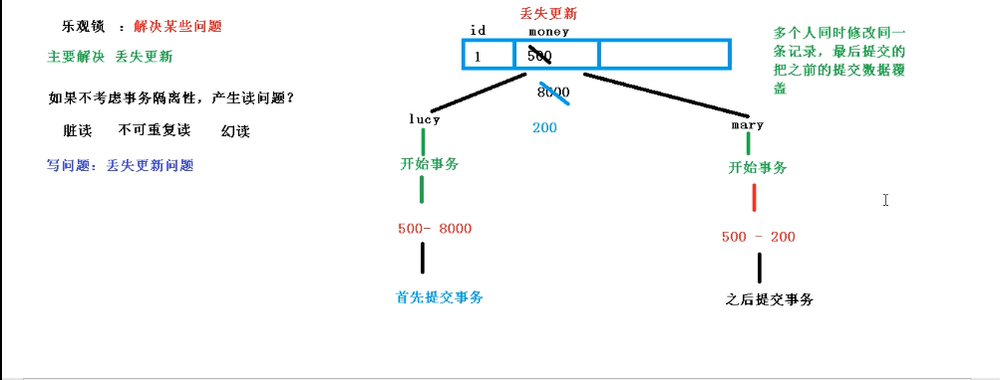

# 分布式系统唯一ID生成方案汇总

1. 数据库自增长序列或字段

    最常见的方式。利用数据库，全数据库唯一。
    
    优点：
        
        1）简单，代码方便，性能可以接受。
        
        2）数字ID天然排序，对分页或者需要排序的结果很有帮助。
    
    缺点：
    
        1）不同数据库语法和实现不同，数据库迁移的时候或多数据库版本支持的时候需要处理。
        
        2）在单个数据库或读写分离或一主多从的情况下，只有一个主库可以生成。有单点故障的风险。
        
        3）在性能达不到要求的情况下，比较难于扩展。
        
        4）如果遇见多个系统需要合并或者涉及到数据迁移会相当痛苦。
        
        5）分表分库的时候会有麻烦。
    
    优化方案：
    
        1）针对主库单点，如果有多个Master库，则每个Master库设置的起始数字不一样，步长一样，可以是Master的个数。比如：Master1 生成的是 1，4，7，10，Master2生成的是2,5,8,11 Master3生成的是 3,6,9,12。这样就可以有效生成集群中的唯一ID，也可以大大降低ID生成数据库操作的负载。
    
2. UUID

    常见的方式。可以利用数据库也可以利用程序生成，一般来说全球唯一。
    
    优点：
    
        1）简单，代码方便。
        
        2）生成ID性能非常好，基本不会有性能问题。
        
        3）全球唯一，在遇见数据迁移，系统数据合并，或者数据库变更等情况下，可以从容应对。
    
    缺点：
    
        1）没有排序，无法保证趋势递增。
        
        2）UUID往往是使用字符串存储，查询的效率比较低。
        
        3）存储空间比较大，如果是海量数据库，就需要考虑存储量的问题。
        
        4）传输数据量大
        
        5）不可读。
    
3. Redis生成ID 
   
    当使用数据库来生成ID性能不够要求的时候，我们可以尝试使用Redis来生成ID。这主要依赖于Redis是单线程的，所以也可以用生成全局唯一的ID。可以用Redis的原子操作 INCR和INCRBY来实现。
    可以使用Redis集群来获取更高的吞吐量。假如一个集群中有5台Redis。可以初始化每台Redis的值分别是1,2,3,4,5，然后步长都是5。各个Redis生成的ID为：
        
    
    ```
    A：1,6,11,16,21
    
    B：2,7,12,17,22
    
    C：3,8,13,18,23
    
    D：4,9,14,19,24
    
    E：5,10,15,20,25
    ```
    
    这个，随便负载到哪个机确定好，未来很难做修改。但是3-5台服务器基本能够满足器上，都可以获得不同的ID。但是步长和初始值一定需要事先需要了。使用Redis集群也可以方式单点故障的问题。
        
    比较适合使用Redis来生成每天从0开始的流水号。比如订单号=日期+当日自增长号。可以每天在Redis中生成一个Key，使用INCR进行累加。
    优点：
        
    
    ```
    1）不依赖于数据库，灵活方便，且性能优于数据库。
    
    2）数字ID天然排序，对分页或者需要排序的结果很有帮助。
    
    缺点：
    
    1）如果系统中没有Redis，还需要引入新的组件，增加系统复杂度。
    
    2）需要编码和配置的工作量比较大。
    ```
    
4. Twitter的snowflake算法

    snowflake是Twitter开源的分布式ID生成算法，结果是一个long型的ID。其核心思想是：使用41bit作为毫秒数，10bit作为机器的ID（5个bit是数据中心，5个bit的机器ID），12bit作为毫秒内的流水号（意味着每个节点在每毫秒可以产生 4096 个 ID），最后还有一个符号位，永远是0。具体实现的代码可以参看https://github.com/twitter/snowflake。

# 自动填充功能

在需要添加的字段上加入@TableField(fill = FieldFill.INSERT)

```java
    public enum FieldFill {
        DEFAULT,
        INSERT,
        UPDATE,
        INSERT_UPDATE;
    
        private FieldFill() {
        }
    }
```

也可以实现MetaObjectHandler接口来自定义填充内容

```java
@Component
public class MyMetaObjectHandler implements MetaObjectHandler {
    @Override
    public void insertFill(MetaObject metaObject) {
        this.setFieldValByName("createTime",new Date(),metaObject);
        this.setFieldValByName("updateTime",new Date(),metaObject);
    }

    @Override
    public void updateFill(MetaObject metaObject) {
        this.setFieldValByName("updateTime",new Date(),metaObject);
    }
}

```

# 乐观锁

解决问题：丢失更新

1. 如果不考虑事务隔离性,产生读问题?
   
    脏读、不可重复读、幻读
    
2. 写问题：丢失更新

    

解决方案：

1. 悲观锁：串行
2. 乐观锁：CAS算法

实现步骤

 1. 表添加字段，作为乐观锁版本号

 2. 对应实体类添加版本号属性

    ```java
     @Version
        private Integer version;
    ```

    

 3. 添加乐观锁插件

    ```java
    @Configuration
    @MapperScan("com.pyw.mp1010.mapper")
    public class Mpconfig {
    
        @Bean
        public OptimisticLockerInterceptor optimisticLockerInterceptor() {
            return new OptimisticLockerInterceptor();
        }
    }
    ```

# 简单查询

1. 通过ID进行查询

   ```java
    User user = userMapper.selectById("1242642950903738369");
   ```

2. 多个id批量查询

   ```java
   List<User> users = userMapper.selectBatchIds(Arrays.asList("1242642950903738369","1242363979456782337"));
           users.forEach(System.out::println);
   ```

3. 根据Map条件查询

   ```java
    HashMap<String, Object> map = new HashMap<>();
           map.put("name","Jone");
           map.put("age",18);
           List<User> users = userMapper.selectByMap(map);
           users.forEach(System.out::println);
   ```

# 分页查询

1. 配置分页插件

   ```java
       /**
        * 分页插件
        * @return
        */
       @Bean
       public PaginationInterceptor paginationInterceptor() {
           return new PaginationInterceptor();
       }
   ```

2. 编写分页代码

   ```java
     // 参数: 当前页和每页显示记录数
           Page<User> page = new Page<>(1, 3);
   
           userMapper.selectPage(page, null);
   
           // 通过page对象获取分页数据
   
           // 当前页
           System.out.println(page.getCurrent());
   
           // 每页数据list集合
           System.out.println(page.getRecords());
   
           // 每页显示记录数
           System.out.println(page.getSize());
   
           // 总记录数
           System.out.println(page.getTotal());
           
           // 总页数
           System.out.println(page.getPages());
           
           // 是否有下一页
           System.out.println(page.hasNext());
           
           // 是否有上一页
           System.out.println(page.hasPrevious());
   ```

# 物理删除

```java
int result = userMapper.deleteById(1L);
        System.out.println(result);
```

# 批量删除

```java
int result = userMapper.deleteBatchIds(Arrays.asList(8,9,10));
        System.out.println(result);
```

# 逻辑删除

1. 表添加逻辑删除标志

2. 类中添加逻辑删除字段

   ```java
   @TableLogic
       private Integer delected;
   ```

3. 配置逻辑删除插件

   ```java
       /**
        * 逻辑删除插件
        * @return
        */
       @Bean
       public ISqlInjector sqlInjector () {
           return new LogicSqlInjector();
       }
   ```

4. 设置配置文件(可不设置)

   ```yaml
   mybatis-plus:  
     global-config:
       db-config:
       # 删除的状态为(默认1)
         logic-delete-value: 1
        # 不删除的状态为(默认0)
      	  logic-not-delete-value: 0
   ```

   

