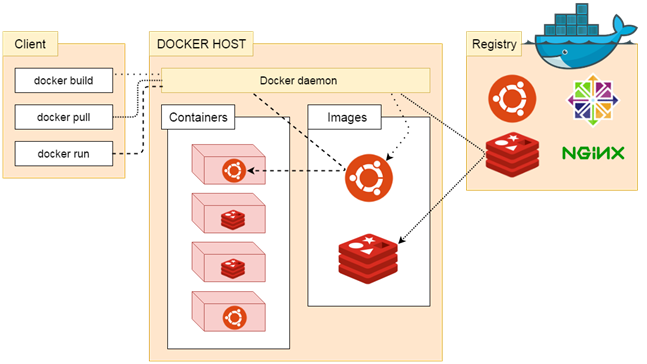
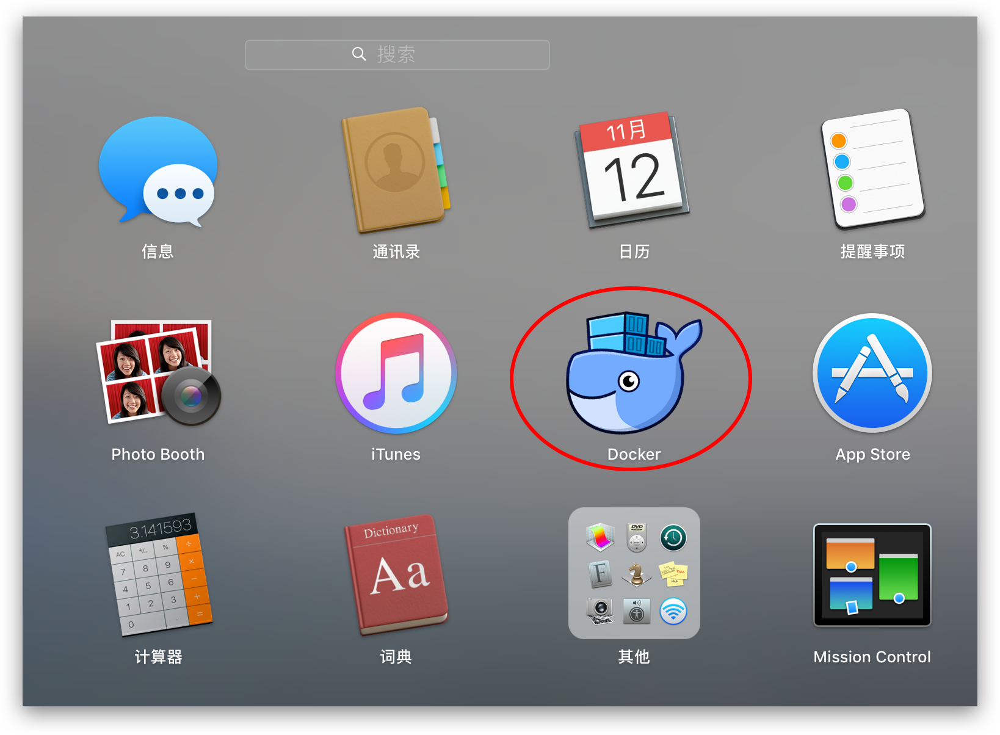
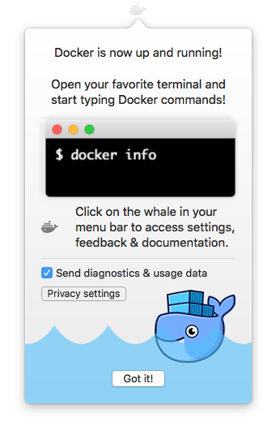
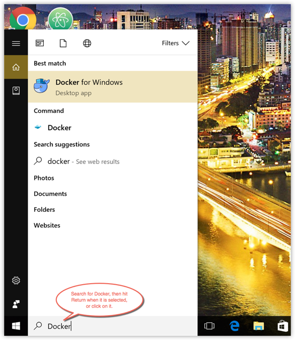
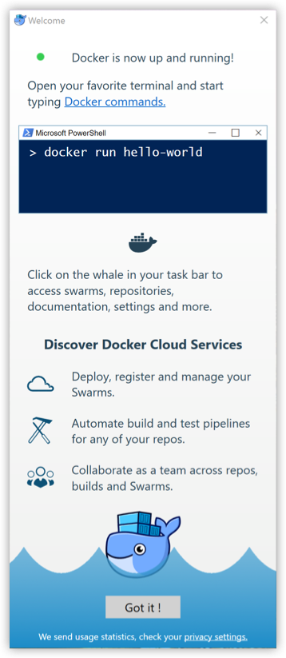

# 第一章 什么是docker

​	总结：**docker真正的实现了一次编译到处运行，微服务与分布式必须掌握**

​	Docker 最初是 dotCloud 公司创始人 Solomon Hykes 在法国期间发起的一个公司内部项目，它是基于 dotCloud 公司多年云服务技术的一次革新，并于 [2013 年 3 月以 Apache 2.0 授权协议开源](https://en.wikipedia.org/wiki/Docker_(software))，主要项目代码在 [GitHub](https://github.com/moby/moby) 上进行维护。Docker 项目后来还加入了 Linux 基金会，并成立推动 [开放容器联盟（OCI）](https://www.opencontainers.org/)。

​	Docker 自开源后受到广泛的关注和讨论，至今其 GitHub 项目已经超过 4 万 6 千个星标和一万多个 fork。甚至由于 Docker 项目的火爆，在 2013 年底，[dotCloud 公司决定改名为 Docker](https://blog.docker.com/2013/10/dotcloud-is-becoming-docker-inc/)。Docker 最初是在 Ubuntu 12.04 上开发实现的；Red Hat 则从 RHEL 6.5 开始对 Docker 进行支持；Google 也在其 PaaS 产品中广泛应用 Docker。

​	Docker 使用 Google 公司推出的 [Go 语言](https://golang.org/) 进行开发实现，基于 Linux 内核的 [cgroup](https://zh.wikipedia.org/wiki/Cgroups)，[namespace](https://en.wikipedia.org/wiki/Linux_namespaces)，以及 [AUFS](https://en.wikipedia.org/wiki/Aufs) 类的 [Union FS](https://en.wikipedia.org/wiki/Union_mount) 等技术，对进程进行封装隔离，属于 [操作系统层面的虚拟化技术](https://en.wikipedia.org/wiki/Operating-system-level_virtualization)。由于隔离的进程独立于宿主和其它的隔离的进程，因此也称其为容器。最初实现是基于 [LXC](https://linuxcontainers.org/lxc/introduction/)，从 0.7 版本以后开始去除 LXC，转而使用自行开发的 [libcontainer](https://github.com/docker/libcontainer)，从 1.11 开始，则进一步演进为使用 [runC](https://github.com/opencontainers/runc) 和 [containerd](https://github.com/containerd/containerd)。

​	Docker 在容器的基础上，进行了进一步的封装，从文件系统、网络互联到进程隔离等等，极大的简化了容器的创建和维护。使得 Docker 技术比虚拟机技术更为轻便、快捷。

​	下面的图片比较了 Docker 和传统虚拟化方式的不同之处。传统虚拟机技术是虚拟出一套硬件后，在其上运行一个完整操作系统，在该系统上再运行所需应用进程；而容器内的应用进程直接运行于宿主的内核，容器内没有自己的内核，而且也没有进行硬件虚拟。因此容器要比传统虚拟机更为轻便。


# 第二章 为什么要使用 Docker

​	作为一种新兴的虚拟化方式，Docker 跟传统的虚拟化方式相比具有众多的优势。 

## 2.1 更高效的利用系统资源

​	由于容器不需要进行硬件虚拟以及运行完整操作系统等额外开销，Docker 对系统资源的利用率更高。无论是应用执行速度、内存损耗或者文件存储速度，都要比传统虚拟机技术更高效。因此，相比虚拟机技术，一个相同配置的主机，往往可以运行更多数量的应用。 

## 2.2 更快速的启动时间

​	传统的虚拟机技术启动应用服务往往需要数分钟，而 Docker 容器应用，由于直接运行于宿主内核，无需启动完整的操作系统，因此可以做到秒级、甚至毫秒级的启动时间。大大的节约了开发、测试、部署的时间。 

## 2.3 一致的运行环境

​	开发过程中一个常见的问题是环境一致性问题。由于开发环境、测试环境、生产环境不一致，导致有些 bug 并未在开发过程中被发现。而 Docker 的镜像提供了除内核外完整的运行时环境，确保了应用运行环境一致性，从而不会再出现 *「这段代码在我机器上没问题啊」* 这类问题。 

## 2.4 持续交付和部署

​	对开发和运维（[DevOps](https://zh.wikipedia.org/wiki/DevOps)）人员来说，最希望的就是一次创建或配置，可以在任意地方正常运行。

​	使用 Docker 可以通过定制应用镜像来实现持续集成、持续交付、部署。开发人员可以通过 `Dockerfile` 来进行镜像构建，并结合 [持续集成(Continuous Integration)](https://en.wikipedia.org/wiki/Continuous_integration) 系统进行集成测试，而运维人员则可以直接在生产环境中快速部署该镜像，甚至结合 [持续部署(Continuous Delivery/Deployment)](https://en.wikipedia.org/wiki/Continuous_delivery) 系统进行自动部署。

​	而且使用 `Dockerfile` 使镜像构建透明化，不仅仅开发团队可以理解应用运行环境，也方便运维团队理解应用运行所需条件，帮助更好的生产环境中部署该镜像。

## 2.5 更轻松的迁移

​	由于 Docker 确保了执行环境的一致性，使得应用的迁移更加容易。Docker 可以在很多平台上运行，无论是物理机、虚拟机、公有云、私有云，甚至是笔记本，其运行结果是一致的。因此用户可以很轻易的将在一个平台上运行的应用，迁移到另一个平台上，而不用担心运行环境的变化导致应用无法正常运行的情况。 

## 2.6 更轻松的维护和扩展

​	Docker 使用的分层存储以及镜像的技术，使得应用重复部分的复用更为容易，也使得应用的维护更新更加简单，基于基础镜像进一步扩展镜像也变得非常简单。此外，Docker 团队同各个开源项目团队一起维护了一大批高质量的 [官方镜像](https://store.docker.com/search?q=&source=verified&type=image)，既可以直接在生产环境使用，又可以作为基础进一步定制，大大的降低了应用服务的镜像制作成本。 

## 2.7 对比传统虚拟机总结

|    特性    |        容器        |   虚拟机    |
| :--------: | :----------------: | :---------: |
|    启动    |        秒级        |   分钟级    |
|  硬盘使用  |    一般为 `MB`     | 一般为 `GB` |
|    性能    |      接近原生      |    弱于     |
| 系统支持量 | 单机支持上千个容器 | 一般几十个  |

# 第三章 Docker 基本概念

Docker 包括三个基本概念

- 镜像（`Image`）
- 容器（`Container`）
- 仓库（`Repository`）

理解了这三个概念，就理解了 Docker 的整个生命周期。

## 3.1 Docker 引擎

Docker 引擎是一个包含以下主要组件的客户端服务器应用程序。

- 一种服务器，它是一种称为守护进程并且长时间运行的程序。
- REST API用于指定程序可以用来与守护进程通信的接口，并指示它做什么。
- 一个有命令行界面 (CLI) 工具的客户端。

Docker 引擎组件的流程如下图所示：


## 3.2 Docker 系统架构

​	Docker 使用客户端-服务器 (C/S) 架构模式，使用远程 API 来管理和创建 Docker 容器。

​	Docker 容器通过 Docker 镜像来创建。

​	容器与镜像的关系类似于面向对象编程中的对象与类。

| Docker | 面向对象 |
| :----: | :------: |
|  容器  |   对象   |
|  镜像  |    类    |



|      标题       |                             说明                             |
| :-------------: | :----------------------------------------------------------: |
|  镜像(Images)   |          Docker 镜像是用于创建 Docker 容器的模板。           |
| 容器(Container) |               容器是独立运行的一个或一组应用。               |
| 客户端(Client)  | Docker 客户端通过命令行或者其他工具使用 Docker API (https://docs.docker.com/reference/api/docker_remote_api) 与 Docker 的守护进程通信。 |
|   主机(Host)    |    一个物理或者虚拟的机器用于执行 Docker 守护进程和容器。    |
| 仓库(Registry)  | Docker 仓库用来保存镜像，可以理解为代码控制中的代码仓库。Docker Hub([https://hub.docker.com](https://hub.docker.com/)) 提供了庞大的镜像集合供使用。 |
| Docker Machine  | Docker Machine是一个简化Docker安装的命令行工具，通过一个简单的命令行即可在相应的平台上安装Docker，比如VirtualBox、 Digital Ocean、Microsoft Azure。 |

## 3.3 Docker 镜像

​	我们都知道，操作系统分为内核和用户空间。对于 Linux 而言，内核启动后，会挂载 `root` 文件系统为其提供用户空间支持。而 Docker 镜像（Image），就相当于是一个 `root` 文件系统。比如官方镜像 `ubuntu:16.04` 就包含了完整的一套 Ubuntu 16.04 最小系统的 `root` 文件系统。

​	Docker 镜像是一个特殊的文件系统，除了提供容器运行时所需的程序、库、资源、配置等文件外，还包含了一些为运行时准备的一些配置参数（如匿名卷、环境变量、用户等）。镜像不包含任何动态数据，其内容在构建之后也不会被改变。

## 3.4 分层存储

​	因为镜像包含操作系统完整的 `root` 文件系统，其体积往往是庞大的，因此在 Docker 设计时，就充分利用 [Union FS](https://en.wikipedia.org/wiki/Union_mount) 的技术，将其设计为分层存储的架构。所以严格来说，镜像并非是像一个 ISO 那样的打包文件，镜像只是一个虚拟的概念，其实际体现并非由一个文件组成，而是由一组文件系统组成，或者说，由多层文件系统联合组成。

​	镜像构建时，会一层层构建，前一层是后一层的基础。每一层构建完就不会再发生改变，后一层上的任何改变只发生在自己这一层。比如，删除前一层文件的操作，实际不是真的删除前一层的文件，而是仅在当前层标记为该文件已删除。在最终容器运行的时候，虽然不会看到这个文件，但是实际上该文件会一直跟随镜像。因此，在构建镜像的时候，需要额外小心，每一层尽量只包含该层需要添加的东西，任何额外的东西应该在该层构建结束前清理掉。

​	分层存储的特征还使得镜像的复用、定制变的更为容易。甚至可以用之前构建好的镜像作为基础层，然后进一步添加新的层，以定制自己所需的内容，构建新的镜像。

​	关于镜像构建，将会在后续相关章节中做进一步的讲解。

## 3.5 Docker 容器

​	镜像（`Image`）和容器（`Container`）的关系，就像是面向对象程序设计中的 `类` 和 `实例` 一样，镜像是静态的定义，容器是镜像运行时的实体。容器可以被创建、启动、停止、删除、暂停等。

​	容器的实质是进程，但与直接在宿主执行的进程不同，容器进程运行于属于自己的独立的 [命名空间](https://en.wikipedia.org/wiki/Linux_namespaces)。因此容器可以拥有自己的 `root` 文件系统、自己的网络配置、自己的进程空间，甚至自己的用户 ID 空间。容器内的进程是运行在一个隔离的环境里，使用起来，就好像是在一个独立于宿主的系统下操作一样。这种特性使得容器封装的应用比直接在宿主运行更加安全。也因为这种隔离的特性，很多人初学 Docker 时常常会混淆容器和虚拟机。

​	前面讲过镜像使用的是分层存储，容器也是如此。每一个容器运行时，是以镜像为基础层，在其上创建一个当前容器的存储层，我们可以称这个为容器运行时读写而准备的存储层为**容器存储层**。

​	容器存储层的生存周期和容器一样，容器消亡时，容器存储层也随之消亡。因此，任何保存于容器存储层的信息都会随容器删除而丢失。

​	按照 Docker 最佳实践的要求，容器不应该向其存储层内写入任何数据，容器存储层要保持无状态化。所有的文件写入操作，都应该使用 `数据卷（Volume）`、或者绑定宿主目录，在这些位置的读写会跳过容器存储层，直接对宿主（或网络存储）发生读写，其性能和稳定性更高。

​	数据卷的生存周期独立于容器，容器消亡，数据卷不会消亡。因此，使用数据卷后，容器删除或者重新运行之后，数据却不会丢失。

## 3.6 Docker 仓库

​	镜像构建完成后，可以很容易的在当前宿主机上运行，但是，如果需要在其它服务器上使用这个镜像，我们就需要一个集中的存储、分发镜像的服务，`Docker Registry` 就是这样的服务。

​	一个 **Docker Registry** 中可以包含多个**仓库**（`Repository`）；每个仓库可以包含多个**标签**（`Tag`）；每个标签对应一个镜像。

​	通常，一个仓库会包含同一个软件不同版本的镜像，而标签就常用于对应该软件的各个版本。我们可以通过 `<仓库名>:<标签>` 的格式来指定具体是这个软件哪个版本的镜像。如果不给出标签，将以 `latest` 作为默认标签。

​	以 [Ubuntu 镜像](https://store.docker.com/images/ubuntu) 为例，`ubuntu` 是仓库的名字，其内包含有不同的版本标签，如，`14.04`, `16.04`。我们可以通过 `ubuntu:14.04`，或者 `ubuntu:16.04` 来具体指定所需哪个版本的镜像。如果忽略了标签，比如 `ubuntu`，那将视为 `ubuntu:latest`。

​	仓库名经常以 *两段式路径* 形式出现，比如 `jwilder/nginx-proxy`，前者往往意味着 Docker Registry 多用户环境下的用户名，后者则往往是对应的软件名。但这并非绝对，取决于所使用的具体 Docker Registry 的软件或服务。

## 3.7 公有 Docker Registry

​	Docker Registry 公开服务是开放给用户使用、允许用户管理镜像的 Registry 服务。一般这类公开服务允许用户免费上传、下载公开的镜像，并可能提供收费服务供用户管理私有镜像。

​	最常使用的 Registry 公开服务是官方的 [Docker Hub](https://hub.docker.com/)，这也是默认的 Registry，并拥有大量的高质量的官方镜像。除此以外，还有 [CoreOS](https://coreos.com/) 的 [Quay.io](https://quay.io/repository/)，CoreOS 相关的镜像存储在这里；Google 的 [Google Container Registry](https://cloud.google.com/container-registry/)，[Kubernetes](http://kubernetes.io/) 的镜像使用的就是这个服务。

​	由于某些原因，在国内访问这些服务可能会比较慢。国内的一些云服务商提供了针对 Docker Hub 的镜像服务（`Registry Mirror`），这些镜像服务被称为**加速器**。常见的有 [阿里云加速器](https://cr.console.aliyun.com/#/accelerator)、[DaoCloud 加速器](https://www.daocloud.io/mirror#accelerator-doc) 等。使用加速器会直接从国内的地址下载 Docker Hub 的镜像，比直接从 Docker Hub 下载速度会提高很多。

​	国内也有一些云服务商提供类似于 Docker Hub 的公开服务。比如 [时速云镜像仓库](https://hub.tenxcloud.com/)、[网易云镜像服务](https://c.163.com/hub#/m/library/)、[DaoCloud 镜像市场](https://hub.daocloud.io/)、[阿里云镜像库](https://cr.console.aliyun.com/) 等。

## 3.8 私有 Docker Registry

​	除了使用公开服务外，用户还可以在本地搭建私有 Docker Registry。Docker 官方提供了 [Docker Registry](https://store.docker.com/images/registry/) 镜像，可以直接使用做为私有 Registry 服务。

​	开源的 Docker Registry 镜像只提供了 [Docker Registry API](https://docs.docker.com/registry/spec/api/) 的服务端实现，足以支持 `docker` 命令，不影响使用。但不包含图形界面，以及镜像维护、用户管理、访问控制等高级功能。在官方的商业化版本 [Docker Trusted Registry](https://docs.docker.com/datacenter/dtr/2.0/) 中，提供了这些高级功能。

​	除了官方的 Docker Registry 外，还有第三方软件实现了 Docker Registry API，甚至提供了用户界面以及一些高级功能。比如，[VMWare Harbor](https://github.com/vmware/harbor) 和 [Sonatype Nexus](https://www.sonatype.com/docker)。

# 第四章 安装 Docker

​	docker 在 1.13 版本之后，从 2017 年的 3 月 1 日开始，版本命名规则变为如下：

| 项目        | 说明         |
| :---------- | :----------- |
| 版本格式    | YY.MM        |
| Stable 版本 | 每个季度发行 |
| Edge 版本   | 每个月发行   |

​	同时 Docker 划分为 CE 和 EE。CE 即社区版（免费，支持周期三个月），EE 即企业版，强调安全，付费使用。

​	Docker CE 每月发布一个 Edge 版本 (17.03, 17.04, 17.05...)，每三个月发布一个 Stable 版本 (17.03, 17.06, 17.09...)，Docker EE 和 Stable 版本号保持一致，但每个版本提供一年维护。

​	官方网站上有各种环境下的 [安装指南](https://docs.docker.com/engine/installation/)，这里主要介绍 Docker CE 在 Linux 、Windows 10 (PC) 和 macOS 上的安装。

## 4.1 Ubuntu 安装 Docker

### 4.1.1 准备工作

系统要求

Docker CE 支持以下版本的 [Ubuntu](https://www.ubuntu.com/server) 操作系统：

- Artful 17.10 (Docker CE 17.11 Edge +)
- Xenial 16.04 (LTS)
- Trusty 14.04 (LTS)

Docker CE 可以安装在 64 位的 x86 平台或 ARM 平台上。Ubuntu 发行版中，LTS（Long-Term-Support）长期支持版本，会获得 5 年的升级维护支持，这样的版本会更稳定，因此在生产环境中推荐使用 LTS 版本,当前最新的 LTS 版本为 Ubuntu 16.04。

卸载旧版本

​	旧版本的 Docker 称为 `docker` 或者 `docker-engine`，使用以下命令卸载旧版本： 

```sh
$ sudo apt-get remove docker \
               docker-engine \
               docker.io
```

### 4.1.2 Ubuntu 14.04 可选内核模块

从 Ubuntu 14.04 开始，一部分内核模块移到了可选内核模块包 (`linux-image-extra-*`) ，以减少内核软件包的体积。正常安装的系统应该会包含可选内核模块包，而一些裁剪后的系统可能会将其精简掉。`AUFS` 内核驱动属于可选内核模块的一部分，作为推荐的 Docker 存储层驱动，一般建议安装可选内核模块包以使用 `AUFS`。

如果系统没有安装可选内核模块的话，可以执行下面的命令来安装可选内核模块包：

```sh
$ sudo apt-get update

$ sudo apt-get install \
    linux-image-extra-$(uname -r) \
    linux-image-extra-virtual
```

### 4.1.3 Ubuntu 16.04 +

 Ubuntu 16.04 + 上的 Docker CE 默认使用 `overlay2` 存储层驱动,无需手动配置。 

使用 APT 安装

安装-Docker.html#安装必要的一些系统工具)安装必要的一些系统工具

```sh
sudo apt-get update
sudo apt-get -y install apt-transport-https ca-certificates curl software-properties-common
```

安装 GPG 证书

```sh
curl -fsSL http://mirrors.aliyun.com/docker-ce/linux/ubuntu/gpg | sudo apt-key add -
```

写入软件源信息

```sh
sudo add-apt-repository "deb [arch=amd64] http://mirrors.aliyun.com/docker-ce/linux/ubuntu $(lsb_release -cs) stable"
```

更新并安装 Docker CE

```sh
sudo apt-get -y update
sudo apt-get -y install docker-ce
```

 以上命令会添加稳定版本的 Docker CE APT 镜像源，如果需要最新或者测试版本的 Docker CE 请将 stable 改为 edge 或者 test。从 Docker 17.06 开始，edge test 版本的 APT 镜像源也会包含稳定版本的 Docker。 

### 4.1.4 使用脚本自动安装

​	在测试或开发环境中 Docker 官方为了简化安装流程，提供了一套便捷的安装脚本，Ubuntu 系统上可以使用这套脚本安装 :

```sh
$ curl -fsSL get.docker.com -o get-docker.sh
# 可能会出现 404 错误，请移步下面的特别说明
$ sudo sh get-docker.sh --mirror Aliyun
```

​	执行这个命令后，脚本就会自动的将一切准备工作做好，并且把 Docker CE 的 Edge 版本安装在系统中。 

**特别说明**

2018 年 7 月 21 日，貌似阿里云这边在做调整，故导致 Docker 的 Aliyun 安装脚本不可用，是永久性还是临时性的尚不清除，如果你已经按照之前的操作安装 Docker，请按以下步骤进行修复并重新安装

- 如果已经使用了 Aliyun 脚本安装并成功的
  - 请先卸载 Docker，命令为：`apt-get autoremove docker-ce`
  - 删除 `/etc/apt/sources.list.d` 目录下的 `docker.list` 文件
- 使用 `AzureChinaCloud` 镜像脚本重新安装，命令为：`sudo sh get-docker.sh --mirror AzureChinaCloud`

### 4.1.5 启动 Docker CE

```sh
$ sudo systemctl enable docker
$ sudo systemctl start docker
```

 Ubuntu 14.04 请使用以下命令启动： 

```sh
$ sudo service docker start
```

### 4.1.6  建立 docker 用户组

默认情况下，`docker` 命令会使用 [Unix socket](https://en.wikipedia.org/wiki/Unix_domain_socket) 与 Docker 引擎通讯。而只有 `root` 用户和 `docker` 组的用户才可以访问 Docker 引擎的 Unix socket。出于安全考虑，一般 Linux 系统上不会直接使用 `root` 用户。因此，更好地做法是将需要使用 `docker` 的用户加入 `docker` 用户组。

建立 `docker` 组：

```sh
$ sudo groupadd docker
```

 将当前用户加入 `docker` 组： 

```sh
$ sudo usermod -aG docker $USER
```

 退出当前终端并重新登录，进行如下测试。 

### 4.1.7 测试 Docker 是否安装正确

```sh
$ docker run hello-world

Unable to find image 'hello-world:latest' locally
latest: Pulling from library/hello-world
ca4f61b1923c: Pull complete
Digest: sha256:be0cd392e45be79ffeffa6b05338b98ebb16c87b255f48e297ec7f98e123905c
Status: Downloaded newer image for hello-world:latest

Hello from Docker!
This message shows that your installation appears to be working correctly.

To generate this message, Docker took the following steps:
 1. The Docker client contacted the Docker daemon.
 2. The Docker daemon pulled the "hello-world" image from the Docker Hub.
    (amd64)
 3. The Docker daemon created a new container from that image which runs the
    executable that produces the output you are currently reading.
 4. The Docker daemon streamed that output to the Docker client, which sent it
    to your terminal.

To try something more ambitious, you can run an Ubuntu container with:
 $ docker run -it ubuntu bash

Share images, automate workflows, and more with a free Docker ID:
 https://cloud.docker.com/

For more examples and ideas, visit:
 https://docs.docker.com/engine/userguide/
```

 若能正常输出以上信息，则说明安装成功 

### 4.1.8 镜像加速

鉴于国内网络问题，后续拉取 Docker 镜像十分缓慢，强烈建议安装 Docker 之后配置 `国内镜像加速`。 

### 4.1.9 参考文档

 [Docker 官方 Ubuntu 安装文档](https://docs.docker.com/engine/installation/linux/docker-ce/ubuntu/) 

## 4.2  CentOS 安装 Docker

> 警告：切勿在没有配置 Docker YUM 源的情况下直接使用 yum 命令安装 Docker. 

### 4.2.1 准备工作

系统要求

​	Docker CE 支持 64 位版本 CentOS 7，并且要求内核版本不低于 3.10。 CentOS 7 满足最低内核的要求，但由于内核版本比较低，部分功能（如 `overlay2` 存储层驱动）无法使用，并且部分功能可能不太稳定。

卸载旧版本

​	旧版本的 Docker 称为 `docker` 或者 `docker-engine`，使用以下命令卸载旧版本：

```bash
$ sudo yum remove docker \
                  docker-client \
                  docker-client-latest \
                  docker-common \
                  docker-latest \
                  docker-latest-logrotate \
                  docker-logrotate \
                  docker-selinux \
                  docker-engine-selinux \
                  docker-engine
```

### 4.2.2 使用 yum 安装

执行以下命令安装依赖包：

```bash
$ sudo yum install -y yum-utils \
           device-mapper-persistent-data \
           lvm2
```

​	鉴于国内网络问题，强烈建议使用国内源，官方源请在注释中查看。

执行下面的命令添加 `yum` 软件源：

```bash
$ sudo yum-config-manager \
    --add-repo \
    https://mirrors.ustc.edu.cn/docker-ce/linux/centos/docker-ce.repo


# 官方源
# $ sudo yum-config-manager \
#     --add-repo \
#     https://download.docker.com/linux/centos/docker-ce.repo    
```

如果需要最新版本的 Docker CE 请使用以下命令：

```bash
$ sudo yum-config-manager --enable docker-ce-edge
```

如果需要测试版本的 Docker CE 请使用以下命令：

```bash
$ sudo yum-config-manager --enable docker-ce-test
```

### 4.2.3 安装 Docker CE

更新 `yum` 软件源缓存，并安装 `docker-ce`。

```bash
$ sudo yum makecache fast
$ sudo yum install docker-ce
```

### 4.2.4 使用脚本自动安装

​	在测试或开发环境中 Docker 官方为了简化安装流程，提供了一套便捷的安装脚本，CentOS 系统上可以使用这套脚本安装：

```bash
$ curl -fsSL get.docker.com -o get-docker.sh
$ sudo sh get-docker.sh --mirror Aliyun
```


​	执行这个命令后，脚本就会自动的将一切准备工作做好，并且把 Docker CE 的 Edge 版本安装在系统中。

### 4.2.5 启动 Docker CE

```bash
$ sudo systemctl enable docker
$ sudo systemctl start docker
```

### 4.2.6 建立 docker 用户组

​	默认情况下，`docker` 命令会使用 [Unix socket](https://en.wikipedia.org/wiki/Unix_domain_socket) 与 Docker 引擎通讯。而只有 `root` 用户和 `docker` 组的用户才可以访问 Docker 引擎的 Unix socket。出于安全考虑，一般 Linux 系统上不会直接使用 `root` 用户。因此，更好地做法是将需要使用 `docker` 的用户加入 `docker` 用户组。

建立 `docker` 组：

```bash
$ sudo groupadd docker
```

将当前用户加入 `docker` 组：

```bash
$ sudo usermod -aG docker $USER
```

退出当前终端并重新登录，进行如下测试。

### 4.2.7 测试 Docker 是否安装正确

```bash
$ docker run hello-world

Unable to find image 'hello-world:latest' locally
latest: Pulling from library/hello-world
ca4f61b1923c: Pull complete
Digest: sha256:be0cd392e45be79ffeffa6b05338b98ebb16c87b255f48e297ec7f98e123905c
Status: Downloaded newer image for hello-world:latest

Hello from Docker!
This message shows that your installation appears to be working correctly.

To generate this message, Docker took the following steps:
 1. The Docker client contacted the Docker daemon.
 2. The Docker daemon pulled the "hello-world" image from the Docker Hub.
    (amd64)
 3. The Docker daemon created a new container from that image which runs the
    executable that produces the output you are currently reading.
 4. The Docker daemon streamed that output to the Docker client, which sent it
    to your terminal.

To try something more ambitious, you can run an Ubuntu container with:
 $ docker run -it ubuntu bash

Share images, automate workflows, and more with a free Docker ID:
 https://cloud.docker.com/

For more examples and ideas, visit:
 https://docs.docker.com/engine/userguide/
```

若能正常输出以上信息，则说明安装成功。

### 4.2.8 镜像加速

鉴于国内网络问题，后续拉取 Docker 镜像十分缓慢，强烈建议安装 Docker 之后配置 `国内镜像加速`。

### 4.2.9 添加内核参数

​	默认配置下，如果在 CentOS 使用 Docker CE 看到下面的这些警告信息：

```bash
WARNING: bridge-nf-call-iptables is disabled
WARNING: bridge-nf-call-ip6tables is disabled
```

请添加内核配置参数以启用这些功能。

```bash
$ sudo tee -a /etc/sysctl.conf <<-EOF
net.bridge.bridge-nf-call-ip6tables = 1
net.bridge.bridge-nf-call-iptables = 1
EOF
```

然后重新加载 `sysctl.conf` 即可

```bash
$ sudo sysctl -p
```

### 4.2.10 参考文档

- [Docker 官方 CentOS 安装文档](https://docs.docker.com/engine/installation/linux/docker-ce/centos/)。

## 4.3 树莓派卡片电脑安装 Docker

> 警告：切勿在没有配置 Docker APT 源的情况下直接使用 apt 命令安装 Docker.

系统要求

Docker CE 不仅支持 `x86_64` 架构的计算机，同时也支持 `ARM` 架构的计算机，本小节内容以树莓派单片电脑为例讲解 `ARM` 架构安装 Docker CE。

Docker CE 支持以下版本的 [Raspbian](https://www.raspberrypi.org/downloads/raspbian/) 操作系统：

- Raspbian Stretch
- Raspbian Jessie

*注：* `Raspbian` 是树莓派的开发与维护机构 [树莓派基金会](http://www.raspberrypi.org/) 推荐用于树莓派的首选系统，其基于 `Debian`。

### 4.3.1 使用 APT 安装

由于 apt 源使用 HTTPS 以确保软件下载过程中不被篡改。因此，我们首先需要添加使用 HTTPS 传输的软件包以及 CA 证书。

```bash
$ sudo apt-get update

$ sudo apt-get install \
     apt-transport-https \
     ca-certificates \
     curl \
     gnupg2 \
     lsb-release \
     software-properties-common
```

鉴于国内网络问题，强烈建议使用国内源，官方源请在注释中查看。

为了确认所下载软件包的合法性，需要添加软件源的 GPG 密钥。

```bash
$ curl -fsSL https://mirrors.ustc.edu.cn/docker-ce/linux/raspbian/gpg | sudo apt-key add -


# 官方源
# $ curl -fsSL https://download.docker.com/linux/raspbian/gpg | sudo apt-key add -
```

然后，我们需要向 `source.list` 中添加 Docker CE 软件源：

```bash
$ sudo add-apt-repository \
    "deb [arch=armhf] https://mirrors.ustc.edu.cn/docker-ce/linux/raspbian \
    $(lsb_release -cs) \
    stable"


# 官方源
# $ sudo add-apt-repository \
#    "deb [arch=armhf] https://download.docker.com/linux/raspbian \
#    $(lsb_release -cs) \
#    stable"    
```

> 以上命令会添加稳定版本的 Docker CE APT 源，如果需要最新版本的 Docker CE 请将 stable 改为 edge 或者 test。从 Docker 17.06 开始，edge test 版本的 APT 源也会包含稳定版本的 Docker CE。

### 4.3.2 安装 Docker CE

更新 apt 软件包缓存，并安装 `docker-ce`。

```bash
$ sudo apt-get update

$ sudo apt-get install docker-ce
```

### 4.3.3 树莓派安装-Docker.html#使用脚本自动安装)使用脚本自动安装

在测试或开发环境中 Docker 官方为了简化安装流程，提供了一套便捷的安装脚本，Raspbian 系统上可以使用这套脚本安装：

```bash
$ curl -fsSL get.docker.com -o get-docker.sh
$ sudo sh get-docker.sh --mirror Aliyun
```

执行这个命令后，脚本就会自动的将一切准备工作做好，并且把 Docker CE 的 Edge 版本安装在系统中。

### 4.3.4 启动 Docker CE

```bash
$ sudo systemctl enable docker
$ sudo systemctl start docker
```

### 4.3.5 建立 docker 用户组

默认情况下，`docker` 命令会使用 [Unix socket](https://en.wikipedia.org/wiki/Unix_domain_socket) 与 Docker 引擎通讯。而只有 `root` 用户和 `docker` 组的用户才可以访问 Docker 引擎的 Unix socket。出于安全考虑，一般 Linux 系统上不会直接使用 `root` 用户。因此，更好地做法是将需要使用 `docker` 的用户加入 `docker` 用户组。

建立 `docker` 组：

```bash
$ sudo groupadd docker
```

将当前用户加入 `docker` 组：

```bash
$ sudo usermod -aG docker $USER
```

退出当前终端并重新登录，进行如下测试。

### 4.3.6 测试 Docker 是否安装正确

```bash
$ docker run arm32v7/hello-world

Unable to find image 'hello-world:latest' locally
latest: Pulling from library/hello-world
ca4f61b1923c: Pull complete
Digest: sha256:be0cd392e45be79ffeffa6b05338b98ebb16c87b255f48e297ec7f98e123905c
Status: Downloaded newer image for hello-world:latest

Hello from Docker!
This message shows that your installation appears to be working correctly.

To generate this message, Docker took the following steps:
 1. The Docker client contacted the Docker daemon.
 2. The Docker daemon pulled the "hello-world" image from the Docker Hub.
    (amd64)
 3. The Docker daemon created a new container from that image which runs the
    executable that produces the output you are currently reading.
 4. The Docker daemon streamed that output to the Docker client, which sent it
    to your terminal.

To try something more ambitious, you can run an Ubuntu container with:
 $ docker run -it ubuntu bash

Share images, automate workflows, and more with a free Docker ID:
 https://cloud.docker.com/

For more examples and ideas, visit:
 https://docs.docker.com/engine/userguide/
```

若能正常输出以上信息，则说明安装成功。

*注意：* ARM 平台不能使用 `x86` 镜像，查看 Raspbian 可使用镜像请访问 [arm32v7](https://hub.docker.com/u/arm32v7/)。

### 4.3.7 镜像加速

鉴于国内网络问题，后续拉取 Docker 镜像十分缓慢，强烈建议安装 Docker 之后配置 `国内镜像加速`。

## 4.4 macOS 安装 Docker

### 4.4.1 系统要求

[Docker for Mac](https://docs.docker.com/docker-for-mac/) 要求系统最低为 macOS 10.10.3 Yosemite。如果系统不满足需求，可以安装 [Docker Toolbox](https://docs.docker.com/toolbox/overview/)。

### 4.4.2 安装

使用 Homebrew 安装

[Homebrew](http://brew.sh/) 的 [Cask](https://caskroom.github.io/) 已经支持 Docker for Mac，因此可以很方便的使用 Homebrew Cask 来进行安装：

```bash
$ brew cask install docker
```

### 4.4.3 手动下载安装

如果需要手动下载，请点击以下链接下载 [Stable](https://download.docker.com/mac/stable/Docker.dmg) 或 [Edge](https://download.docker.com/mac/edge/Docker.dmg) 版本的 Docker for Mac。

如同 macOS 其它软件一样，安装也非常简单，双击下载的 `.dmg` 文件，然后将那只叫 [Moby](https://blog.docker.com/2013/10/call-me-moby-dock/) 的鲸鱼图标拖拽到 `Application` 文件夹即可（其间需要输入用户密码）。


### 4.4.4 运行

从应用中找到 Docker 图标并点击运行。



运行之后，会在右上角菜单栏看到多了一个鲸鱼图标，这个图标表明了 Docker 的运行状态。


第一次点击图标，可能会看到这个安装成功的界面，点击 "Got it!" 可以关闭这个窗口。



以后每次点击鲸鱼图标会弹出操作菜单。


启动终端后，通过命令可以检查安装后的 Docker 版本。

```bash
$ docker --version
Docker version 17.10.0-ce, build f4ffd25
$ docker-compose --version
docker-compose version 1.17.0-rc1, build a0f95af
$ docker-machine --version
docker-machine version 0.13.0, build 9ba6da9
```

如果 `docker version`、`docker info` 都正常的话，可以尝试运行一个 [Nginx 服务器](https://store.docker.com/images/nginx/)：

```bash
$ docker run -d -p 80:80 --name webserver nginx
```

服务运行后，可以访问 [http://localhost](http://localhost/)，如果看到了 "Welcome to nginx!"，就说明 Docker for Mac 安装成功了。


要停止 Nginx 服务器并删除执行下面的命令：

```bash
$ docker stop webserver
$ docker rm webserver
```

### 4.4.5 镜像加速

鉴于国内网络问题，后续拉取 Docker 镜像十分缓慢，强烈建议安装 Docker 之后配置 `国内镜像加速`。

## 4.5 Windows 安装 Docker

### 4.5.1 系统要求

[Docker for Windows](https://docs.docker.com/docker-for-windows/install/) 支持 64 位版本的 Windows 10 Pro，且必须开启 Hyper-V。

### 4.5.2 安装

点击以下链接下载 [Stable](https://download.docker.com/win/stable/Docker for Windows Installer.exe) 或 [Edge](https://download.docker.com/win/edge/Docker for Windows Installer.exe) 版本的 Docker for Windows。

下载好之后双击 Docker for Windows Installer.exe 开始安装。

### 4.5.3 运行

在 Windows 搜索栏输入 Docker 点击 Docker for Windows 开始运行。



Docker CE 启动之后会在 Windows 任务栏出现鲸鱼图标。


等待片刻，点击 Got it 开始使用 Docker CE。



### 4.5.4 镜像加速

鉴于国内网络问题，后续拉取 Docker 镜像十分缓慢，强烈建议安装 Docker 之后配置 `国内镜像加速`。

# 第五章 Docker 镜像加速器

国内从 Docker Hub 拉取镜像有时会遇到困难，此时可以配置镜像加速器。Docker 官方和国内很多云服务商都提供了国内加速器服务，例如：

- [Docker 官方提供的中国 registry mirror](https://docs.docker.com/registry/recipes/mirror/#use-case-the-china-registry-mirror)
- [阿里云加速器](https://cr.console.aliyun.com/#/accelerator)
- [DaoCloud 加速器](https://www.daocloud.io/mirror#accelerator-doc)

我们以 Docker 官方加速器为例进行介绍。

## 5.1 Ubuntu 14.04、Debian 7 Wheezy

对于使用 [upstart](http://upstart.ubuntu.com/) 的系统而言，编辑 `/etc/default/docker` 文件，在其中的 `DOCKER_OPTS` 中配置加速器地址：

```bash
DOCKER_OPTS="--registry-mirror=https://registry.docker-cn.com"
```

重新启动服务。

```bash
$ sudo service docker restart
```

## 5.2 Ubuntu 16.04+、Debian 8+、CentOS 7

对于使用 [systemd](https://www.freedesktop.org/wiki/Software/systemd/) 的系统，请在 `/etc/docker/daemon.json` 中写入如下内容（如果文件不存在请新建该文件）

```json
{
  "registry-mirrors": [
    "https://registry.docker-cn.com"
  ]
}
```

> 注意，一定要保证该文件符合 json 规范，否则 Docker 将不能启动。

之后重新启动服务。

```bash
$ sudo systemctl daemon-reload
$ sudo systemctl restart docker
```

> 注意：如果您之前查看旧教程，修改了 `docker.service` 文件内容，请去掉您添加的内容（`--registry-mirror=https://registry.docker-cn.com`），这里不再赘述。

## 5.3 Windows 10

对于使用 Windows 10 的系统，在系统右下角托盘 Docker 图标内右键菜单选择 `Settings`，打开配置窗口后左侧导航菜单选择 `Daemon`。在 `Registry mirrors` 一栏中填写加速器地址 `https://registry.docker-cn.com`，之后点击 `Apply` 保存后 Docker 就会重启并应用配置的镜像地址了。

## 5.4 macOS

对于使用 macOS 的用户，在任务栏点击 Docker for mac 应用图标 -> Perferences... -> Daemon -> Registry mirrors。在列表中填写加速器地址 `https://registry.docker-cn.com`。修改完成之后，点击 `Apply & Restart` 按钮，Docker 就会重启并应用配置的镜像地址了。

## 5.5 检查加速器是否生效

配置加速器之后，如果拉取镜像仍然十分缓慢，请手动检查加速器配置是否生效，在命令行执行 `docker info`，如果从结果中看到了如下内容，说明配置成功。

```bash
Registry Mirrors:
 https://registry.docker-cn.com/
```

# 第六章 使用 Docker 镜像

​	在之前的介绍中，我们知道镜像是 Docker 的三大组件之一。

​	Docker 运行容器前需要本地存在对应的镜像，如果本地不存在该镜像，Docker 会从镜像仓库下载该镜像。

本章将介绍更多关于镜像的内容，包括：

- 从仓库获取镜像；

- 管理本地主机上的镜像；

- 介绍镜像实现的基本原理。

## 6.1 Docker 获取镜像

  ​	之前提到过，[Docker Hub](https://hub.docker.com/explore/) 上有大量的高质量的镜像可以用，这里我们就说一下怎么获取这些镜像。

  ​	从 Docker 镜像仓库获取镜像的命令是 `docker pull`。其命令格式为：

  ```bash
  docker pull [选项] [Docker Registry 地址[:端口号]/]仓库名[:标签]
  ```

  ​	具体的选项可以通过 `docker pull --help` 命令看到，这里我们说一下镜像名称的格式。

  - Docker 镜像仓库地址：地址的格式一般是 `<域名/IP>[:端口号]`。默认地址是 Docker Hub。

  - 仓库名：如之前所说，这里的仓库名是两段式名称，即 `<用户名>/<软件名>`。对于 Docker Hub，如果不给出用户名，则默认为 `library`，也就是官方镜像。

    比如：

  ```bash
  $ docker pull ubuntu:16.04
  16.04: Pulling from library/ubuntu
  bf5d46315322: Pull complete
  9f13e0ac480c: Pull complete
  e8988b5b3097: Pull complete
  40af181810e7: Pull complete
  e6f7c7e5c03e: Pull complete
  Digest: sha256:147913621d9cdea08853f6ba9116c2e27a3ceffecf3b492983ae97c3d643fbbe
  Status: Downloaded newer image for ubuntu:16.04
  ```

  ​	上面的命令中没有给出 Docker 镜像仓库地址，因此将会从 Docker Hub 获取镜像。而镜像名称是 `ubuntu:16.04`，因此将会获取官方镜像 `library/ubuntu` 仓库中标签为 `16.04` 的镜像。

  ​	从下载过程中可以看到我们之前提及的分层存储的概念，镜像是由多层存储所构成。下载也是一层层的去下载，并非单一文件。下载过程中给出了每一层的 ID 的前 12 位。并且下载结束后，给出该镜像完整的 `sha256` 的摘要，以确保下载一致性。

  ​	在使用上面命令的时候，你可能会发现，你所看到的层 ID 以及 `sha256` 的摘要和这里的不一样。这是因为官方镜像是一直在维护的，有任何新的 bug，或者版本更新，都会进行修复再以原来的标签发布，这样可以确保任何使用这个标签的用户可以获得更安全、更稳定的镜像。

  *如果从 Docker Hub 下载镜像非常缓慢，可以参照 `镜像加速器` 一节配置加速器。*

  

运行

  有了镜像后，我们就能够以这个镜像为基础启动并运行一个容器。以上面的 `ubuntu:16.04` 为例，如果我们打算启动里面的 `bash` 并且进行交互式操作的话，可以执行下面的命令。

  ```bash
  $ docker run -it --rm \
      ubuntu:16.04 \
      bash
  
  root@e7009c6ce357:/# cat /etc/os-release
  NAME="Ubuntu"
  VERSION="16.04.4 LTS, Trusty Tahr"
  ID=ubuntu
  ID_LIKE=debian
  PRETTY_NAME="Ubuntu 16.04.4 LTS"
  VERSION_ID="16.04"
  HOME_URL="http://www.ubuntu.com/"
  SUPPORT_URL="http://help.ubuntu.com/"
  BUG_REPORT_URL="http://bugs.launchpad.net/ubuntu/"
  ```

  `docker run` 就是运行容器的命令，我们这里简要的说明一下上面用到的参数。

  - `-it`：这是两个参数，一个是 `-i`：交互式操作，一个是 `-t` 终端。我们这里打算进入 `bash` 执行一些命令并查看返回结果，因此我们需要交互式终端。
  - `--rm`：这个参数是说容器退出后随之将其删除。默认情况下，为了排障需求，退出的容器并不会立即删除，除非手动 `docker rm`。我们这里只是随便执行个命令，看看结果，不需要排障和保留结果，因此使用 `--rm` 可以避免浪费空间。
  - `ubuntu:16.04`：这是指用 `ubuntu:16.04` 镜像为基础来启动容器。
  - `bash`：放在镜像名后的是**命令**，这里我们希望有个交互式 Shell，因此用的是 `bash`。

进入容器后，我们可以在 Shell 下操作，执行任何所需的命令。这里，我们执行了 `cat /etc/os-release`，这是 Linux 常用的查看当前系统版本的命令，从返回的结果可以看到容器内是 `Ubuntu 16.04.4 LTS` 系统。

  最后我们通过 `exit` 退出了这个容器。


## 6.2 Docker 列出镜像

要想列出已经下载下来的镜像，可以使用 `docker image ls` 命令。

```bash
$ docker image ls
REPOSITORY           TAG                 IMAGE ID            CREATED             SIZE
redis                latest              5f515359c7f8        5 days ago          183 MB
nginx                latest              05a60462f8ba        5 days ago          181 MB
mongo                3.2                 fe9198c04d62        5 days ago          342 MB
<none>               <none>              00285df0df87        5 days ago          342 MB
ubuntu               16.04               f753707788c5        4 weeks ago         127 MB
ubuntu               latest              f753707788c5        4 weeks ago         127 MB
ubuntu               14.04               1e0c3dd64ccd        4 weeks ago         188 MB
```

列表包含了 `仓库名`、`标签`、`镜像 ID`、`创建时间` 以及 `所占用的空间`。

其中仓库名、标签在之前的基础概念章节已经介绍过了。**镜像 ID** 则是镜像的唯一标识，一个镜像可以对应多个**标签**。因此，在上面的例子中，我们可以看到 `ubuntu:16.04` 和 `ubuntu:latest` 拥有相同的 ID，因为它们对应的是同一个镜像。

镜像体积

如果仔细观察，会注意到，这里标识的所占用空间和在 Docker Hub 上看到的镜像大小不同。比如，`ubuntu:16.04` 镜像大小，在这里是 `127 MB`，但是在 [Docker Hub](https://hub.docker.com/r/library/ubuntu/tags/) 显示的却是 `50 MB`。这是因为 Docker Hub 中显示的体积是压缩后的体积。在镜像下载和上传过程中镜像是保持着压缩状态的，因此 Docker Hub 所显示的大小是网络传输中更关心的流量大小。而 `docker image ls` 显示的是镜像下载到本地后，展开的大小，准确说，是展开后的各层所占空间的总和，因为镜像到本地后，查看空间的时候，更关心的是本地磁盘空间占用的大小。

另外一个需要注意的问题是，`docker image ls` 列表中的镜像体积总和并非是所有镜像实际硬盘消耗。由于 Docker 镜像是多层存储结构，并且可以继承、复用，因此不同镜像可能会因为使用相同的基础镜像，从而拥有共同的层。由于 Docker 使用 Union FS，相同的层只需要保存一份即可，因此实际镜像硬盘占用空间很可能要比这个列表镜像大小的总和要小的多。

你可以通过以下命令来便捷的查看镜像、容器、数据卷所占用的空间。

```bash
$ docker system df

TYPE                TOTAL               ACTIVE              SIZE                RECLAIMABLE
Images              24                  0                   1.992GB             1.992GB (100%)
Containers          1                   0                   62.82MB             62.82MB (100%)
Local Volumes       9                   0                   652.2MB             652.2MB (100%)
Build Cache                                                 0B                  0B
```

虚悬镜像

上面的镜像列表中，还可以看到一个特殊的镜像，这个镜像既没有仓库名，也没有标签，均为 ``。：

```bash
<none>               <none>              00285df0df87        5 days ago          342 MB
```

这个镜像原本是有镜像名和标签的，原来为 `mongo:3.2`，随着官方镜像维护，发布了新版本后，重新 `docker pull mongo:3.2` 时，`mongo:3.2` 这个镜像名被转移到了新下载的镜像身上，而旧的镜像上的这个名称则被取消，从而成为了 ``。除了 `docker pull` 可能导致这种情况，`docker build` 也同样可以导致这种现象。由于新旧镜像同名，旧镜像名称被取消，从而出现仓库名、标签均为 `` 的镜像。这类无标签镜像也被称为 **虚悬镜像(dangling image)** ，可以用下面的命令专门显示这类镜像：

```bash
$ docker image ls -f dangling=true
REPOSITORY          TAG                 IMAGE ID            CREATED             SIZE
<none>              <none>              00285df0df87        5 days ago          342 MB
```

一般来说，虚悬镜像已经失去了存在的价值，是可以随意删除的，可以用下面的命令删除。

```bash
$ docker image prune
```

中间层镜像

为了加速镜像构建、重复利用资源，Docker 会利用 **中间层镜像**。所以在使用一段时间后，可能会看到一些依赖的中间层镜像。默认的 `docker image ls` 列表中只会显示顶层镜像，如果希望显示包括中间层镜像在内的所有镜像的话，需要加 `-a` 参数。

```bash
$ docker image ls -a
```

这样会看到很多无标签的镜像，与之前的虚悬镜像不同，这些无标签的镜像很多都是中间层镜像，是其它镜像所依赖的镜像。这些无标签镜像不应该删除，否则会导致上层镜像因为依赖丢失而出错。实际上，这些镜像也没必要删除，因为之前说过，相同的层只会存一遍，而这些镜像是别的镜像的依赖，因此并不会因为它们被列出来而多存了一份，无论如何你也会需要它们。只要删除那些依赖它们的镜像后，这些依赖的中间层镜像也会被连带删除。

列出部分镜像

不加任何参数的情况下，`docker image ls` 会列出所有顶级镜像，但是有时候我们只希望列出部分镜像。`docker image ls` 有好几个参数可以帮助做到这个事情。

根据仓库名列出镜像

```bash
$ docker image ls ubuntu
REPOSITORY          TAG                 IMAGE ID            CREATED             SIZE
ubuntu              16.04               f753707788c5        4 weeks ago         127 MB
ubuntu              latest              f753707788c5        4 weeks ago         127 MB
ubuntu              14.04               1e0c3dd64ccd        4 weeks ago         188 MB
```

列出特定的某个镜像，也就是说指定仓库名和标签

```bash
$ docker image ls ubuntu:16.04
REPOSITORY          TAG                 IMAGE ID            CREATED             SIZE
ubuntu              16.04               f753707788c5        4 weeks ago         127 MB
```

除此以外，`docker image ls` 还支持强大的过滤器参数 `--filter`，或者简写 `-f`。之前我们已经看到了使用过滤器来列出虚悬镜像的用法，它还有更多的用法。比如，我们希望看到在 `mongo:3.2` 之后建立的镜像，可以用下面的命令：

```bash
$ docker image ls -f since=mongo:3.2
REPOSITORY          TAG                 IMAGE ID            CREATED             SIZE
redis               latest              5f515359c7f8        5 days ago          183 MB
nginx               latest              05a60462f8ba        5 days ago          181 MB
```

想查看某个位置之前的镜像也可以，只需要把 `since` 换成 `before` 即可。

此外，如果镜像构建时，定义了 `LABEL`，还可以通过 `LABEL` 来过滤。

```bash
$ docker image ls -f label=com.example.version=0.1
...
```

以特定格式显示

默认情况下，`docker image ls` 会输出一个完整的表格，但是我们并非所有时候都会需要这些内容。比如，刚才删除虚悬镜像的时候，我们需要利用 `docker image ls` 把所有的虚悬镜像的 ID 列出来，然后才可以交给 `docker image rm` 命令作为参数来删除指定的这些镜像，这个时候就用到了 `-q` 参数。

```bash
$ docker image ls -q
5f515359c7f8
05a60462f8ba
fe9198c04d62
00285df0df87
f753707788c5
f753707788c5
1e0c3dd64ccd
```

`--filter` 配合 `-q` 产生出指定范围的 ID 列表，然后送给另一个 `docker` 命令作为参数，从而针对这组实体成批的进行某种操作的做法在 Docker 命令行使用过程中非常常见，不仅仅是镜像，将来我们会在各个命令中看到这类搭配以完成很强大的功能。因此每次在文档看到过滤器后，可以多注意一下它们的用法。

另外一些时候，我们可能只是对表格的结构不满意，希望自己组织列；或者不希望有标题，这样方便其它程序解析结果等，这就用到了 [Go 的模板语法](https://gohugo.io/templates/go-templates/)。

比如，下面的命令会直接列出镜像结果，并且只包含镜像ID和仓库名：

```bash
$ docker image ls --format "{{.ID}}: {{.Repository}}"
5f515359c7f8: redis
05a60462f8ba: nginx
fe9198c04d62: mongo
00285df0df87: <none>
f753707788c5: ubuntu
f753707788c5: ubuntu
1e0c3dd64ccd: ubuntu
```

或者打算以表格等距显示，并且有标题行，和默认一样，不过自己定义列：

```bash
$ docker image ls --format "table {{.ID}}\t{{.Repository}}\t{{.Tag}}"
IMAGE ID            REPOSITORY          TAG
5f515359c7f8        redis               latest
05a60462f8ba        nginx               latest
fe9198c04d62        mongo               3.2
00285df0df87        <none>              <none>
f753707788c5        ubuntu              16.04
f753707788c5        ubuntu              latest
1e0c3dd64ccd        ubuntu              14.04
```

## 6.3 Docker 删除本地镜像

如果要删除本地的镜像，可以使用 `docker image rm` 命令，其格式为：

如果要删除本地的镜像，可以使用 `docker image rm` 命令，其格式为：

```sh
$ docker image rm [选项] <镜像1> [<镜像2> ...]
```

### 6.3.1 用 ID、镜像名、摘要删除镜像

其中，`<镜像>` 可以是 `镜像短 ID`、`镜像长 ID`、`镜像名` 或者 `镜像摘要`。

用 ID、镜像名、摘要删除镜像

其中，`<镜像>` 可以是 `镜像短 ID`、`镜像长 ID`、`镜像名` 或者 `镜像摘要`。

比如我们有这么一些镜像：

```bash
$ docker image ls
REPOSITORY                  TAG                 IMAGE ID            CREATED             SIZE
centos                      latest              0584b3d2cf6d        3 weeks ago         196.5 MB
redis                       alpine              501ad78535f0        3 weeks ago         21.03 MB
docker                      latest              cf693ec9b5c7        3 weeks ago         105.1 MB
nginx                       latest              e43d811ce2f4        5 weeks ago         181.5 MB
```

​	我们可以用镜像的完整 ID，也称为 `长 ID`，来删除镜像。使用脚本的时候可能会用长 ID，但是人工输入就太累了，所以更多的时候是用 `短 ID` 来删除镜像。`docker image ls` 默认列出的就已经是短 ID 了，一般取前3个字符以上，只要足够区分于别的镜像就可以了。

我们可以用镜像的完整 ID，也称为 `长 ID`，来删除镜像。使用脚本的时候可能会用长 ID，但是人工输入就太累了，所以更多的时候是用 `短 ID` 来删除镜像。`docker image ls` 默认列出的就已经是短 ID 了，一般取前3个字符以上，只要足够区分于别的镜像就可以了。

比如这里，如果我们要删除 `redis:alpine` 镜像，可以执行：

```bash
$ docker image rm 501
Untagged: redis:alpine
Untagged: redis@sha256:f1ed3708f538b537eb9c2a7dd50dc90a706f7debd7e1196c9264edeea521a86d
Deleted: sha256:501ad78535f015d88872e13fa87a828425117e3d28075d0c117932b05bf189b7
Deleted: sha256:96167737e29ca8e9d74982ef2a0dda76ed7b430da55e321c071f0dbff8c2899b
Deleted: sha256:32770d1dcf835f192cafd6b9263b7b597a1778a403a109e2cc2ee866f74adf23
Deleted: sha256:127227698ad74a5846ff5153475e03439d96d4b1c7f2a449c7a826ef74a2d2fa
Deleted: sha256:1333ecc582459bac54e1437335c0816bc17634e131ea0cc48daa27d32c75eab3
Deleted: sha256:4fc455b921edf9c4aea207c51ab39b10b06540c8b4825ba57b3feed1668fa7c7
```

我们也可以用`镜像名`，也就是 `<仓库名>:<标签>`，来删除镜像。

我们也可以用`镜像名`，也就是 `<仓库名>:<标签>`，来删除镜像。
```bash
$ docker image rm centos
Untagged: centos:latest
Untagged: centos@sha256:b2f9d1c0ff5f87a4743104d099a3d561002ac500db1b9bfa02a783a46e0d366c
Deleted: sha256:0584b3d2cf6d235ee310cf14b54667d889887b838d3f3d3033acd70fc3c48b8a
Deleted: sha256:97ca462ad9eeae25941546209454496e1d66749d53dfa2ee32bf1faabd239d38
```

	当然，更精确的是使用 `镜像摘要` 删除镜像。
=======
当然，更精确的是使用 `镜像摘要` 删除镜像.。
```bash
$ docker image ls --digests
REPOSITORY                  TAG                 DIGEST                                                                    IMAGE ID            CREATED             SIZE
node                        slim                sha256:b4f0e0bdeb578043c1ea6862f0d40cc4afe32a4a582f3be235a3b164422be228   6e0c4c8e3913        3 weeks ago         214 MB

$ docker image rm node@sha256:b4f0e0bdeb578043c1ea6862f0d40cc4afe32a4a582f3be235a3b164422be228
Untagged: node@sha256:b4f0e0bdeb578043c1ea6862f0d40cc4afe32a4a582f3be235a3b164422be228
```

### 6.3.2 Untagged 和 Deleted

​	如果观察上面这几个命令的运行输出信息的话，你会注意到删除行为分为两类，一类是 `Untagged`，另一类是 `Deleted`。我们之前介绍过，镜像的唯一标识是其 ID 和摘要，而一个镜像可以有多个标签。

​	因此当我们使用上面命令删除镜像的时候，实际上是在要求删除某个标签的镜像。所以首先需要做的是将满足我们要求的所有镜像标签都取消，这就是我们看到的 `Untagged` 的信息。因为一个镜像可以对应多个标签，因此当我们删除了所指定的标签后，可能还有别的标签指向了这个镜像，如果是这种情况，那么 `Delete` 行为就不会发生。所以并非所有的 `docker image rm` 都会产生删除镜像的行为，有可能仅仅是取消了某个标签而已。

​	当该镜像所有的标签都被取消了，该镜像很可能会失去了存在的意义，因此会触发删除行为。镜像是多层存储结构，因此在删除的时候也是从上层向基础层方向依次进行判断删除。镜像的多层结构让镜像复用变动非常容易，因此很有可能某个其它镜像正依赖于当前镜像的某一层。这种情况，依旧不会触发删除该层的行为。直到没有任何层依赖当前层时，才会真实的删除当前层。这就是为什么，有时候会奇怪，为什么明明没有别的标签指向这个镜像，但是它还是存在的原因，也是为什么有时候会发现所删除的层数和自己 `docker pull` 看到的层数不一样的源。

​	除了镜像依赖以外，还需要注意的是容器对镜像的依赖。如果有用这个镜像启动的容器存在（即使容器没有运行），那么同样不可以删除这个镜像。之前讲过，容器是以镜像为基础，再加一层容器存储层，组成这样的多层存储结构去运行的。因此该镜像如果被这个容器所依赖的，那么删除必然会导致故障。如果这些容器是不需要的，应该先将它们删除，然后再来删除镜像。

### 6.3.3 用 docker image ls 命令来配合

​	像其它可以承接多个实体的命令一样，可以使用 `docker image ls -q` 来配合使用 `docker image rm`，这样可以成批的删除希望删除的镜像。我们在“镜像列表”章节介绍过很多过滤镜像列表的方式都可以拿过来使用。

比如，我们需要删除所有仓库名为 `redis` 的镜像：

Untagged 和 Deleted

如果观察上面这几个命令的运行输出信息的话，你会注意到删除行为分为两类，一类是 `Untagged`，另一类是 `Deleted`。我们之前介绍过，镜像的唯一标识是其 ID 和摘要，而一个镜像可以有多个标签。

因此当我们使用上面命令删除镜像的时候，实际上是在要求删除某个标签的镜像。所以首先需要做的是将满足我们要求的所有镜像标签都取消，这就是我们看到的 `Untagged` 的信息。因为一个镜像可以对应多个标签，因此当我们删除了所指定的标签后，可能还有别的标签指向了这个镜像，如果是这种情况，那么 `Delete` 行为就不会发生。所以并非所有的 `docker image rm` 都会产生删除镜像的行为，有可能仅仅是取消了某个标签而已。

当该镜像所有的标签都被取消了，该镜像很可能会失去了存在的意义，因此会触发删除行为。镜像是多层存储结构，因此在删除的时候也是从上层向基础层方向依次进行判断删除。镜像的多层结构让镜像复用变动非常容易，因此很有可能某个其它镜像正依赖于当前镜像的某一层。这种情况，依旧不会触发删除该层的行为。直到没有任何层依赖当前层时，才会真实的删除当前层。这就是为什么，有时候会奇怪，为什么明明没有别的标签指向这个镜像，但是它还是存在的原因，也是为什么有时候会发现所删除的层数和自己 `docker pull` 看到的层数不一样的源。

除了镜像依赖以外，还需要注意的是容器对镜像的依赖。如果有用这个镜像启动的容器存在（即使容器没有运行），那么同样不可以删除这个镜像。之前讲过，容器是以镜像为基础，再加一层容器存储层，组成这样的多层存储结构去运行的。因此该镜像如果被这个容器所依赖的，那么删除必然会导致故障。如果这些容器是不需要的，应该先将它们删除，然后再来删除镜像。

用 docker image ls 命令来配合

像其它可以承接多个实体的命令一样，可以使用 `docker image ls -q` 来配合使用 `docker image rm`，这样可以成批的删除希望删除的镜像。我们在“镜像列表”章节介绍过很多过滤镜像列表的方式都可以拿过来使用。

比如，我们需要删除所有仓库名为 `redis` 的镜像：
```bash
$ docker image rm $(docker image ls -q redis)
```

或者删除所有在 `mongo:3.2` 之前的镜像：

```bash
$ docker image rm $(docker image ls -q -f before=mongo:3.2)
```

充分利用你的想象力和 Linux 命令行的强大，你可以完成很多非常赞的功能。

### 6.3.4 CentOS/RHEL 的用户需要注意的事项

​	在 Ubuntu/Debian 上有 `UnionFS` 可以使用，如 `aufs` 或者 `overlay2`，而 CentOS 和 RHEL 的内核中没有相关驱动。因此对于这类系统，一般使用 `devicemapper` 驱动利用 LVM 的一些机制来模拟分层存储。这样的做法除了性能比较差外，稳定性一般也不好，而且配置相对复杂。Docker 安装在 CentOS/RHEL 上后，会默认选择 `devicemapper`，但是为了简化配置，其 `devicemapper` 是跑在一个稀疏文件模拟的块设备上，也被称为 `loop-lvm`。这样的选择是因为不需要额外配置就可以运行 Docker，这是自动配置唯一能做到的事情。但是 `loop-lvm` 的做法非常不好，其稳定性、性能更差，无论是日志还是 `docker info` 中都会看到警告信息。官方文档有明确的文章讲解了如何配置块设备给 `devicemapper` 驱动做存储层的做法，这类做法也被称为配置 `direct-lvm`。

​	除了前面说到的问题外，`devicemapper` + `loop-lvm` 还有一个缺陷，因为它是稀疏文件，所以它会不断增长。用户在使用过程中会注意到 `/var/lib/docker/devicemapper/devicemapper/data` 不断增长，而且无法控制。很多人会希望删除镜像或者可以解决这个问题，结果发现效果并不明显。原因就是这个稀疏文件的空间释放后基本不进行垃圾回收的问题。因此往往会出现即使删除了文件内容，空间却无法回收，随着使用这个稀疏文件一直在不断增长。

​	所以对于 CentOS/RHEL 的用户来说，在没有办法使用 `UnionFS` 的情况下，一定要配置 `direct-lvm` 给 `devicemapper`，无论是为了性能、稳定性还是空间利用率。

*或许有人注意到了 CentOS 7 中存在被 backports 回来的 `overlay` 驱动，不过 CentOS 里的这个驱动达不到生产环境使用的稳定程度，所以不推荐使用。*


## 6.4 利用 commit 理解镜像构成

注意： `docker commit` 命令除了学习之外，还有一些特殊的应用场合，比如被入侵后保存现场等。但是，不要使用 `docker commit` 定制镜像，定制镜像应该使用 `Dockerfile` 来完成。如果你想要定制镜像请查看下一小节。

镜像是容器的基础，每次执行 `docker run` 的时候都会指定哪个镜像作为容器运行的基础。在之前的例子中，我们所使用的都是来自于 Docker Hub 的镜像。直接使用这些镜像是可以满足一定的需求，而当这些镜像无法直接满足需求时，我们就需要定制这些镜像。接下来的几节就将讲解如何定制镜像。

回顾一下之前我们学到的知识，镜像是多层存储，每一层是在前一层的基础上进行的修改；而容器同样也是多层存储，是在以镜像为基础层，在其基础上加一层作为容器运行时的存储层。

现在让我们以定制一个 Web 服务器为例子，来讲解镜像是如何构建的。

```bash
$ docker run --name webserver -d -p 80:80 nginx
```

这条命令会用 `nginx` 镜像启动一个容器，命名为 `webserver`，并且映射了 80 端口，这样我们可以用浏览器去访问这个 `nginx` 服务器。

如果是在 Linux 本机运行的 Docker，或者如果使用的是 Docker for Mac、Docker for Windows，那么可以直接访问：[http://localhost](http://localhost/)；如果使用的是 Docker Toolbox，或者是在虚拟机、云服务器上安装的 Docker，则需要将 `localhost` 换为虚拟机地址或者实际云服务器地址。

直接用浏览器访问的话，我们会看到默认的 Nginx 欢迎页面。


现在，假设我们非常不喜欢这个欢迎页面，我们希望改成欢迎 Docker 的文字，我们可以使用 `docker exec` 命令进入容器，修改其内容。

```bash
$ docker exec -it webserver bash
root@3729b97e8226:/# echo '<h1>Hello, Docker!</h1>' > /usr/share/nginx/html/index.html
root@3729b97e8226:/# exit
exit
```

我们以交互式终端方式进入 `webserver` 容器，并执行了 `bash` 命令，也就是获得一个可操作的 Shell。

然后，我们用 `Hello, Docker!` 覆盖了 `/usr/share/nginx/html/index.html` 的内容。

现在我们再刷新浏览器的话，会发现内容被改变了。


我们修改了容器的文件，也就是改动了容器的存储层。我们可以通过 `docker diff` 命令看到具体的改动。

```bash
$ docker diff webserver
C /root
A /root/.bash_history
C /run
C /usr
C /usr/share
C /usr/share/nginx
C /usr/share/nginx/html
C /usr/share/nginx/html/index.html
C /var
C /var/cache
C /var/cache/nginx
A /var/cache/nginx/client_temp
A /var/cache/nginx/fastcgi_temp
A /var/cache/nginx/proxy_temp
A /var/cache/nginx/scgi_temp
A /var/cache/nginx/uwsgi_temp
```


现在我们定制好了变化，我们希望能将其保存下来形成镜像。

要知道，当我们运行一个容器的时候（如果不使用卷的话），我们做的任何文件修改都会被记录于容器存储层里。而 Docker 提供了一个 `docker commit` 命令，可以将容器的存储层保存下来成为镜像。换句话说，就是在原有镜像的基础上，再叠加上容器的存储层，并构成新的镜像。以后我们运行这个新镜像的时候，就会拥有原有容器最后的文件变化。

`docker commit` 的语法格式为：

```bash
docker commit [选项] <容器ID或容器名> [<仓库名>[:<标签>]]
```

我们可以用下面的命令将容器保存为镜像：

```bash
$ docker commit \
    --author "Tao Wang <twang2218@gmail.com>" \
    --message "修改了默认网页" \
    webserver \
    nginx:v2
sha256:07e33465974800ce65751acc279adc6ed2dc5ed4e0838f8b86f0c87aa1795214
```

其中 `--author` 是指定修改的作者，而 `--message` 则是记录本次修改的内容。这点和 `git` 版本控制相似，不过这里这些信息可以省略留空。

我们可以在 `docker image ls` 中看到这个新定制的镜像：

~~~bash
$ docker image ls nginx
REPOSITORY          TAG                 IMAGE ID            CREATED             SIZE
nginx               v2                  07e334659748        9 seconds ago       181.5 MB
nginx               1.11                05a60462f8ba        12 days ago         181.5 MB
nginx               latest              e43d811ce2f4        4 weeks ago         181.5 MB```

我们还可以用 `docker history` 具体查看镜像内的历史记录，如果比较 `nginx:latest` 的历史记录，我们会发现新增了我们刚刚提交的这一层。

```bash
$ docker history nginx:v2
IMAGE               CREATED             CREATED BY                                      SIZE                COMMENT
07e334659748        54 seconds ago      nginx -g daemon off;                            95 B                修改了默认网页
e43d811ce2f4        4 weeks ago         /bin/sh -c #(nop)  CMD ["nginx" "-g" "daemon    0 B
<missing>           4 weeks ago         /bin/sh -c #(nop)  EXPOSE 443/tcp 80/tcp        0 B
<missing>           4 weeks ago         /bin/sh -c ln -sf /dev/stdout /var/log/nginx/   22 B
<missing>           4 weeks ago         /bin/sh -c apt-key adv --keyserver hkp://pgp.   58.46 MB
<missing>           4 weeks ago         /bin/sh -c #(nop)  ENV NGINX_VERSION=1.11.5-1   0 B
<missing>           4 weeks ago         /bin/sh -c #(nop)  MAINTAINER NGINX Docker Ma   0 B
<missing>           4 weeks ago         /bin/sh -c #(nop)  CMD ["/bin/bash"]            0 B
<missing>           4 weeks ago         /bin/sh -c #(nop) ADD file:23aa4f893e3288698c   123 MB
~~~

新的镜像定制好后，我们可以来运行这个镜像。

```bash
docker run --name web2 -d -p 81:80 nginx:v2
```

这里我们命名为新的服务为 `web2`，并且映射到 `81` 端口。如果是 Docker for Mac/Windows 或 Linux 桌面的话，我们就可以直接访问 [http://localhost:81](http://localhost:81/) 看到结果，其内容应该和之前修改后的 `webserver` 一样。

至此，我们第一次完成了定制镜像，使用的是 `docker commit` 命令，手动操作给旧的镜像添加了新的一层，形成新的镜像，对镜像多层存储应该有了更直观的感觉。

*慎用 docker commit*

使用 `docker commit` 命令虽然可以比较直观的帮助理解镜像分层存储的概念，但是实际环境中并不会这样使用。

首先，如果仔细观察之前的 `docker diff webserver` 的结果，你会发现除了真正想要修改的 `/usr/share/nginx/html/index.html` 文件外，由于命令的执行，还有很多文件被改动或添加了。这还仅仅是最简单的操作，如果是安装软件包、编译构建，那会有大量的无关内容被添加进来，如果不小心清理，将会导致镜像极为臃肿。

此外，使用 `docker commit` 意味着所有对镜像的操作都是黑箱操作，生成的镜像也被称为**黑箱镜像**，换句话说，就是除了制作镜像的人知道执行过什么命令、怎么生成的镜像，别人根本无从得知。而且，即使是这个制作镜像的人，过一段时间后也无法记清具体在操作的。虽然 `docker diff` 或许可以告诉得到一些线索，但是远远不到可以确保生成一致镜像的地步。这种黑箱镜像的维护工作是非常痛苦的。

而且，回顾之前提及的镜像所使用的分层存储的概念，除当前层外，之前的每一层都是不会发生改变的，换句话说，任何修改的结果仅仅是在当前层进行标记、添加、修改，而不会改动上一层。如果使用 `docker commit` 制作镜像，以及后期修改的话，每一次修改都会让镜像更加臃肿一次，所删除的上一层的东西并不会丢失，会一直如影随形的跟着这个镜像，即使根本无法访问到。这会让镜像更加臃肿。