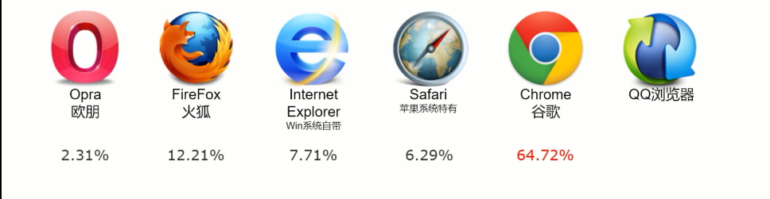

# 1. 什么是HTML5？

HTML5是HTML网页标准的5.0版本，5.0版本相比4.0版本新增了很多技术内容，这一次的变化是比较大的，甚至是革命性的。

它的诞生带动了很多领域的发展，尤其是移动端设备

# 2. 什么是H5？

HTML5的简称

# 3. 什么是全栈？

看的到部分叫前端，看不到的部分叫后端。既能做前端与后端

# 4. HTML5能做什么？

网页、微信小程序、APP、微信小游戏

# 5. 什么是网页?

由浏览器执行的HTML代码

## 5.1 常见浏览器

**ps：QQ浏览器来自国内(目前腾讯旗下产品网页浏览技术都由它提供)，IE从Windows10之后由Edge浏览器接替IE。**

