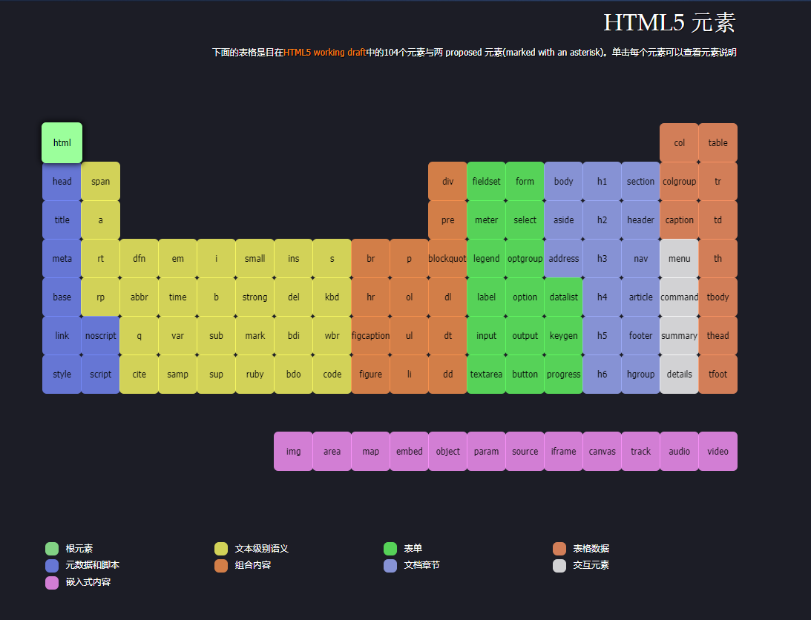

1. 什么是HTML、CSS?

2. Vscode
    - 插件: chinese(语言包)、open in browers(打开浏览器)、view in borwer(打开浏览器))
    - <kbd>shift</kbd> + <kbd>alt</kbd> + <kbd>↓</kbd>: 复制一行
    - <kbd>alt</kbd> + <kbd>↑或↓</kbd>:移动一行
    - <kbd>tab</kbd> + <kbd>shift</kbd>:向前缩进
    - <kbd>alt</kbd> + <kbd>左键</kbd>:批量修改

3. chrome浏览器
4. 深入了解网站开发
    - UI设计师
    - WEB前端开发工程师(H5开发)
5. web三大核心技术
    - HTML
    - CSS
    - JavaScript
6. HTML基本结构和属性
    - HTML:超文本标记语言
        - 超文本: 文本内容 + 非文本内容 (图片、视频、音频等)
        - 标记: <单词>,也叫标签
        - 语言: 编程语言
    - HTML: [元素周期表](http://demo.yanue.net/HTML5element/)
    
7. HTML初始代码
    - 每个.html文件都有的代码叫做初始代码,要符合html文件的规范文件
    - vscode生成快捷键: <kbd>!</kbd> + <kbd>tab</kbd>
    ```html
    <!DOCTYPE html>
    <html lang="en">
    <head>
        <meta charset="UTF-8">
        <meta name="viewport" content="width=device-width, initial-scale=1.0">
        <meta http-equiv="X-UA-Compatible" content="ie=edge">
        <title>Document</title>
    </head>
    <body>
        
    </body>
    </html>
    ```