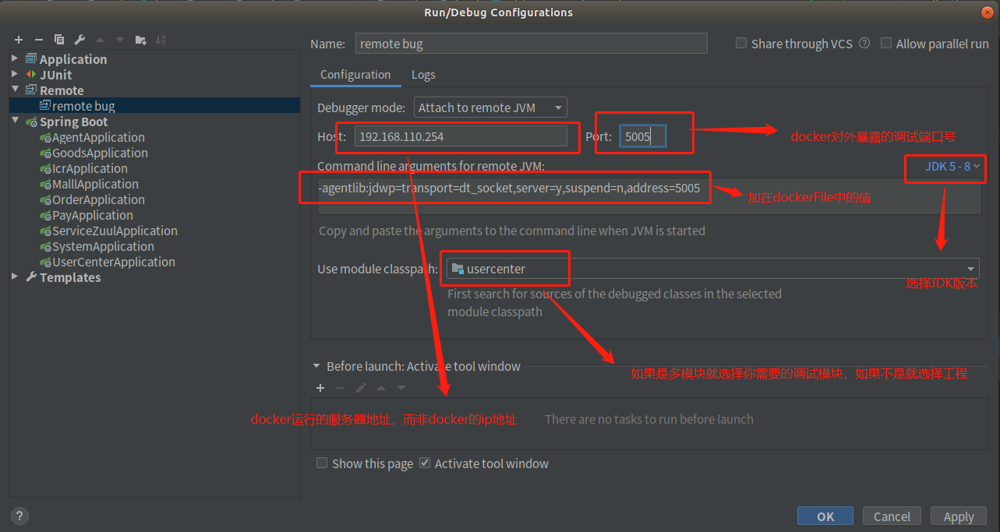
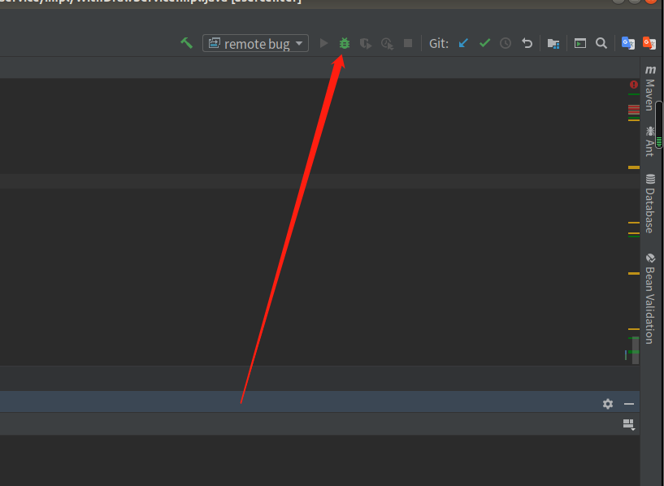
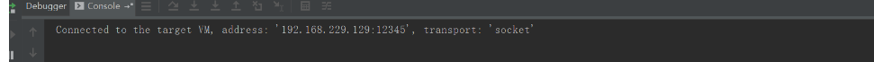

# 一、常用的快捷键

|    名称    |            快捷键             |   说明   |
| :--------: | :---------------------------: | :------: |
|   列模式   |    alt + shift + 鼠标左键     | 批量写入 |
| 移动代码块 | ctrl + shift + &uarr; &darr;| 上下移动代码  |
|运行\|查看断点|ctrl + shift + F8|异常断点使用|

# 二、DEBUG技巧

## 2.1 异常断点


让idea直接断点停在抛出异常前
1. idea 快捷键`ctrl` + `shift` + `F8`,或点击


2.  添加需要捕获的异常


3. 开启异常断点


## 2.2  远程调试docker springboot
1. springboot项目打包
```xml
<plugin>
    <groupId>org.springframework.boot</groupId>
    <artifactId>spring-boot-maven-plugin</artifactId>
</plugin>
```

2. dockerfile内容
```dockerfile
# 继承制定镜像
FROM java:8
#
VOLUME /opt/mydockerwork/docker-test-work
#暴露调试端口，容器内部
EXPOSE 5005
#下面的address和上面的EXPOSE一致
ENTRYPOINT ["java","-jar","-agentlib:jdwp=transport=dt_socket,server=y,suspend=n,address=5005","-Dspring.profiles.active=sit","docker-test.jar"]
```
3. 生成镜像
```shell
# docker-test 为镜像名称可随意  . 代表当前上下文对象
docker build -t docker-test .
```
4. 启动容器
```shell
# 5005 代表docker 对外暴露的调试端口,8070代表项目运行的端口
docker run -p 5005:8070 docker-test 
```
5. idea 配置



6. 运行远程调试


7. 成功图示
