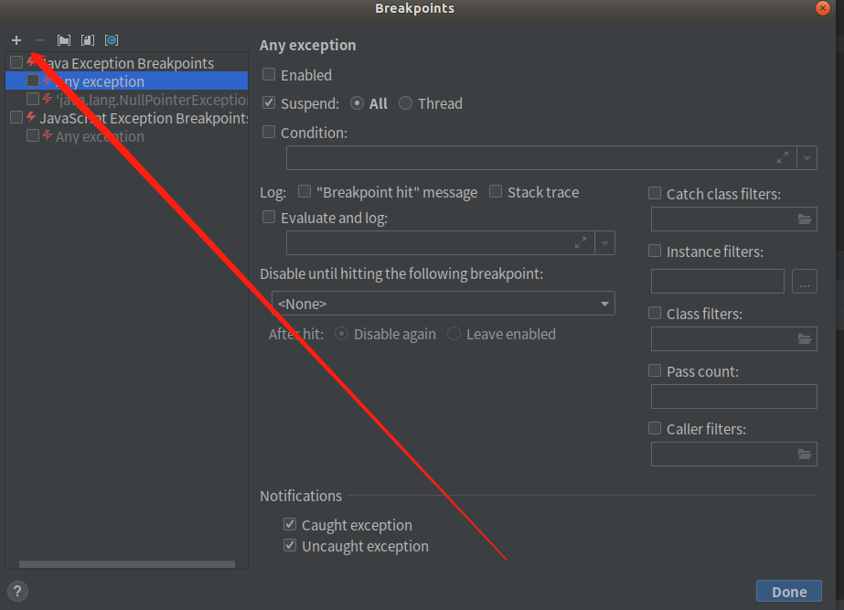

# 一、常用的快捷键

|    名称    |            快捷键             |   说明   |
| :--------: | :---------------------------: | :------: |
|   列模式   |    alt + shift + 鼠标左键     | 批量写入 |
| 移动代码块 | ctrl + shift + &uarr; &darr;| 上下移动代码  |
|运行\|查看断点|ctrl + shift + F8|异常断点使用|

# 二、DEBUG技巧

## 2.1 异常断点

让idea直接断点停在抛出异常前
1. idea 快捷键`ctrl` + `shift` + `F8`,或点击

2.  添加需要捕获的异常

3. 开启异常断点

