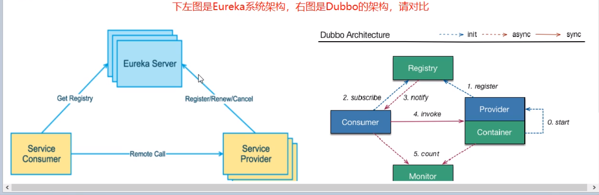

# 一、什么是服务注册

​	Eureka采用CS的设计架构，Eureka Server作为服务注册功能的服务器，它是服务注册中心。而系统中的其他微服务，使用Eureka的客户端连接到Eureka Server并维持**心跳连接**。这样系统的维护人员就可以通过Eureka Server来监控系统中各个微服务是否正常运行。

​	在服务注册与发现中，有一个注册中心。当服务器启动的时候，会把当前自己服务器的信息，比如：服务地址、通信地址等以别名方式注册到注册中心上。另一方(消费者|服务提供者)，以该别名的方式去注册中心上获取到实际的服务通讯地址，然后再实现本地RPC远程调用框架。

​	核心设计思想：在于注册中心，因为使用注册中心管理每个服务于服务之间得到一个依赖关系(服务治理概念)。在任何rpc远程框架中，都会有一个注册中心(存放服务地址相关信息(接口地址))

# 二、Eureka包含两个组件：Eureka Server 与Eureka Client

1. Eureka Server提供服务注册服务：各个微服务节点通过配置启动后，会在EurekaServer中进行注册，这样EurekaServer中的服务注册表中将会存储所有可用服务节点的信息，服务节点的信息可以在界面中直观看到。
2. Eureka Client通过注册中心进行访问：是一个Java客户端，用户简化Eureka Server的交互，客户端同时也具备一个内置的、使用轮询（round-robin）负载算法的负载均衡器。在应用启动后，将会向Eureka Server发送心跳(默认周期为30秒)。如果Euraka Server在多个心跳周期内没有接收到某个节点的心跳，EurekaServer将会从服务注册表中把这个服务节点移除(默认90秒)

